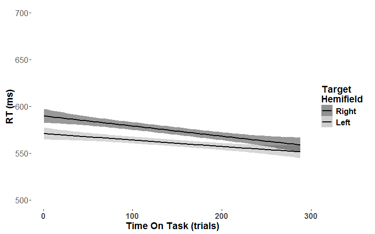
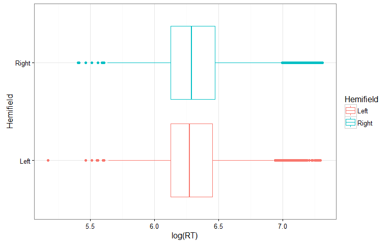
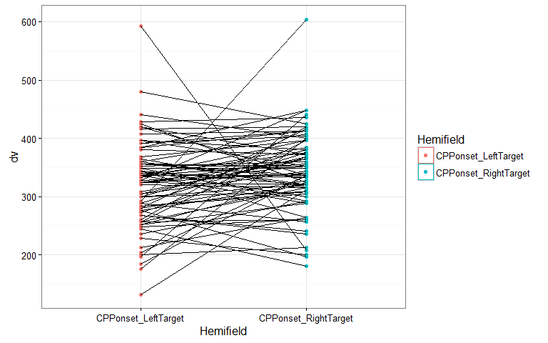
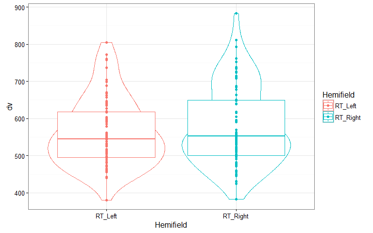
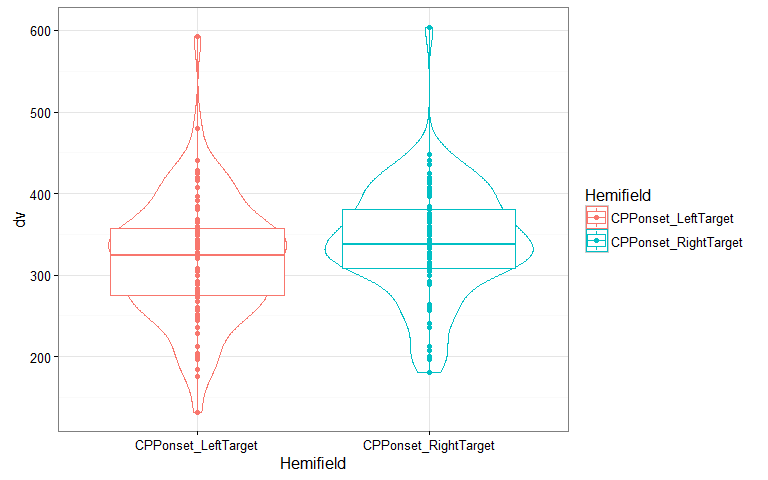
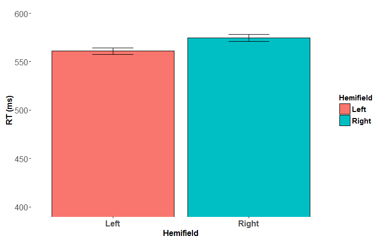
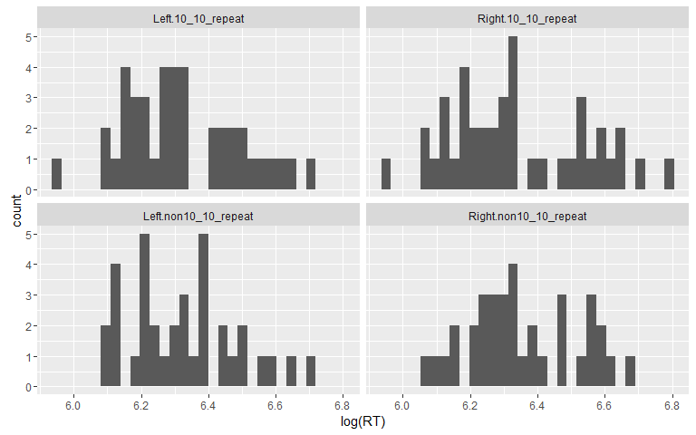
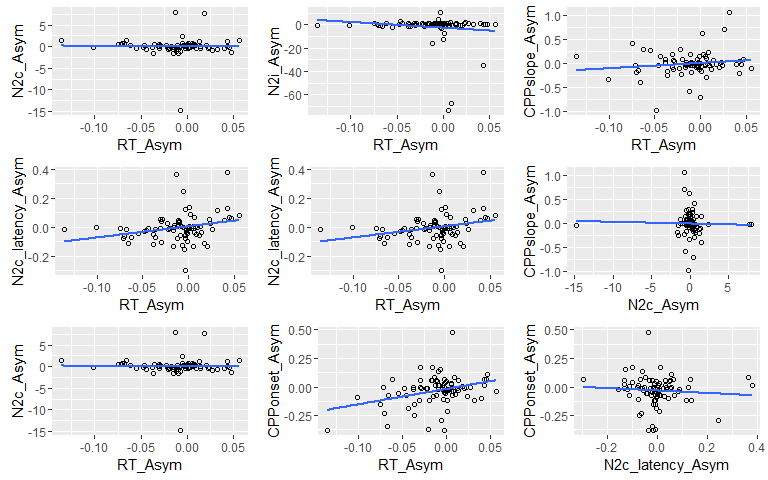
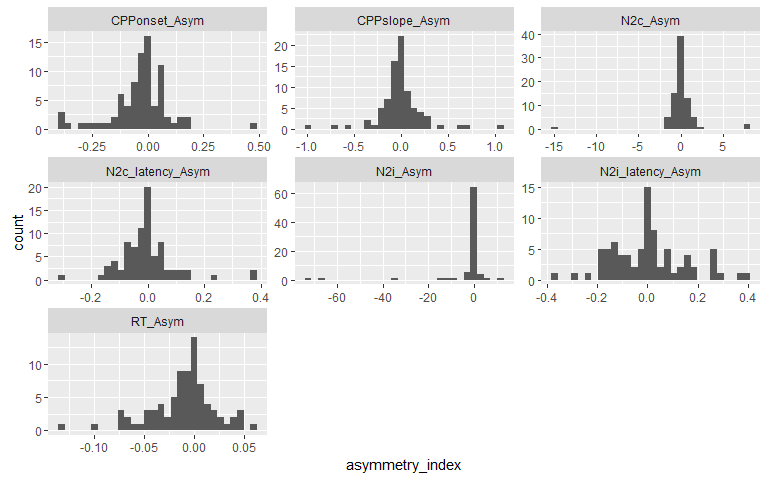
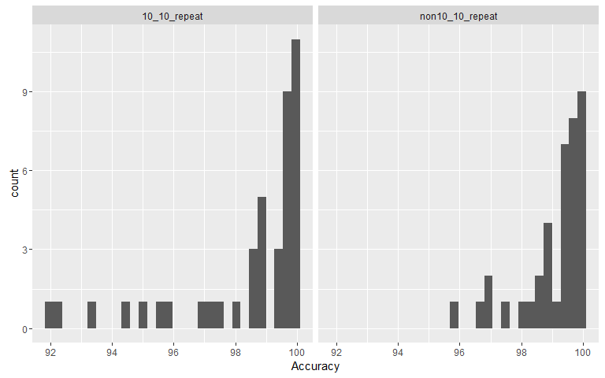

# BigDots
Daniel Newman  
12 June 2016  


#Test the effect of Target Hemifield on RT, CPPonset, N2c, etc. using Factorial Permutation test

```
## [1] "Factorial Permutation test for the effect of Hemifield on RT:"
```

```
##      Effect p p<.05
## 1 Hemifield 0     *
```

<!-- --><!-- -->

```
## [1] "Factorial Permutation test for the effect of Hemifield on CPP Slope:"
```

```
##      Effect    p p<.05
## 1 Hemifield 0.34
```

```
## [1] "Factorial Permutation test for the effect of Hemifield on CPP Onset:"
```

```
##      Effect     p p<.05
## 1 Hemifield 0.036     *
```

<!-- --><!-- -->

```
## [1] "Factorial Permutation test for the effect of Hemifield on N2i_latency:"
```

```
##      Effect     p p<.05
## 1 Hemifield 0.771
```

```
## [1] "Factorial Permutation test for the effect of Hemifield on N2i Amplitude:"
```

```
##      Effect     p p<.05
## 1 Hemifield 0.388
```

```
## [1] "Factorial Permutation test for the effect of Hemifield on N2c_latency:"
```

```
##      Effect    p p<.05
## 1 Hemifield 0.54
```

```
## [1] "Factorial Permutation test for the effect of Hemifield on N2c Amplitude:"
```

```
##      Effect     p p<.05
## 1 Hemifield 0.897
```


#Test the effect of Target Hemifield on RT, CPPonset, N2c, etc. using repeated measures ANOVA

```
## [1] "Factorial Permutation test for the effect of Hemifield on CPP Slope:"
```

```
## $ANOVA
##      Effect DFn DFd       F           p p<.05        ges
## 2 Hemifield   1  80 10.1044 0.002103799     * 0.00530509
```

<!-- --><!-- -->

```
## [1] "Factorial Permutation test for the effect of Hemifield on CPP Slope:"
```

```
## $ANOVA
##      Effect DFn DFd         F         p p<.05          ges
## 2 Hemifield   1  80 0.7597552 0.3860135       0.0004590317
```

```
## [1] "Factorial Permutation test for the effect of Hemifield on CPP Onset:"
```

```
## $ANOVA
##      Effect DFn DFd        F          p p<.05        ges
## 2 Hemifield   1  80 4.656914 0.03392769     * 0.02114102
```

<!-- --><!-- -->

```
## [1] "Factorial Permutation test for the effect of Hemifield on N2i_latency:"
```

```
## $ANOVA
##      Effect DFn DFd          F         p p<.05         ges
## 2 Hemifield   1  80 0.08062017 0.7771923       0.000367989
```

```
## [1] "Factorial Permutation test for the effect of Hemifield on N2i Amplitude:"
```

```
## $ANOVA
##      Effect DFn DFd         F         p p<.05         ges
## 2 Hemifield   1  80 0.7866565 0.3777717       0.003281528
```

```
## [1] "Factorial Permutation test for the effect of Hemifield on N2c_latency:"
```

```
## $ANOVA
##      Effect DFn DFd         F        p p<.05         ges
## 2 Hemifield   1  80 0.3948941 0.531528       0.001221908
```

```
## [1] "Factorial Permutation test for the effect of Hemifield on N2c Amplitude:"
```

```
## $ANOVA
##      Effect DFn DFd          F         p p<.05          ges
## 2 Hemifield   1  80 0.01854784 0.8920129       7.722735e-05
```


#test correlation between all of the Asymmetry measures (i.e. RT, N2, CPP, alpha, asymmetry) 

```
## Call:corr.test(x = data_for_cor, method = "pearson", adjust = "none", 
##     alpha = 0.05, ci = TRUE)
## Correlation matrix 
##                  RT_Asym N2c_Asym N2c_latency_Asym N2i_Asym
## RT_Asym             1.00    -0.02             0.27    -0.14
## N2c_Asym           -0.02     1.00             0.25    -0.02
## N2c_latency_Asym    0.27     0.25             1.00    -0.10
## N2i_Asym           -0.14    -0.02            -0.10     1.00
## N2i_latency_Asym    0.02    -0.09            -0.31     0.08
## CPPonset_Asym       0.34    -0.13            -0.08    -0.12
## CPPslope_Asym       0.14    -0.03             0.07     0.02
##                  N2i_latency_Asym CPPonset_Asym CPPslope_Asym
## RT_Asym                      0.02          0.34          0.14
## N2c_Asym                    -0.09         -0.13         -0.03
## N2c_latency_Asym            -0.31         -0.08          0.07
## N2i_Asym                     0.08         -0.12          0.02
## N2i_latency_Asym             1.00          0.00          0.01
## CPPonset_Asym                0.00          1.00          0.09
## CPPslope_Asym                0.01          0.09          1.00
## Sample Size 
## [1] 81
## Probability values (Entries above the diagonal are adjusted for multiple tests.) 
##                  RT_Asym N2c_Asym N2c_latency_Asym N2i_Asym
## RT_Asym             0.00     0.89             0.02     0.23
## N2c_Asym            0.89     0.00             0.02     0.89
## N2c_latency_Asym    0.02     0.02             0.00     0.39
## N2i_Asym            0.23     0.89             0.39     0.00
## N2i_latency_Asym    0.86     0.42             0.01     0.48
## CPPonset_Asym       0.00     0.26             0.48     0.29
## CPPslope_Asym       0.22     0.79             0.54     0.87
##                  N2i_latency_Asym CPPonset_Asym CPPslope_Asym
## RT_Asym                      0.86          0.00          0.22
## N2c_Asym                     0.42          0.26          0.79
## N2c_latency_Asym             0.01          0.48          0.54
## N2i_Asym                     0.48          0.29          0.87
## N2i_latency_Asym             0.00          0.97          0.93
## CPPonset_Asym                0.97          0.00          0.42
## CPPslope_Asym                0.93          0.42          0.00
## 
##  To see confidence intervals of the correlations, print with the short=FALSE option
## 
##  Confidence intervals based upon normal theory.  To get bootstrapped values, try cor.ci
##               lower     r upper    p
## RT_As-N2c_A   -0.23 -0.02  0.20 0.89
## RT_As-N2c__A   0.05  0.27  0.46 0.02
## RT_As-N2_As   -0.34 -0.14  0.09 0.23
## RT_As-N2_l_A  -0.20  0.02  0.24 0.86
## RT_As-CPPn_A   0.14  0.34  0.52 0.00
## RT_As-CPPs_A  -0.08  0.14  0.35 0.22
## N2c_A-N2c__A   0.03  0.25  0.44 0.02
## N2c_A-N2_As   -0.23 -0.02  0.20 0.89
## N2c_A-N2_l_A  -0.30 -0.09  0.13 0.42
## N2c_A-CPPn_A  -0.34 -0.13  0.09 0.26
## N2c_A-CPPs_A  -0.25 -0.03  0.19 0.79
## N2c__A-N2_As  -0.31 -0.10  0.13 0.39
## N2c__A-N2_l_A -0.49 -0.31 -0.10 0.01
## N2c__A-CPPn_A -0.29 -0.08  0.14 0.48
## N2c__A-CPPs_A -0.15  0.07  0.28 0.54
## N2_As-N2_l_A  -0.14  0.08  0.29 0.48
## N2_As-CPPn_A  -0.33 -0.12  0.10 0.29
## N2_As-CPPs_A  -0.20  0.02  0.24 0.87
## N2_l_A-CPPn_A -0.22  0.00  0.21 0.97
## N2_l_A-CPPs_A -0.21  0.01  0.23 0.93
## CPPn_A-CPPs_A -0.13  0.09  0.30 0.42
```

```
## png 
##   2
```

<!-- -->

```
## png 
##   2
```

<!-- -->

```
## png 
##   2
```

<!-- -->

```
## `stat_bin()` using `bins = 30`. Pick better value with `binwidth`.
```

```
## png 
##   2
```

```
## `stat_bin()` using `bins = 30`. Pick better value with `binwidth`.
```

<!-- -->


#Look at the effect of Hemifield on RT on a single trial level using linear mixed model

```
## Data: data
## Models:
## RT_random_effects_only: log(RT) ~ 1 + (Hemifield | ID) + (1 | ITI) + (1 | Trial)
## RT_Hemifield: log(RT) ~ (Hemifield | ID) + (1 | ITI) + (1 | Trial) + Hemifield
## RT_Hemifield_by_TOT: log(RT) ~ (Hemifield | ID) + (1 | ITI) + (1 | Trial) + Hemifield + 
## RT_Hemifield_by_TOT:     Trial + Hemifield:Trial
##                        Df     AIC     BIC logLik deviance   Chisq Chi Df
## RT_random_effects_only  7 -9140.6 -9084.9 4577.3  -9154.6               
## RT_Hemifield            8 -9145.9 -9082.2 4580.9  -9161.9  7.2662      1
## RT_Hemifield_by_TOT    10 -9186.1 -9106.5 4603.0  -9206.1 44.1561      2
##                        Pr(>Chisq)    
## RT_random_effects_only               
## RT_Hemifield             0.007027 ** 
## RT_Hemifield_by_TOT      2.58e-10 ***
## ---
## Signif. codes:  0 '***' 0.001 '**' 0.01 '*' 0.05 '.' 0.1 ' ' 1
```

<!-- -->

**So this ^ shows that participants tended to react faster to left hemifield targets, but this leftward advangate decreased over time**


