# BigDots
Daniel Newman  
12 June 2016  


# Stim Locked Beta

```
## Automatically converting the following non-factors to factors: Time, Hemifield
```

```
## Loading required package: plyr
```

```
## -------------------------------------------------------------------------
```

```
## You have loaded plyr after dplyr - this is likely to cause problems.
## If you need functions from both plyr and dplyr, please load plyr first, then dplyr:
## library(plyr); library(dplyr)
```

```
## -------------------------------------------------------------------------
```

```
## 
## Attaching package: 'plyr'
```

```
## The following object is masked from 'package:lubridate':
## 
##     here
```

```
##    Min. 1st Qu.  Median    Mean 3rd Qu.    Max. 
##    -558      -8     542     542    1092    1642
```

```
## Loading required package: dplyr
```

```
## 
## Attaching package: 'dplyr'
```

```
## The following objects are masked from 'package:plyr':
## 
##     arrange, count, desc, failwith, id, mutate, rename, summarise,
##     summarize
```

```
## The following object is masked from 'package:MASS':
## 
##     select
```

```
## The following objects are masked from 'package:lubridate':
## 
##     intersect, setdiff, union
```

```
## The following objects are masked from 'package:stats':
## 
##     filter, lag
```

```
## The following objects are masked from 'package:base':
## 
##     intersect, setdiff, setequal, union
```

```
## [[1]]
## [1] TRUE
## 
## [[2]]
## [1] TRUE
## 
## [[3]]
## [1] TRUE
## 
## [[4]]
## [1] TRUE
## 
## [[5]]
## [1] TRUE
## 
## [[6]]
## [1] TRUE
## 
## [[7]]
## [1] TRUE
## 
## [[8]]
## [1] TRUE
## 
## [[9]]
## [1] TRUE
## 
## [[10]]
## [1] TRUE
## 
## [[11]]
## [1] TRUE
## 
## [[12]]
## [1] TRUE
## 
## [[13]]
## [1] TRUE
## 
## [[14]]
## [1] TRUE
## 
## [[15]]
## [1] TRUE
```

<!-- --><!-- -->

```
## Adding missing grouping variables: `ID`
```

# Resp Locked Beta Slope

```
## Automatically converting the following non-factors to factors: Time, Hemifield
```

```
##    Min. 1st Qu.  Median    Mean 3rd Qu.    Max. 
##    -400    -280    -160    -160     -40      80
```

```
## Loading required package: dplyr
```

```
## 
## Attaching package: 'dplyr'
```

```
## The following objects are masked from 'package:plyr':
## 
##     arrange, count, desc, failwith, id, mutate, rename, summarise,
##     summarize
```

```
## The following object is masked from 'package:MASS':
## 
##     select
```

```
## The following objects are masked from 'package:lubridate':
## 
##     intersect, setdiff, union
```

```
## The following objects are masked from 'package:stats':
## 
##     filter, lag
```

```
## The following objects are masked from 'package:base':
## 
##     intersect, setdiff, setequal, union
```

```
## [[1]]
## [1] TRUE
## 
## [[2]]
## [1] TRUE
## 
## [[3]]
## [1] TRUE
## 
## [[4]]
## [1] TRUE
## 
## [[5]]
## [1] TRUE
## 
## [[6]]
## [1] TRUE
## 
## [[7]]
## [1] TRUE
## 
## [[8]]
## [1] TRUE
## 
## [[9]]
## [1] TRUE
## 
## [[10]]
## [1] TRUE
## 
## [[11]]
## [1] TRUE
## 
## [[12]]
## [1] TRUE
## 
## [[13]]
## [1] TRUE
## 
## [[14]]
## [1] TRUE
## 
## [[15]]
## [1] TRUE
```

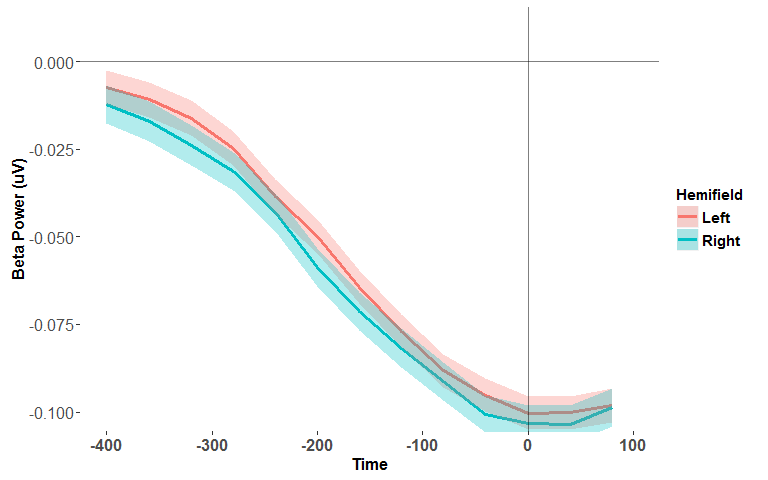<!-- -->

```
## Adding missing grouping variables: `ID`
```

#Run the Shapiro-Wilk test of normality on the RT, CPPonset, N2c, etc. measures as a function of hemifield

Table: Normality tests

key                          ShapiroWilk_p_value   Anderson_Darling_p_value   CramerVonMises_p_value   Shapiro_Francia_p_value   Kolmogorov_Smirnov_p_value   average_p_value
--------------------------  --------------------  -------------------------  -----------------------  ------------------------  ---------------------------  ----------------
Beta_LeftTarget                           0.0000                     0.0000                   0.0000                    0.0000                       0.0001            0.0000
Beta_RightTarget                          0.0000                     0.0004                   0.0011                    0.0001                       0.0012            0.0006
RT_Right                                  0.0042                     0.0008                   0.0006                    0.0066                       0.0000            0.0024
RT_Left                                   0.0074                     0.0069                   0.0117                    0.0115                       0.0050            0.0085
Beta_slope_LeftTarget                     0.0002                     0.0041                   0.0064                    0.0002                       0.0358            0.0094
N2i_latency_LeftTarget                    0.0006                     0.0027                   0.0240                    0.0028                       0.0429            0.0146
N2c_latency_LeftTarget                    0.0052                     0.0052                   0.0104                    0.0037                       0.0733            0.0196
AlphaDesync_c_RightTarget                 0.0421                     0.0087                   0.0066                    0.0216                       0.0409            0.0240
AlphaDesync_i_RightTarget                 0.0413                     0.0224                   0.0198                    0.0182                       0.0556            0.0315
AlphaDesync_i_LeftTarget                  0.0875                     0.0415                   0.0301                    0.0297                       0.1065            0.0591
CPPslope_LeftTarget                       0.0281                     0.0339                   0.0739                    0.0465                       0.1255            0.0616
N2i_latency_RightTarget                   0.0102                     0.0594                   0.1797                    0.0357                       0.0837            0.0737
N2c_RightTarget                           0.2607                     0.1636                   0.0979                    0.1458                       0.0710            0.1478
CPPslope_RightTarget                      0.0316                     0.1115                   0.2422                    0.0504                       0.3796            0.1631
CPPonset_RightTarget                      0.2368                     0.2326                   0.3083                    0.1364                       0.1971            0.2222
N2c_latency_RightTarget                   0.3077                     0.2236                   0.2044                    0.4142                       0.1073            0.2514
Beta_slope_RightTarget                    0.4875                     0.1687                   0.1056                    0.4690                       0.0447            0.2551
AlphaDesync_c_LeftTarget                  0.0965                     0.2956                   0.3734                    0.0272                       0.4893            0.2564
N2i_RightTarget                           0.4963                     0.3320                   0.3637                    0.3537                       0.2313            0.3554
N2i_LeftTarget                            0.7587                     0.5311                   0.4459                    0.6838                       0.3698            0.5579
CPPonset_LeftTarget                       0.8845                     0.7969                   0.7322                    0.5580                       0.5883            0.7120
N2c_LeftTarget                            0.7328                     0.8604                   0.8168                    0.8690                       0.8110            0.8180


#Test the effect of Target Hemifield on RT, CPPonset, N2c, etc. using repeated measures ANOVA

##In cases where the assumption of normality was violated, a factorial permutation test for the effect of Target Hemifield was performed with 1000 permutations and the permuted p-value also reported

```
## [1] "Repeated Measures ANOVA  for the effect of Hemifield on RT:"
```

```
## $ANOVA
##      Effect DFn DFd        F           p p<.05        ges
## 2 Hemifield   1  79 11.09909 0.001315453     * 0.00614155
```

```
## [1] "Factorial Permutation test for the effect of Hemifield on RT:"
```

```
##      Effect     p p<.05
## 1 Hemifield 0.001     *
```

<!-- -->

```
## [1] "Repeated Measures ANOVA  for the effect of Hemifield on CPP Onset:"
```

```
## $ANOVA
##      Effect DFn DFd        F         p p<.05        ges
## 2 Hemifield   1  79 5.540077 0.0210716     * 0.02451972
```

<!-- -->

```
## [1] "Repeated Measures ANOVA  for the effect of Hemifield on CPP Slope:"
```

```
## $ANOVA
##      Effect DFn DFd        F         p p<.05          ges
## 2 Hemifield   1  79 1.256175 0.2657719       0.0007765846
```

```
## [1] "Repeated Measures ANOVA  for the effect of Hemifield on N2i_latency:"
```

```
## $ANOVA
##      Effect DFn DFd         F         p p<.05          ges
## 2 Hemifield   1  79 0.1545535 0.6952802       0.0006968114
```

```
## [1] "Factorial Permutation test for the effect of Hemifield on N2i_latency:"
```

```
##      Effect     p p<.05
## 1 Hemifield 0.691
```

```
## [1] "Repeated Measures ANOVA  for the effect of Hemifield on N2i Amplitude:"
```

```
## $ANOVA
##      Effect DFn DFd        F         p p<.05         ges
## 2 Hemifield   1  79 1.258714 0.2652931       0.005234692
```

```
## [1] "Repeated Measures ANOVA  for the effect of Hemifield on N2c_latency:"
```

```
## $ANOVA
##      Effect DFn DFd           F         p p<.05           ges
## 2 Hemifield   1  79 0.005734358 0.9398289       0.00001832557
```

```
## [1] "Factorial Permutation test for the effect of Hemifield on N2c_latency:"
```

```
##      Effect     p p<.05
## 1 Hemifield 0.946
```

```
## [1] "Repeated Measures ANOVA  for the effect of Hemifield on N2c Amplitude:"
```

```
## $ANOVA
##      Effect DFn DFd          F         p p<.05          ges
## 2 Hemifield   1  79 0.07554369 0.7841474       0.0003143128
```

```
## [1] "Repeated Measures ANOVA  for the effect of Hemifield on Stim Locked Beta Amplitude:"
```

```
## $ANOVA
##      Effect DFn DFd         F        p p<.05          ges
## 2 Hemifield   1  79 0.6776128 0.412888       0.0006998092
```

```
## [1] "Factorial Permutation test for the effect of Hemifield on Stim Locked Beta Amplitude:"
```

```
##      Effect     p p<.05
## 1 Hemifield 0.418
```

```
## [1] "Repeated Measures ANOVA  for the effect of Hemifield on Resp Locked Beta Slope:"
```

```
## $ANOVA
##      Effect DFn DFd         F         p p<.05          ges
## 2 Hemifield   1  79 0.1933328 0.6613577       0.0002554888
```

```
## [1] "Factorial Permutation test for the effect of Hemifield on SResp Locked Beta Slope:"
```

```
##      Effect    p p<.05
## 1 Hemifield 0.66
```


#test correlation between all of the Asymmetry measures (i.e. RT, N2, CPP, alpha, asymmetry) 

Table: Normality tests

key                   ShapiroWilk_p_value   Anderson_Darling_p_value   CramerVonMises_p_value   Shapiro_Francia_p_value   Kolmogorov_Smirnov_p_value   average_p_value
-------------------  --------------------  -------------------------  -----------------------  ------------------------  ---------------------------  ----------------
N2i_Asym                           0.0000                     0.0000                   0.0000                    0.0000                       0.0000            0.0000
Beta_Asym                          0.0000                     0.0000                   0.0000                    0.0000                       0.0000            0.0000
AlphaDesync_c_Asym                 0.0000                     0.0000                   0.0000                    0.0000                       0.0000            0.0000
Beta_slope_Asym                    0.0000                     0.0000                   0.0000                    0.0000                       0.0000            0.0000
AlphaDesync_i_Asym                 0.0000                     0.0000                   0.0000                    0.0000                       0.0000            0.0000
N2c_Asym                           0.0000                     0.0000                   0.0000                    0.0000                       0.0000            0.0000
CPPslope_Asym                      0.0000                     0.0000                   0.0000                    0.0000                       0.0000            0.0000
CPPonset_Asym                      0.0001                     0.0000                   0.0001                    0.0001                       0.0016            0.0004
RT_Asym                            0.0072                     0.0015                   0.0009                    0.0071                       0.0056            0.0045
N2c_latency_Asym                   0.0409                     0.0739                   0.1188                    0.0272                       0.0150            0.0552
PostAlphaAsym                      0.4050                     0.1085                   0.0547                    0.3847                       0.0405            0.1987
N2i_latency_Asym                   0.4109                     0.3248                   0.2624                    0.3902                       0.1485            0.3073
PreAlphaAsym                       0.9362                     0.8864                   0.7902                    0.9589                       0.5177            0.8179

```
## Call:corr.test(x = data_for_cor, use = "pairwise", method = "pearson", 
##     adjust = "none")
## Correlation matrix 
##                    RT_Asym AlphaDesync_c_Asym AlphaDesync_i_Asym
## RT_Asym               1.00               0.03               0.03
## AlphaDesync_c_Asym    0.03               1.00              -0.03
## AlphaDesync_i_Asym    0.03              -0.03               1.00
## CPPonset_Asym         0.34              -0.06               0.05
## CPPslope_Asym         0.22               0.02               0.13
## N2c_Asym              0.02              -0.03               0.00
## N2c_latency_Asym      0.19              -0.03               0.12
## N2i_Asym             -0.05              -0.02               0.03
## N2i_latency_Asym      0.00              -0.21               0.13
## PostAlphaAsym         0.03              -0.02              -0.05
## PreAlphaAsym          0.22               0.08              -0.04
## Beta_Asym             0.11              -0.55              -0.05
## Beta_slope_Asym       0.01               0.00               0.03
##                    CPPonset_Asym CPPslope_Asym N2c_Asym N2c_latency_Asym
## RT_Asym                     0.34          0.22     0.02             0.19
## AlphaDesync_c_Asym         -0.06          0.02    -0.03            -0.03
## AlphaDesync_i_Asym          0.05          0.13     0.00             0.12
## CPPonset_Asym               1.00          0.21     0.01             0.02
## CPPslope_Asym               0.21          1.00    -0.08             0.02
## N2c_Asym                    0.01         -0.08     1.00             0.24
## N2c_latency_Asym            0.02          0.02     0.24             1.00
## N2i_Asym                   -0.02          0.01    -0.07            -0.08
## N2i_latency_Asym            0.06          0.04     0.00            -0.06
## PostAlphaAsym               0.04          0.05    -0.02            -0.07
## PreAlphaAsym                0.09          0.09     0.06            -0.03
## Beta_Asym                  -0.02         -0.13     0.18             0.26
## Beta_slope_Asym            -0.19         -0.07    -0.43            -0.21
##                    N2i_Asym N2i_latency_Asym PostAlphaAsym PreAlphaAsym
## RT_Asym               -0.05             0.00          0.03         0.22
## AlphaDesync_c_Asym    -0.02            -0.21         -0.02         0.08
## AlphaDesync_i_Asym     0.03             0.13         -0.05        -0.04
## CPPonset_Asym         -0.02             0.06          0.04         0.09
## CPPslope_Asym          0.01             0.04          0.05         0.09
## N2c_Asym              -0.07             0.00         -0.02         0.06
## N2c_latency_Asym      -0.08            -0.06         -0.07        -0.03
## N2i_Asym               1.00             0.04          0.07         0.03
## N2i_latency_Asym       0.04             1.00         -0.01         0.16
## PostAlphaAsym          0.07            -0.01          1.00         0.17
## PreAlphaAsym           0.03             0.16          0.17         1.00
## Beta_Asym              0.01             0.05         -0.14         0.04
## Beta_slope_Asym        0.02             0.08          0.06        -0.04
##                    Beta_Asym Beta_slope_Asym
## RT_Asym                 0.11            0.01
## AlphaDesync_c_Asym     -0.55            0.00
## AlphaDesync_i_Asym     -0.05            0.03
## CPPonset_Asym          -0.02           -0.19
## CPPslope_Asym          -0.13           -0.07
## N2c_Asym                0.18           -0.43
## N2c_latency_Asym        0.26           -0.21
## N2i_Asym                0.01            0.02
## N2i_latency_Asym        0.05            0.08
## PostAlphaAsym          -0.14            0.06
## PreAlphaAsym            0.04           -0.04
## Beta_Asym               1.00           -0.04
## Beta_slope_Asym        -0.04            1.00
## Sample Size 
## [1] 80
## Probability values (Entries above the diagonal are adjusted for multiple tests.) 
##                    RT_Asym AlphaDesync_c_Asym AlphaDesync_i_Asym
## RT_Asym               0.00               0.83               0.77
## AlphaDesync_c_Asym    0.83               0.00               0.82
## AlphaDesync_i_Asym    0.77               0.82               0.00
## CPPonset_Asym         0.00               0.59               0.63
## CPPslope_Asym         0.05               0.83               0.23
## N2c_Asym              0.87               0.81               0.97
## N2c_latency_Asym      0.09               0.78               0.29
## N2i_Asym              0.66               0.87               0.76
## N2i_latency_Asym      0.98               0.07               0.26
## PostAlphaAsym         0.77               0.89               0.66
## PreAlphaAsym          0.05               0.45               0.72
## Beta_Asym             0.32               0.00               0.67
## Beta_slope_Asym       0.92               0.98               0.76
##                    CPPonset_Asym CPPslope_Asym N2c_Asym N2c_latency_Asym
## RT_Asym                     0.00          0.05     0.87             0.09
## AlphaDesync_c_Asym          0.59          0.83     0.81             0.78
## AlphaDesync_i_Asym          0.63          0.23     0.97             0.29
## CPPonset_Asym               0.00          0.06     0.93             0.87
## CPPslope_Asym               0.06          0.00     0.46             0.83
## N2c_Asym                    0.93          0.46     0.00             0.04
## N2c_latency_Asym            0.87          0.83     0.04             0.00
## N2i_Asym                    0.88          0.96     0.56             0.47
## N2i_latency_Asym            0.59          0.76     0.97             0.63
## PostAlphaAsym               0.75          0.64     0.84             0.56
## PreAlphaAsym                0.41          0.41     0.58             0.76
## Beta_Asym                   0.88          0.24     0.12             0.02
## Beta_slope_Asym             0.08          0.52     0.00             0.06
##                    N2i_Asym N2i_latency_Asym PostAlphaAsym PreAlphaAsym
## RT_Asym                0.66             0.98          0.77         0.05
## AlphaDesync_c_Asym     0.87             0.07          0.89         0.45
## AlphaDesync_i_Asym     0.76             0.26          0.66         0.72
## CPPonset_Asym          0.88             0.59          0.75         0.41
## CPPslope_Asym          0.96             0.76          0.64         0.41
## N2c_Asym               0.56             0.97          0.84         0.58
## N2c_latency_Asym       0.47             0.63          0.56         0.76
## N2i_Asym               0.00             0.71          0.56         0.78
## N2i_latency_Asym       0.71             0.00          0.96         0.16
## PostAlphaAsym          0.56             0.96          0.00         0.14
## PreAlphaAsym           0.78             0.16          0.14         0.00
## Beta_Asym              0.94             0.64          0.23         0.76
## Beta_slope_Asym        0.88             0.47          0.57         0.73
##                    Beta_Asym Beta_slope_Asym
## RT_Asym                 0.32            0.92
## AlphaDesync_c_Asym      0.00            0.98
## AlphaDesync_i_Asym      0.67            0.76
## CPPonset_Asym           0.88            0.08
## CPPslope_Asym           0.24            0.52
## N2c_Asym                0.12            0.00
## N2c_latency_Asym        0.02            0.06
## N2i_Asym                0.94            0.88
## N2i_latency_Asym        0.64            0.47
## PostAlphaAsym           0.23            0.57
## PreAlphaAsym            0.76            0.73
## Beta_Asym               0.00            0.72
## Beta_slope_Asym         0.72            0.00
## 
##  To see confidence intervals of the correlations, print with the short=FALSE option
## 
##  Confidence intervals based upon normal theory.  To get bootstrapped values, try cor.ci
##                             lower     r upper    p
## RT_As-AlphDsync_c_A         -0.20  0.03  0.24 0.83
## RT_As-AlphDsync__As         -0.19  0.03  0.25 0.77
## RT_As-CPPn_A                 0.13  0.34  0.52 0.00
## RT_As-CPPs_A                 0.00  0.22  0.42 0.05
## RT_As-N2c_A                 -0.20  0.02  0.24 0.87
## RT_As-N2c__A                -0.03  0.19  0.39 0.09
## RT_As-N2_As                 -0.27 -0.05  0.17 0.66
## RT_As-N2_l_A                -0.22  0.00  0.22 0.98
## RT_As-PstAA                 -0.19  0.03  0.25 0.77
## RT_As-PrAlA                  0.00  0.22  0.42 0.05
## RT_As-Bt_As                 -0.11  0.11  0.32 0.32
## RT_As-Bt__A                 -0.21  0.01  0.23 0.92
## AlphDsync_c_A-AlphDsync__As -0.24 -0.03  0.20 0.82
## AlphDsync_c_A-CPPn_A        -0.28 -0.06  0.16 0.59
## AlphDsync_c_A-CPPs_A        -0.20  0.02  0.24 0.83
## AlphDsync_c_A-N2c_A         -0.25 -0.03  0.19 0.81
## AlphDsync_c_A-N2c__A        -0.25 -0.03  0.19 0.78
## AlphDsync_c_A-N2_As         -0.24 -0.02  0.20 0.87
## AlphDsync_c_A-N2_l_A        -0.41 -0.21  0.01 0.07
## AlphDsync_c_A-PstAA         -0.23 -0.02  0.21 0.89
## AlphDsync_c_A-PrAlA         -0.14  0.08  0.30 0.45
## AlphDsync_c_A-Bt_As         -0.69 -0.55 -0.38 0.00
## AlphDsync_c_A-Bt__A         -0.22  0.00  0.22 0.98
## AlphDsync__As-CPPn_A        -0.17  0.05  0.27 0.63
## AlphDsync__As-CPPs_A        -0.09  0.13  0.34 0.23
## AlphDsync__As-N2c_A         -0.22  0.00  0.22 0.97
## AlphDsync__As-N2c__A        -0.10  0.12  0.33 0.29
## AlphDsync__As-N2_As         -0.19  0.03  0.25 0.76
## AlphDsync__As-N2_l_A        -0.10  0.13  0.34 0.26
## AlphDsync__As-PstAA         -0.27 -0.05  0.17 0.66
## AlphDsync__As-PrAlA         -0.26 -0.04  0.18 0.72
## AlphDsync__As-Bt_As         -0.26 -0.05  0.17 0.67
## AlphDsync__As-Bt__A         -0.19  0.03  0.25 0.76
## CPPn_A-CPPs_A               -0.01  0.21  0.41 0.06
## CPPn_A-N2c_A                -0.21  0.01  0.23 0.93
## CPPn_A-N2c__A               -0.20  0.02  0.24 0.87
## CPPn_A-N2_As                -0.24 -0.02  0.20 0.88
## CPPn_A-N2_l_A               -0.16  0.06  0.28 0.59
## CPPn_A-PstAA                -0.19  0.04  0.25 0.75
## CPPn_A-PrAlA                -0.13  0.09  0.31 0.41
## CPPn_A-Bt_As                -0.24 -0.02  0.20 0.88
## CPPn_A-Bt__A                -0.40 -0.19  0.03 0.08
## CPPs_A-N2c_A                -0.30 -0.08  0.14 0.46
## CPPs_A-N2c__A               -0.20  0.02  0.24 0.83
## CPPs_A-N2_As                -0.21  0.01  0.22 0.96
## CPPs_A-N2_l_A               -0.19  0.04  0.25 0.76
## CPPs_A-PstAA                -0.17  0.05  0.27 0.64
## CPPs_A-PrAlA                -0.13  0.09  0.31 0.41
## CPPs_A-Bt_As                -0.34 -0.13  0.09 0.24
## CPPs_A-Bt__A                -0.29 -0.07  0.15 0.52
## N2c_A-N2c__A                 0.02  0.24  0.43 0.04
## N2c_A-N2_As                 -0.28 -0.07  0.16 0.56
## N2c_A-N2_l_A                -0.22  0.00  0.22 0.97
## N2c_A-PstAA                 -0.24 -0.02  0.20 0.84
## N2c_A-PrAlA                 -0.16  0.06  0.28 0.58
## N2c_A-Bt_As                 -0.04  0.18  0.38 0.12
## N2c_A-Bt__A                 -0.59 -0.43 -0.23 0.00
## N2c__A-N2_As                -0.30 -0.08  0.14 0.47
## N2c__A-N2_l_A               -0.27 -0.06  0.17 0.63
## N2c__A-PstAA                -0.28 -0.07  0.16 0.56
## N2c__A-PrAlA                -0.25 -0.03  0.19 0.76
## N2c__A-Bt_As                 0.04  0.26  0.45 0.02
## N2c__A-Bt__A                -0.41 -0.21  0.01 0.06
## N2_As-N2_l_A                -0.18  0.04  0.26 0.71
## N2_As-PstAA                 -0.16  0.07  0.28 0.56
## N2_As-PrAlA                 -0.19  0.03  0.25 0.78
## N2_As-Bt_As                 -0.21  0.01  0.23 0.94
## N2_As-Bt__A                 -0.20  0.02  0.24 0.88
## N2_l_A-PstAA                -0.23 -0.01  0.21 0.96
## N2_l_A-PrAlA                -0.06  0.16  0.36 0.16
## N2_l_A-Bt_As                -0.17  0.05  0.27 0.64
## N2_l_A-Bt__A                -0.14  0.08  0.30 0.47
## PstAA-PrAlA                 -0.05  0.17  0.37 0.14
## PstAA-Bt_As                 -0.34 -0.14  0.09 0.23
## PstAA-Bt__A                 -0.16  0.06  0.28 0.57
## PrAlA-Bt_As                 -0.19  0.04  0.25 0.76
## PrAlA-Bt__A                 -0.26 -0.04  0.18 0.73
## Bt_As-Bt__A                 -0.26 -0.04  0.18 0.72
```

```
## png 
##   2
```

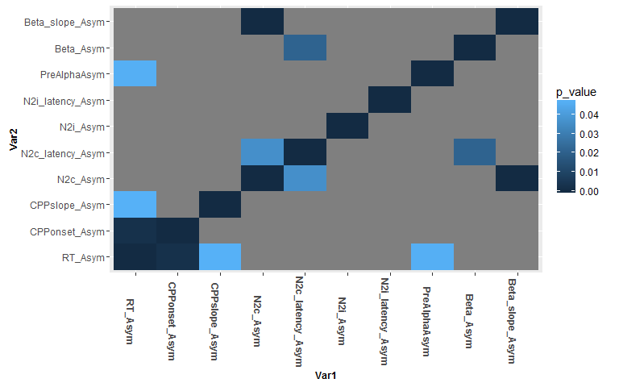<!-- -->

```
## png 
##   2
```

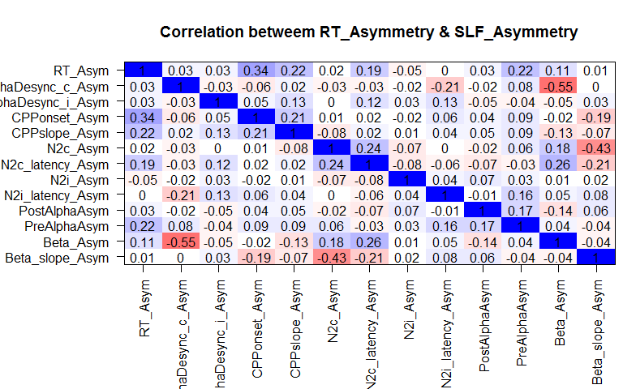<!-- -->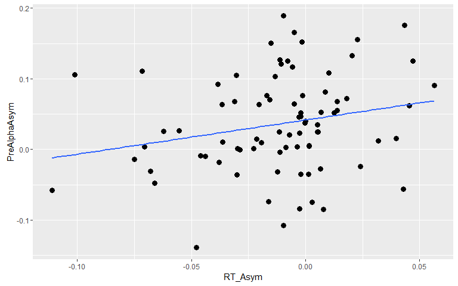<!-- -->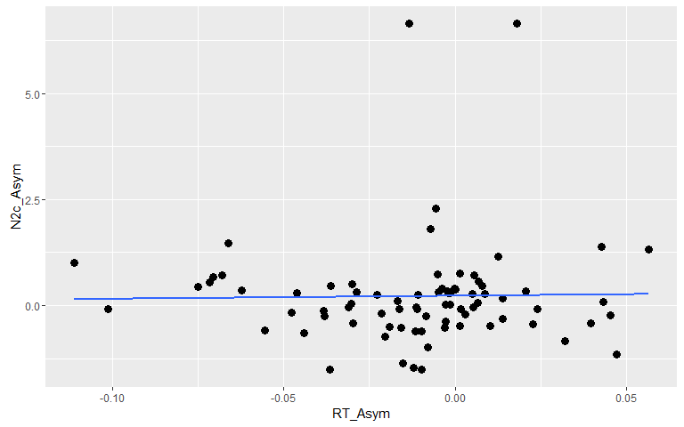<!-- -->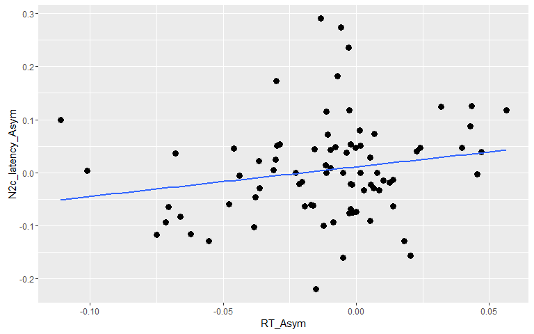<!-- -->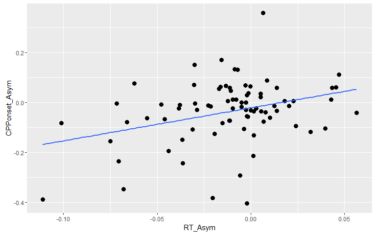<!-- -->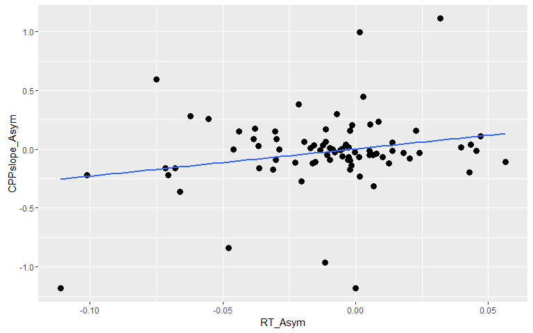<!-- -->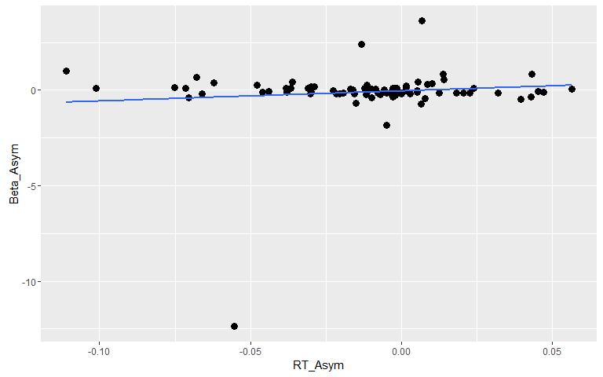<!-- -->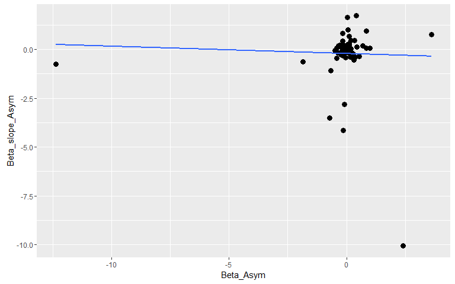<!-- -->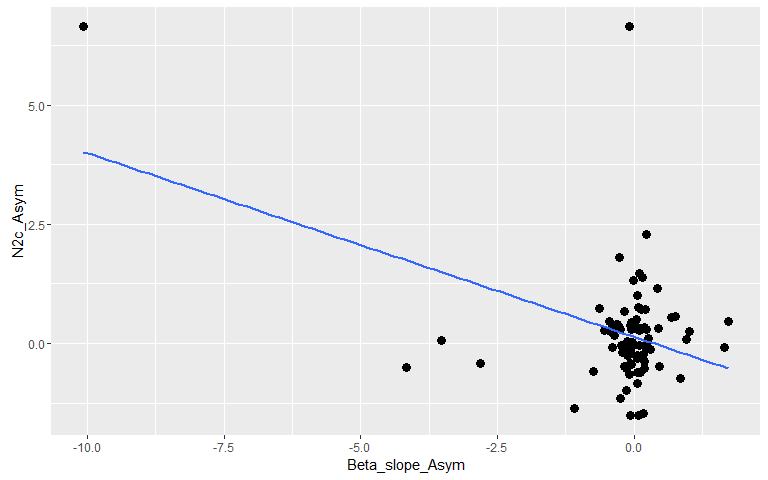<!-- -->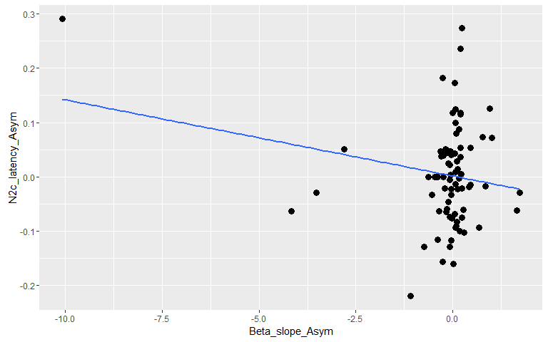<!-- -->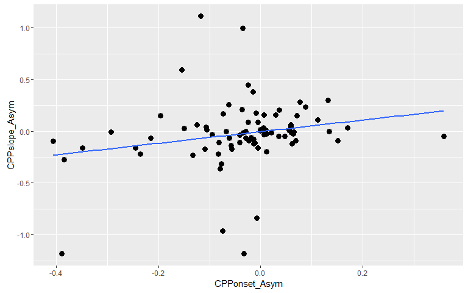<!-- --><!-- --><!-- -->

```
## `stat_bin()` using `bins = 30`. Pick better value with `binwidth`.
```

```
## png 
##   2
```

```
## `stat_bin()` using `bins = 30`. Pick better value with `binwidth`.
```

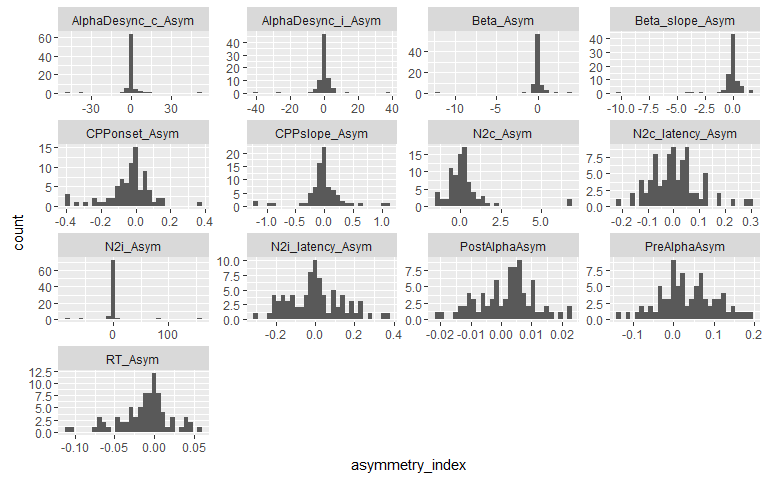<!-- -->

#Look at multiple regression to predice RT_Asym 

```
## Analysis of Variance Table
## 
## Model 1: RT_Asym ~ 1
## Model 2: RT_Asym ~ Location + Sex + Age
## Model 3: RT_Asym ~ Location + Sex + Age + PreAlphaAsym
## Model 4: RT_Asym ~ Location + Sex + Age + PreAlphaAsym + N2c_Asym
## Model 5: RT_Asym ~ Location + Sex + Age + PreAlphaAsym + N2c_Asym + N2c_latency_Asym
## Model 6: RT_Asym ~ Location + Sex + Age + PreAlphaAsym + N2c_Asym + N2c_latency_Asym + 
##     CPPonset_Asym
## Model 7: RT_Asym ~ Location + Sex + Age + PreAlphaAsym + N2c_Asym + N2c_latency_Asym + 
##     CPPonset_Asym + CPPslope_Asym
## Model 8: RT_Asym ~ Location + Sex + Age + PreAlphaAsym + N2c_Asym + N2c_latency_Asym + 
##     CPPonset_Asym + CPPslope_Asym + Beta_Asym
##   Res.Df      RSS Df Sum of Sq      F  Pr(>F)   
## 1     79 0.080663                               
## 2     76 0.077307  3 0.0033561 1.2676 0.29223   
## 3     75 0.073756  1 0.0035507 4.0232 0.04874 * 
## 4     74 0.073747  1 0.0000095 0.0108 0.91750   
## 5     73 0.069951  1 0.0037956 4.3007 0.04178 * 
## 6     72 0.063390  1 0.0065614 7.4345 0.00808 **
## 7     71 0.062519  1 0.0008710 0.9869 0.32392   
## 8     70 0.061779  1 0.0007401 0.8385 0.36296   
## ---
## Signif. codes:  0 '***' 0.001 '**' 0.01 '*' 0.05 '.' 0.1 ' ' 1
```

```
## 
## Call:
## lm(formula = RT_Asym ~ PreAlphaAsym + N2c_latency_Asym + CPPonset_Asym, 
##     data = participant_level)
## 
## Residuals:
##       Min        1Q    Median        3Q       Max 
## -0.092355 -0.018423  0.002957  0.018507  0.055820 
## 
## Coefficients:
##                   Estimate Std. Error t value Pr(>|t|)   
## (Intercept)      -0.012205   0.003888  -3.139  0.00241 **
## PreAlphaAsym      0.092805   0.047985   1.934  0.05683 . 
## N2c_latency_Asym  0.066100   0.035556   1.859  0.06690 . 
## CPPonset_Asym     0.079537   0.026393   3.014  0.00351 **
## ---
## Signif. codes:  0 '***' 0.001 '**' 0.01 '*' 0.05 '.' 0.1 ' ' 1
## 
## Residual standard error: 0.02938 on 76 degrees of freedom
## Multiple R-squared:  0.1869,	Adjusted R-squared:  0.1548 
## F-statistic: 5.824 on 3 and 76 DF,  p-value: 0.00123
```

```
## Analysis of Variance Table
## 
## Response: RT_Asym
##                  Df   Sum Sq   Mean Sq F value   Pr(>F)   
## PreAlphaAsym      1 0.004037 0.0040367  4.6777 0.033702 * 
## N2c_latency_Asym  1 0.003205 0.0032046  3.7135 0.057713 . 
## CPPonset_Asym     1 0.007837 0.0078369  9.0815 0.003507 **
## Residuals        76 0.065585 0.0008630                    
## ---
## Signif. codes:  0 '***' 0.001 '**' 0.01 '*' 0.05 '.' 0.1 ' ' 1
```

```
## Loading required package: boot
```

```
## 
## Attaching package: 'boot'
```

```
## The following object is masked from 'package:survival':
## 
##     aml
```

```
## The following object is masked from 'package:psych':
## 
##     logit
```

```
## 
## Attaching package: 'QuantPsyc'
```

```
## The following object is masked from 'package:Matrix':
## 
##     norm
```

```
## The following object is masked from 'package:base':
## 
##     norm
```

```
## 
## Attaching package: 'car'
```

```
## The following object is masked from 'package:boot':
## 
##     logit
```

```
## The following object is masked from 'package:dplyr':
## 
##     recode
```

```
## The following object is masked from 'package:psych':
## 
##     logit
```

```
##     PreAlphaAsym N2c_latency_Asym    CPPonset_Asym 
##        0.2010498        0.1924425        0.3131420
```

```
##                         2.5 %       97.5 %
## (Intercept)      -0.019947508 -0.004462044
## PreAlphaAsym     -0.002764770  0.188375318
## N2c_latency_Asym -0.004716814  0.136916493
## CPPonset_Asym     0.026970651  0.132104128
```

<!-- -->

```
## Percentage of sample with standardized residuals greater than abs 2:
```

```
## 3.75 %
```

```
##             ID standardized.residuals cooks.distance   leverage
## 11     114M_CS              -2.192238     0.05129041 0.04094168
## 53     414M_LA              -2.534599     0.26270902 0.14057956
## 61 AA_15_04_14              -3.189023     0.07355423 0.02811684
##    covariance.ratios
## 11         0.8466146
## 53         0.8617520
## 61         0.6107168
```

```
##  lag Autocorrelation D-W Statistic p-value
##    1     -0.05587817       2.10579   0.624
##  Alternative hypothesis: rho != 0
```

```
##     PreAlphaAsym N2c_latency_Asym    CPPonset_Asym 
##         1.010076         1.001661         1.009278
```

```
##     PreAlphaAsym N2c_latency_Asym    CPPonset_Asym 
##        0.9900241        0.9983418        0.9908076
```

```
## Start:  AIC=-553.3
## RT_Asym ~ Location + Sex + Age + PreAlphaAsym + N2c_Asym + N2c_latency_Asym + 
##     CPPonset_Asym + CPPslope_Asym + Beta_Asym
## 
##                    Df Sum of Sq      RSS     AIC
## - Location          1 0.0000050 0.061784 -555.29
## - Sex               1 0.0000338 0.061813 -555.25
## - N2c_Asym          1 0.0001532 0.061932 -555.10
## - Beta_Asym         1 0.0007401 0.062519 -554.35
## - CPPslope_Asym     1 0.0009995 0.062778 -554.01
## - Age               1 0.0015636 0.063342 -553.30
## <none>                          0.061779 -553.30
## - N2c_latency_Asym  1 0.0023375 0.064116 -552.33
## - PreAlphaAsym      1 0.0026927 0.064472 -551.88
## - CPPonset_Asym     1 0.0053837 0.067163 -548.61
## 
## Step:  AIC=-555.29
## RT_Asym ~ Sex + Age + PreAlphaAsym + N2c_Asym + N2c_latency_Asym + 
##     CPPonset_Asym + CPPslope_Asym + Beta_Asym
## 
##                    Df Sum of Sq      RSS     AIC
## - Sex               1 0.0000367 0.061821 -557.24
## - N2c_Asym          1 0.0001596 0.061943 -557.08
## - Beta_Asym         1 0.0007383 0.062522 -556.34
## - CPPslope_Asym     1 0.0010131 0.062797 -555.99
## <none>                          0.061784 -555.29
## - Age               1 0.0015890 0.063373 -555.26
## - N2c_latency_Asym  1 0.0023325 0.064116 -554.33
## - PreAlphaAsym      1 0.0027599 0.064544 -553.80
## + Location          1 0.0000050 0.061779 -553.30
## - CPPonset_Asym     1 0.0055642 0.067348 -550.39
## 
## Step:  AIC=-557.24
## RT_Asym ~ Age + PreAlphaAsym + N2c_Asym + N2c_latency_Asym + 
##     CPPonset_Asym + CPPslope_Asym + Beta_Asym
## 
##                    Df Sum of Sq      RSS     AIC
## - N2c_Asym          1 0.0001379 0.061958 -559.07
## - Beta_Asym         1 0.0007072 0.062528 -558.33
## - CPPslope_Asym     1 0.0011532 0.062974 -557.77
## <none>                          0.061821 -557.24
## - Age               1 0.0015782 0.063399 -557.23
## - N2c_latency_Asym  1 0.0023740 0.064194 -556.23
## - PreAlphaAsym      1 0.0029096 0.064730 -555.56
## + Sex               1 0.0000367 0.061784 -555.29
## + Location          1 0.0000079 0.061813 -555.25
## - CPPonset_Asym     1 0.0055486 0.067369 -552.37
## 
## Step:  AIC=-559.07
## RT_Asym ~ Age + PreAlphaAsym + N2c_latency_Asym + CPPonset_Asym + 
##     CPPslope_Asym + Beta_Asym
## 
##                    Df Sum of Sq      RSS     AIC
## - Beta_Asym         1 0.0006489 0.062607 -560.23
## - CPPslope_Asym     1 0.0012336 0.063192 -559.49
## - Age               1 0.0015652 0.063524 -559.07
## <none>                          0.061958 -559.07
## - N2c_latency_Asym  1 0.0022388 0.064197 -558.23
## - PreAlphaAsym      1 0.0028313 0.064790 -557.49
## + N2c_Asym          1 0.0001379 0.061821 -557.24
## + Sex               1 0.0000150 0.061943 -557.08
## + Location          1 0.0000135 0.061945 -557.08
## - CPPonset_Asym     1 0.0055183 0.067477 -554.24
## 
## Step:  AIC=-560.23
## RT_Asym ~ Age + PreAlphaAsym + N2c_latency_Asym + CPPonset_Asym + 
##     CPPslope_Asym
## 
##                    Df Sum of Sq      RSS     AIC
## - CPPslope_Asym     1 0.0010207 0.063628 -560.94
## - Age               1 0.0014767 0.064084 -560.37
## <none>                          0.062607 -560.23
## + Beta_Asym         1 0.0006489 0.061958 -559.07
## - PreAlphaAsym      1 0.0030020 0.065609 -558.49
## + N2c_Asym          1 0.0000797 0.062528 -558.33
## - N2c_latency_Asym  1 0.0031332 0.065741 -558.33
## + Sex               1 0.0000008 0.062607 -558.23
## + Location          1 0.0000005 0.062607 -558.23
## - CPPonset_Asym     1 0.0055456 0.068153 -555.44
## 
## Step:  AIC=-560.94
## RT_Asym ~ Age + PreAlphaAsym + N2c_latency_Asym + CPPonset_Asym
## 
##                    Df Sum of Sq      RSS     AIC
## <none>                          0.063628 -560.94
## - Age               1 0.0019569 0.065585 -560.51
## + CPPslope_Asym     1 0.0010207 0.062607 -560.23
## + Beta_Asym         1 0.0004361 0.063192 -559.49
## + N2c_Asym          1 0.0001477 0.063480 -559.12
## + Sex               1 0.0000601 0.063568 -559.01
## + Location          1 0.0000092 0.063619 -558.95
## - N2c_latency_Asym  1 0.0032578 0.066886 -558.94
## - PreAlphaAsym      1 0.0033134 0.066941 -558.88
## - CPPonset_Asym     1 0.0066902 0.070318 -554.94
```

```
## Stepwise Model Path 
## Analysis of Deviance Table
## 
## Initial Model:
## RT_Asym ~ Location + Sex + Age + PreAlphaAsym + N2c_Asym + N2c_latency_Asym + 
##     CPPonset_Asym + CPPslope_Asym + Beta_Asym
## 
## Final Model:
## RT_Asym ~ Age + PreAlphaAsym + N2c_latency_Asym + CPPonset_Asym
## 
## 
##              Step Df       Deviance Resid. Df Resid. Dev       AIC
## 1                                          70 0.06177881 -553.2977
## 2      - Location  1 0.000005021331        71 0.06178383 -555.2912
## 3           - Sex  1 0.000036678343        72 0.06182051 -557.2437
## 4      - N2c_Asym  1 0.000137903740        73 0.06195841 -559.0655
## 5     - Beta_Asym  1 0.000648936838        74 0.06260735 -560.2319
## 6 - CPPslope_Asym  1 0.001020723159        75 0.06362807 -560.9382
```

<!-- --><!-- --><!-- -->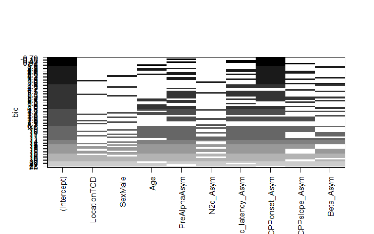<!-- -->


