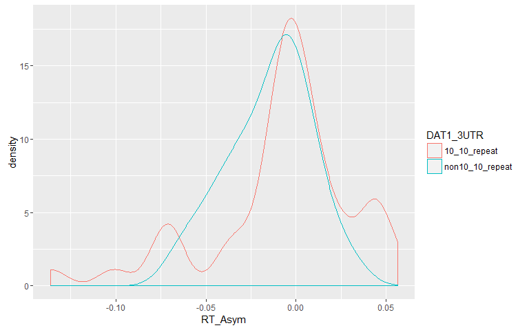
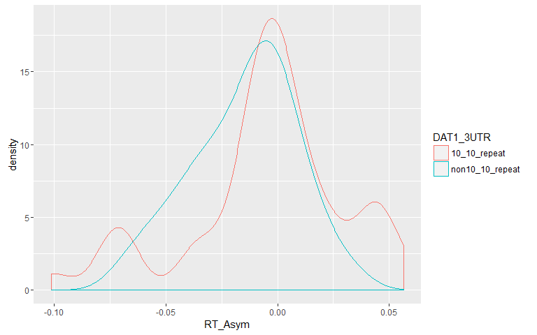
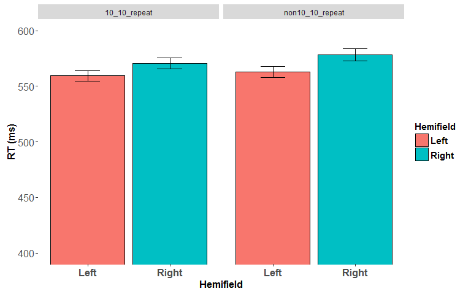
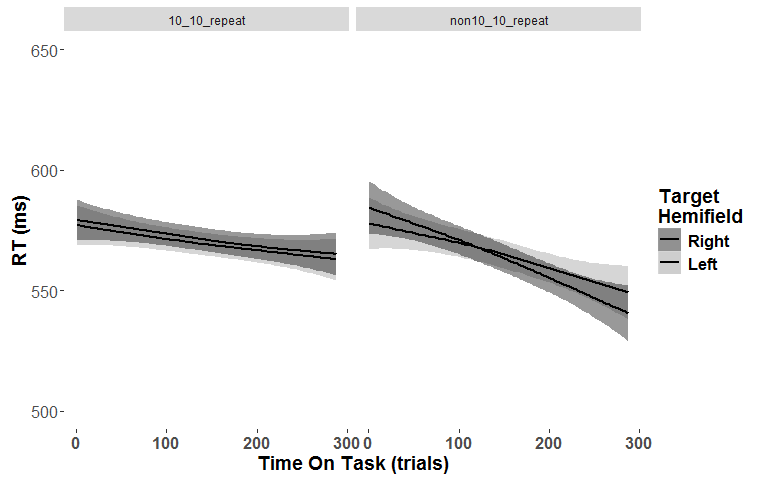

# BigDots
Daniel Newman  
12 June 2016  


#t-tests for the relationship between DAT1 3UTR genotype and all of the Asymmetry measures (i.e. RT, N2, CPP and SLF asymmetry) 
<!-- --><!-- -->

```
## $AD_LI_SLF1
## 
## 	Welch Two Sample t-test
## 
## data:  x by Asym_data_wide$DAT1_3UTR
## t = -2.1486, df = 46.56, p-value = 0.0369
## alternative hypothesis: true difference in means is not equal to 0
## 95 percent confidence interval:
##  -0.0087725488 -0.0002875767
## sample estimates:
##    mean in group 10_10_repeat mean in group non10_10_repeat 
##                 -0.0002864883                  0.0042435744 
## 
## 
## $AD_LI_SLF2
## 
## 	Welch Two Sample t-test
## 
## data:  x by Asym_data_wide$DAT1_3UTR
## t = -1.3879, df = 47.214, p-value = 0.1717
## alternative hypothesis: true difference in means is not equal to 0
## 95 percent confidence interval:
##  -0.006837756  0.001254272
## sample estimates:
##    mean in group 10_10_repeat mean in group non10_10_repeat 
##                   0.005253250                   0.008044992 
## 
## 
## $AD_LI_SLF3
## 
## 	Welch Two Sample t-test
## 
## data:  x by Asym_data_wide$DAT1_3UTR
## t = -1.0559, df = 48.617, p-value = 0.2962
## alternative hypothesis: true difference in means is not equal to 0
## 95 percent confidence interval:
##  -0.005700369  0.001773908
## sample estimates:
##    mean in group 10_10_repeat mean in group non10_10_repeat 
##                  0.0005388862                  0.0025021170 
## 
## 
## $FA_LI_SLF1
## 
## 	Welch Two Sample t-test
## 
## data:  x by Asym_data_wide$DAT1_3UTR
## t = -0.97611, df = 49.861, p-value = 0.3337
## alternative hypothesis: true difference in means is not equal to 0
## 95 percent confidence interval:
##  -0.027985327  0.009681501
## sample estimates:
##    mean in group 10_10_repeat mean in group non10_10_repeat 
##                    0.01156846                    0.02072037 
## 
## 
## $FA_LI_SLF2
## 
## 	Welch Two Sample t-test
## 
## data:  x by Asym_data_wide$DAT1_3UTR
## t = -0.71516, df = 49.998, p-value = 0.4778
## alternative hypothesis: true difference in means is not equal to 0
## 95 percent confidence interval:
##  -0.019139767  0.009088766
## sample estimates:
##    mean in group 10_10_repeat mean in group non10_10_repeat 
##                   -0.02942435                   -0.02439885 
## 
## 
## $FA_LI_SLF3
## 
## 	Welch Two Sample t-test
## 
## data:  x by Asym_data_wide$DAT1_3UTR
## t = 0.80967, df = 49.439, p-value = 0.422
## alternative hypothesis: true difference in means is not equal to 0
## 95 percent confidence interval:
##  -0.006606001  0.015524537
## sample estimates:
##    mean in group 10_10_repeat mean in group non10_10_repeat 
##                   -0.06885681                   -0.07331608 
## 
## 
## $MD_LI_SLF1
## 
## 	Welch Two Sample t-test
## 
## data:  x by Asym_data_wide$DAT1_3UTR
## t = -0.1197, df = 48.249, p-value = 0.9052
## alternative hypothesis: true difference in means is not equal to 0
## 95 percent confidence interval:
##  -0.006654318  0.005906458
## sample estimates:
##    mean in group 10_10_repeat mean in group non10_10_repeat 
##                  -0.005402495                  -0.005028565 
## 
## 
## $MD_LI_SLF2
## 
## 	Welch Two Sample t-test
## 
## data:  x by Asym_data_wide$DAT1_3UTR
## t = 0.0047252, df = 49.499, p-value = 0.9962
## alternative hypothesis: true difference in means is not equal to 0
## 95 percent confidence interval:
##  -0.006772793  0.006804727
## sample estimates:
##    mean in group 10_10_repeat mean in group non10_10_repeat 
##                    0.01630615                    0.01629019 
## 
## 
## $MD_LI_SLF3
## 
## 	Welch Two Sample t-test
## 
## data:  x by Asym_data_wide$DAT1_3UTR
## t = -1.324, df = 49.94, p-value = 0.1915
## alternative hypothesis: true difference in means is not equal to 0
## 95 percent confidence interval:
##  -0.008456669  0.001737260
## sample estimates:
##    mean in group 10_10_repeat mean in group non10_10_repeat 
##                    0.02545215                    0.02881185 
## 
## 
## $RD_LI_SLF1
## 
## 	Welch Two Sample t-test
## 
## data:  x by Asym_data_wide$DAT1_3UTR
## t = 0.51451, df = 48.675, p-value = 0.6092
## alternative hypothesis: true difference in means is not equal to 0
## 95 percent confidence interval:
##  -0.009478012  0.016000011
## sample estimates:
##    mean in group 10_10_repeat mean in group non10_10_repeat 
##                   -0.01027626                   -0.01353726 
## 
## 
## $RD_LI_SLF2
## 
## 	Welch Two Sample t-test
## 
## data:  x by Asym_data_wide$DAT1_3UTR
## t = 0.44823, df = 49.957, p-value = 0.6559
## alternative hypothesis: true difference in means is not equal to 0
## 95 percent confidence interval:
##  -0.008444615  0.013296129
## sample estimates:
##    mean in group 10_10_repeat mean in group non10_10_repeat 
##                    0.02604570                    0.02361994 
## 
## 
## $RD_LI_SLF3
## 
## 	Welch Two Sample t-test
## 
## data:  x by Asym_data_wide$DAT1_3UTR
## t = -1.1252, df = 49.433, p-value = 0.2659
## alternative hypothesis: true difference in means is not equal to 0
## 95 percent confidence interval:
##  -0.012628370  0.003561414
## sample estimates:
##    mean in group 10_10_repeat mean in group non10_10_repeat 
##                    0.04697796                    0.05151144 
## 
## 
## $VOL_LI_SLF1
## 
## 	Welch Two Sample t-test
## 
## data:  x by Asym_data_wide$DAT1_3UTR
## t = -0.55465, df = 49.757, p-value = 0.5816
## alternative hypothesis: true difference in means is not equal to 0
## 95 percent confidence interval:
##  -0.12839636  0.07283419
## sample estimates:
##    mean in group 10_10_repeat mean in group non10_10_repeat 
##                   -0.02482211                    0.00295898 
## 
## 
## $VOL_LI_SLF2
## 
## 	Welch Two Sample t-test
## 
## data:  x by Asym_data_wide$DAT1_3UTR
## t = -0.55656, df = 49.885, p-value = 0.5803
## alternative hypothesis: true difference in means is not equal to 0
## 95 percent confidence interval:
##  -0.2014593  0.1140406
## sample estimates:
##    mean in group 10_10_repeat mean in group non10_10_repeat 
##                     0.1119914                     0.1557008 
## 
## 
## $VOL_LI_SLF3
## 
## 	Welch Two Sample t-test
## 
## data:  x by Asym_data_wide$DAT1_3UTR
## t = -1.4497, df = 43.972, p-value = 0.1542
## alternative hypothesis: true difference in means is not equal to 0
## 95 percent confidence interval:
##  -0.10587145  0.01728433
## sample estimates:
##    mean in group 10_10_repeat mean in group non10_10_repeat 
##                     0.3242392                     0.3685328 
## 
## 
## $CPPonset_Asym
## 
## 	Welch Two Sample t-test
## 
## data:  x by Asym_data_wide$DAT1_3UTR
## t = -0.49888, df = 73.427, p-value = 0.6194
## alternative hypothesis: true difference in means is not equal to 0
## 95 percent confidence interval:
##  -0.06309730  0.03783099
## sample estimates:
##    mean in group 10_10_repeat mean in group non10_10_repeat 
##                   -0.04250616                   -0.02987301 
## 
## 
## $CPPslope_Asym
## 
## 	Welch Two Sample t-test
## 
## data:  x by Asym_data_wide$DAT1_3UTR
## t = -1.6582, df = 75, p-value = 0.1015
## alternative hypothesis: true difference in means is not equal to 0
## 95 percent confidence interval:
##  -0.15231225  0.01393283
## sample estimates:
##    mean in group 10_10_repeat mean in group non10_10_repeat 
##                   -0.04504254                    0.02414717 
## 
## 
## $N2c_Asym
## 
## 	Welch Two Sample t-test
## 
## data:  x by Asym_data_wide$DAT1_3UTR
## t = 0.10775, df = 71.607, p-value = 0.9145
## alternative hypothesis: true difference in means is not equal to 0
## 95 percent confidence interval:
##  -0.2983006  0.3323855
## sample estimates:
##    mean in group 10_10_repeat mean in group non10_10_repeat 
##                    0.06472296                    0.04768050 
## 
## 
## $N2c_latency_Asym
## 
## 	Welch Two Sample t-test
## 
## data:  x by Asym_data_wide$DAT1_3UTR
## t = 0.71208, df = 73.678, p-value = 0.4787
## alternative hypothesis: true difference in means is not equal to 0
## 95 percent confidence interval:
##  -0.02087869  0.04409773
## sample estimates:
##    mean in group 10_10_repeat mean in group non10_10_repeat 
##                  -0.004143108                  -0.015752627 
## 
## 
## $N2i_Asym
## 
## 	Welch Two Sample t-test
## 
## data:  x by Asym_data_wide$DAT1_3UTR
## t = -0.56534, df = 45.814, p-value = 0.5746
## alternative hypothesis: true difference in means is not equal to 0
## 95 percent confidence interval:
##  -2.139919  1.201545
## sample estimates:
##    mean in group 10_10_repeat mean in group non10_10_repeat 
##                    -0.5858428                    -0.1166557 
## 
## 
## $N2i_latency_Asym
## 
## 	Welch Two Sample t-test
## 
## data:  x by Asym_data_wide$DAT1_3UTR
## t = 0.95515, df = 75.676, p-value = 0.3425
## alternative hypothesis: true difference in means is not equal to 0
## 95 percent confidence interval:
##  -0.03393959  0.09648179
## sample estimates:
##    mean in group 10_10_repeat mean in group non10_10_repeat 
##                    0.01215817                   -0.01911292 
## 
## 
## $RT_Asym
## 
## 	Welch Two Sample t-test
## 
## data:  x by Asym_data_wide$DAT1_3UTR
## t = 1.3373, df = 68.189, p-value = 0.1856
## alternative hypothesis: true difference in means is not equal to 0
## 95 percent confidence interval:
##  -0.004445129  0.022511926
## sample estimates:
##    mean in group 10_10_repeat mean in group non10_10_repeat 
##                   -0.00571419                   -0.01474759
```


###So the above ^ shows that there AD_LI_SLF1 is the only asymmetry measure with significant relationship with DAT1 genotype

#Test relationship between N2_Asym, CPP_Asym, RT_Asym and SLF (SLF I, II add III) Asym


```
## Call:corr.test(x = data_for_cor, method = "pearson", adjust = "none", 
##     alpha = 0.05, ci = TRUE)
## Correlation matrix 
##                  RT_Asym N2c_Asym N2c_latency_Asym N2i_Asym
## RT_Asym             1.00    -0.03             0.31    -0.05
## N2c_Asym           -0.03     1.00            -0.06     0.00
## N2c_latency_Asym    0.31    -0.06             1.00     0.13
## N2i_Asym           -0.05     0.00             0.13     1.00
## N2i_latency_Asym   -0.02     0.00            -0.25     0.17
## CPPonset_Asym       0.25    -0.26            -0.16    -0.10
## CPPslope_Asym       0.01    -0.07             0.07     0.04
## AD_LI_SLF1         -0.32    -0.15            -0.11    -0.07
## AD_LI_SLF2         -0.06    -0.31             0.05    -0.15
## AD_LI_SLF3          0.25    -0.08             0.06    -0.05
## FA_LI_SLF1         -0.22     0.19            -0.08    -0.34
## FA_LI_SLF2         -0.16     0.10             0.08     0.07
## FA_LI_SLF3          0.04     0.02             0.09     0.10
## MD_LI_SLF1          0.07    -0.33             0.00     0.37
## MD_LI_SLF2          0.13    -0.28            -0.01    -0.12
## MD_LI_SLF3          0.16    -0.09            -0.04    -0.11
## RD_LI_SLF1          0.17    -0.27             0.04     0.37
## RD_LI_SLF2          0.17    -0.22            -0.03    -0.09
## RD_LI_SLF3          0.08    -0.07            -0.08    -0.09
## VOL_LI_SLF1        -0.09    -0.35             0.09     0.09
## VOL_LI_SLF2        -0.03    -0.21             0.12     0.17
## VOL_LI_SLF3        -0.03    -0.11            -0.06     0.03
##                  N2i_latency_Asym CPPonset_Asym CPPslope_Asym AD_LI_SLF1
## RT_Asym                     -0.02          0.25          0.01      -0.32
## N2c_Asym                     0.00         -0.26         -0.07      -0.15
## N2c_latency_Asym            -0.25         -0.16          0.07      -0.11
## N2i_Asym                     0.17         -0.10          0.04      -0.07
## N2i_latency_Asym             1.00         -0.02         -0.09       0.03
## CPPonset_Asym               -0.02          1.00          0.12       0.14
## CPPslope_Asym               -0.09          0.12          1.00       0.07
## AD_LI_SLF1                   0.03          0.14          0.07       1.00
## AD_LI_SLF2                  -0.04          0.01          0.11       0.36
## AD_LI_SLF3                  -0.06          0.09          0.07       0.17
## FA_LI_SLF1                  -0.13         -0.08         -0.22       0.55
## FA_LI_SLF2                   0.06         -0.29          0.13       0.17
## FA_LI_SLF3                  -0.02          0.02          0.18      -0.08
## MD_LI_SLF1                   0.19          0.20          0.33       0.00
## MD_LI_SLF2                  -0.09          0.28         -0.04       0.06
## MD_LI_SLF3                  -0.01          0.08         -0.06       0.18
## RD_LI_SLF1                   0.17          0.15          0.28      -0.32
## RD_LI_SLF2                  -0.09          0.31         -0.09      -0.05
## RD_LI_SLF3                   0.01          0.06         -0.09       0.16
## VOL_LI_SLF1                  0.06         -0.01          0.17      -0.07
## VOL_LI_SLF2                 -0.08          0.03          0.29       0.17
## VOL_LI_SLF3                  0.07          0.12          0.26       0.19
##                  AD_LI_SLF2 AD_LI_SLF3 FA_LI_SLF1 FA_LI_SLF2 FA_LI_SLF3
## RT_Asym               -0.06       0.25      -0.22      -0.16       0.04
## N2c_Asym              -0.31      -0.08       0.19       0.10       0.02
## N2c_latency_Asym       0.05       0.06      -0.08       0.08       0.09
## N2i_Asym              -0.15      -0.05      -0.34       0.07       0.10
## N2i_latency_Asym      -0.04      -0.06      -0.13       0.06      -0.02
## CPPonset_Asym          0.01       0.09      -0.08      -0.29       0.02
## CPPslope_Asym          0.11       0.07      -0.22       0.13       0.18
## AD_LI_SLF1             0.36       0.17       0.55       0.17      -0.08
## AD_LI_SLF2             1.00       0.42       0.04      -0.03      -0.02
## AD_LI_SLF3             0.42       1.00       0.01       0.05       0.17
## FA_LI_SLF1             0.04       0.01       1.00       0.26      -0.24
## FA_LI_SLF2            -0.03       0.05       0.26       1.00       0.06
## FA_LI_SLF3            -0.02       0.17      -0.24       0.06       1.00
## MD_LI_SLF1             0.20       0.09      -0.83      -0.19       0.23
## MD_LI_SLF2             0.62       0.20      -0.17      -0.79      -0.05
## MD_LI_SLF3             0.31       0.56       0.21      -0.01      -0.70
## RD_LI_SLF1             0.08       0.03      -0.96      -0.23       0.24
## RD_LI_SLF2             0.39       0.10      -0.21      -0.92      -0.06
## RD_LI_SLF3             0.19       0.25       0.25      -0.03      -0.88
## VOL_LI_SLF1            0.28       0.00      -0.61      -0.23       0.05
## VOL_LI_SLF2            0.44       0.09      -0.23      -0.36       0.05
## VOL_LI_SLF3            0.31      -0.03       0.01       0.06      -0.39
##                  MD_LI_SLF1 MD_LI_SLF2 MD_LI_SLF3 RD_LI_SLF1 RD_LI_SLF2
## RT_Asym                0.07       0.13       0.16       0.17       0.17
## N2c_Asym              -0.33      -0.28      -0.09      -0.27      -0.22
## N2c_latency_Asym       0.00      -0.01      -0.04       0.04      -0.03
## N2i_Asym               0.37      -0.12      -0.11       0.37      -0.09
## N2i_latency_Asym       0.19      -0.09      -0.01       0.17      -0.09
## CPPonset_Asym          0.20       0.28       0.08       0.15       0.31
## CPPslope_Asym          0.33      -0.04      -0.06       0.28      -0.09
## AD_LI_SLF1             0.00       0.06       0.18      -0.32      -0.05
## AD_LI_SLF2             0.20       0.62       0.31       0.08       0.39
## AD_LI_SLF3             0.09       0.20       0.56       0.03       0.10
## FA_LI_SLF1            -0.83      -0.17       0.21      -0.96      -0.21
## FA_LI_SLF2            -0.19      -0.79      -0.01      -0.23      -0.92
## FA_LI_SLF3             0.23      -0.05      -0.70       0.24      -0.06
## MD_LI_SLF1             1.00       0.24      -0.14       0.95       0.22
## MD_LI_SLF2             0.24       1.00       0.19       0.22       0.96
## MD_LI_SLF3            -0.14       0.19       1.00      -0.19       0.12
## RD_LI_SLF1             0.95       0.22      -0.19       1.00       0.22
## RD_LI_SLF2             0.22       0.96       0.12       0.22       1.00
## RD_LI_SLF3            -0.20       0.14       0.94      -0.23       0.10
## VOL_LI_SLF1            0.67       0.31      -0.04       0.67       0.27
## VOL_LI_SLF2            0.37       0.55      -0.02       0.29       0.49
## VOL_LI_SLF3            0.15       0.15       0.29       0.08       0.07
##                  RD_LI_SLF3 VOL_LI_SLF1 VOL_LI_SLF2 VOL_LI_SLF3
## RT_Asym                0.08       -0.09       -0.03       -0.03
## N2c_Asym              -0.07       -0.35       -0.21       -0.11
## N2c_latency_Asym      -0.08        0.09        0.12       -0.06
## N2i_Asym              -0.09        0.09        0.17        0.03
## N2i_latency_Asym       0.01        0.06       -0.08        0.07
## CPPonset_Asym          0.06       -0.01        0.03        0.12
## CPPslope_Asym         -0.09        0.17        0.29        0.26
## AD_LI_SLF1             0.16       -0.07        0.17        0.19
## AD_LI_SLF2             0.19        0.28        0.44        0.31
## AD_LI_SLF3             0.25        0.00        0.09       -0.03
## FA_LI_SLF1             0.25       -0.61       -0.23        0.01
## FA_LI_SLF2            -0.03       -0.23       -0.36        0.06
## FA_LI_SLF3            -0.88        0.05        0.05       -0.39
## MD_LI_SLF1            -0.20        0.67        0.37        0.15
## MD_LI_SLF2             0.14        0.31        0.55        0.15
## MD_LI_SLF3             0.94       -0.04       -0.02        0.29
## RD_LI_SLF1            -0.23        0.67        0.29        0.08
## RD_LI_SLF2             0.10        0.27        0.49        0.07
## RD_LI_SLF3             1.00       -0.04       -0.05        0.35
## VOL_LI_SLF1           -0.04        1.00        0.42        0.19
## VOL_LI_SLF2           -0.05        0.42        1.00        0.40
## VOL_LI_SLF3            0.35        0.19        0.40        1.00
## Sample Size 
##                  RT_Asym N2c_Asym N2c_latency_Asym N2i_Asym
## RT_Asym               78       75               75       76
## N2c_Asym              75       76               74       74
## N2c_latency_Asym      75       74               76       75
## N2i_Asym              76       74               75       77
## N2i_latency_Asym      78       76               76       77
## CPPonset_Asym         77       75               75       76
## CPPslope_Asym         76       74               74       75
## AD_LI_SLF1            51       49               51       51
## AD_LI_SLF2            51       49               51       51
## AD_LI_SLF3            51       49               51       51
## FA_LI_SLF1            51       49               51       51
## FA_LI_SLF2            51       49               51       51
## FA_LI_SLF3            51       49               51       51
## MD_LI_SLF1            51       49               51       51
## MD_LI_SLF2            51       49               51       51
## MD_LI_SLF3            51       49               51       51
## RD_LI_SLF1            51       49               51       51
## RD_LI_SLF2            51       49               51       51
## RD_LI_SLF3            51       49               51       51
## VOL_LI_SLF1           51       49               51       51
## VOL_LI_SLF2           51       49               51       51
## VOL_LI_SLF3           51       49               51       51
##                  N2i_latency_Asym CPPonset_Asym CPPslope_Asym AD_LI_SLF1
## RT_Asym                        78            77            76         51
## N2c_Asym                       76            75            74         49
## N2c_latency_Asym               76            75            74         51
## N2i_Asym                       77            76            75         51
## N2i_latency_Asym               79            78            77         52
## CPPonset_Asym                  78            78            76         52
## CPPslope_Asym                  77            76            77         50
## AD_LI_SLF1                     52            52            50         52
## AD_LI_SLF2                     52            52            50         52
## AD_LI_SLF3                     52            52            50         52
## FA_LI_SLF1                     52            52            50         52
## FA_LI_SLF2                     52            52            50         52
## FA_LI_SLF3                     52            52            50         52
## MD_LI_SLF1                     52            52            50         52
## MD_LI_SLF2                     52            52            50         52
## MD_LI_SLF3                     52            52            50         52
## RD_LI_SLF1                     52            52            50         52
## RD_LI_SLF2                     52            52            50         52
## RD_LI_SLF3                     52            52            50         52
## VOL_LI_SLF1                    52            52            50         52
## VOL_LI_SLF2                    52            52            50         52
## VOL_LI_SLF3                    52            52            50         52
##                  AD_LI_SLF2 AD_LI_SLF3 FA_LI_SLF1 FA_LI_SLF2 FA_LI_SLF3
## RT_Asym                  51         51         51         51         51
## N2c_Asym                 49         49         49         49         49
## N2c_latency_Asym         51         51         51         51         51
## N2i_Asym                 51         51         51         51         51
## N2i_latency_Asym         52         52         52         52         52
## CPPonset_Asym            52         52         52         52         52
## CPPslope_Asym            50         50         50         50         50
## AD_LI_SLF1               52         52         52         52         52
## AD_LI_SLF2               52         52         52         52         52
## AD_LI_SLF3               52         52         52         52         52
## FA_LI_SLF1               52         52         52         52         52
## FA_LI_SLF2               52         52         52         52         52
## FA_LI_SLF3               52         52         52         52         52
## MD_LI_SLF1               52         52         52         52         52
## MD_LI_SLF2               52         52         52         52         52
## MD_LI_SLF3               52         52         52         52         52
## RD_LI_SLF1               52         52         52         52         52
## RD_LI_SLF2               52         52         52         52         52
## RD_LI_SLF3               52         52         52         52         52
## VOL_LI_SLF1              52         52         52         52         52
## VOL_LI_SLF2              52         52         52         52         52
## VOL_LI_SLF3              52         52         52         52         52
##                  MD_LI_SLF1 MD_LI_SLF2 MD_LI_SLF3 RD_LI_SLF1 RD_LI_SLF2
## RT_Asym                  51         51         51         51         51
## N2c_Asym                 49         49         49         49         49
## N2c_latency_Asym         51         51         51         51         51
## N2i_Asym                 51         51         51         51         51
## N2i_latency_Asym         52         52         52         52         52
## CPPonset_Asym            52         52         52         52         52
## CPPslope_Asym            50         50         50         50         50
## AD_LI_SLF1               52         52         52         52         52
## AD_LI_SLF2               52         52         52         52         52
## AD_LI_SLF3               52         52         52         52         52
## FA_LI_SLF1               52         52         52         52         52
## FA_LI_SLF2               52         52         52         52         52
## FA_LI_SLF3               52         52         52         52         52
## MD_LI_SLF1               52         52         52         52         52
## MD_LI_SLF2               52         52         52         52         52
## MD_LI_SLF3               52         52         52         52         52
## RD_LI_SLF1               52         52         52         52         52
## RD_LI_SLF2               52         52         52         52         52
## RD_LI_SLF3               52         52         52         52         52
## VOL_LI_SLF1              52         52         52         52         52
## VOL_LI_SLF2              52         52         52         52         52
## VOL_LI_SLF3              52         52         52         52         52
##                  RD_LI_SLF3 VOL_LI_SLF1 VOL_LI_SLF2 VOL_LI_SLF3
## RT_Asym                  51          51          51          51
## N2c_Asym                 49          49          49          49
## N2c_latency_Asym         51          51          51          51
## N2i_Asym                 51          51          51          51
## N2i_latency_Asym         52          52          52          52
## CPPonset_Asym            52          52          52          52
## CPPslope_Asym            50          50          50          50
## AD_LI_SLF1               52          52          52          52
## AD_LI_SLF2               52          52          52          52
## AD_LI_SLF3               52          52          52          52
## FA_LI_SLF1               52          52          52          52
## FA_LI_SLF2               52          52          52          52
## FA_LI_SLF3               52          52          52          52
## MD_LI_SLF1               52          52          52          52
## MD_LI_SLF2               52          52          52          52
## MD_LI_SLF3               52          52          52          52
## RD_LI_SLF1               52          52          52          52
## RD_LI_SLF2               52          52          52          52
## RD_LI_SLF3               52          52          52          52
## VOL_LI_SLF1              52          52          52          52
## VOL_LI_SLF2              52          52          52          52
## VOL_LI_SLF3              52          52          52          52
## Probability values (Entries above the diagonal are adjusted for multiple tests.) 
##                  RT_Asym N2c_Asym N2c_latency_Asym N2i_Asym
## RT_Asym             0.00     0.83             0.01     0.68
## N2c_Asym            0.83     0.00             0.60     0.98
## N2c_latency_Asym    0.01     0.60             0.00     0.26
## N2i_Asym            0.68     0.98             0.26     0.00
## N2i_latency_Asym    0.89     1.00             0.03     0.14
## CPPonset_Asym       0.03     0.02             0.16     0.37
## CPPslope_Asym       0.94     0.53             0.53     0.71
## AD_LI_SLF1          0.02     0.29             0.44     0.61
## AD_LI_SLF2          0.67     0.03             0.71     0.30
## AD_LI_SLF3          0.07     0.60             0.69     0.73
## FA_LI_SLF1          0.13     0.18             0.58     0.01
## FA_LI_SLF2          0.27     0.51             0.56     0.62
## FA_LI_SLF3          0.78     0.88             0.53     0.48
## MD_LI_SLF1          0.65     0.02             0.98     0.01
## MD_LI_SLF2          0.37     0.05             0.92     0.40
## MD_LI_SLF3          0.26     0.56             0.76     0.44
## RD_LI_SLF1          0.24     0.06             0.78     0.01
## RD_LI_SLF2          0.23     0.13             0.85     0.51
## RD_LI_SLF3          0.57     0.64             0.58     0.51
## VOL_LI_SLF1         0.55     0.01             0.54     0.52
## VOL_LI_SLF2         0.81     0.14             0.40     0.23
## VOL_LI_SLF3         0.81     0.46             0.69     0.81
##                  N2i_latency_Asym CPPonset_Asym CPPslope_Asym AD_LI_SLF1
## RT_Asym                      0.89          0.03          0.94       0.02
## N2c_Asym                     1.00          0.02          0.53       0.29
## N2c_latency_Asym             0.03          0.16          0.53       0.44
## N2i_Asym                     0.14          0.37          0.71       0.61
## N2i_latency_Asym             0.00          0.84          0.42       0.84
## CPPonset_Asym                0.84          0.00          0.31       0.33
## CPPslope_Asym                0.42          0.31          0.00       0.61
## AD_LI_SLF1                   0.84          0.33          0.61       0.00
## AD_LI_SLF2                   0.76          0.95          0.44       0.01
## AD_LI_SLF3                   0.65          0.51          0.65       0.22
## FA_LI_SLF1                   0.38          0.59          0.12       0.00
## FA_LI_SLF2                   0.67          0.03          0.35       0.23
## FA_LI_SLF3                   0.89          0.88          0.22       0.59
## MD_LI_SLF1                   0.17          0.15          0.02       1.00
## MD_LI_SLF2                   0.54          0.05          0.77       0.69
## MD_LI_SLF3                   0.96          0.56          0.66       0.21
## RD_LI_SLF1                   0.24          0.28          0.05       0.02
## RD_LI_SLF2                   0.51          0.02          0.52       0.71
## RD_LI_SLF3                   0.92          0.67          0.55       0.27
## VOL_LI_SLF1                  0.67          0.96          0.23       0.64
## VOL_LI_SLF2                  0.55          0.82          0.04       0.22
## VOL_LI_SLF3                  0.64          0.38          0.07       0.18
##                  AD_LI_SLF2 AD_LI_SLF3 FA_LI_SLF1 FA_LI_SLF2 FA_LI_SLF3
## RT_Asym                0.67       0.07       0.13       0.27       0.78
## N2c_Asym               0.03       0.60       0.18       0.51       0.88
## N2c_latency_Asym       0.71       0.69       0.58       0.56       0.53
## N2i_Asym               0.30       0.73       0.01       0.62       0.48
## N2i_latency_Asym       0.76       0.65       0.38       0.67       0.89
## CPPonset_Asym          0.95       0.51       0.59       0.03       0.88
## CPPslope_Asym          0.44       0.65       0.12       0.35       0.22
## AD_LI_SLF1             0.01       0.22       0.00       0.23       0.59
## AD_LI_SLF2             0.00       0.00       0.78       0.85       0.88
## AD_LI_SLF3             0.00       0.00       0.96       0.70       0.23
## FA_LI_SLF1             0.78       0.96       0.00       0.06       0.08
## FA_LI_SLF2             0.85       0.70       0.06       0.00       0.66
## FA_LI_SLF3             0.88       0.23       0.08       0.66       0.00
## MD_LI_SLF1             0.15       0.53       0.00       0.18       0.10
## MD_LI_SLF2             0.00       0.15       0.23       0.00       0.70
## MD_LI_SLF3             0.03       0.00       0.14       0.93       0.00
## RD_LI_SLF1             0.56       0.81       0.00       0.10       0.08
## RD_LI_SLF2             0.00       0.48       0.14       0.00       0.67
## RD_LI_SLF3             0.17       0.07       0.08       0.81       0.00
## VOL_LI_SLF1            0.05       0.98       0.00       0.10       0.72
## VOL_LI_SLF2            0.00       0.52       0.10       0.01       0.70
## VOL_LI_SLF3            0.03       0.81       0.93       0.65       0.00
##                  MD_LI_SLF1 MD_LI_SLF2 MD_LI_SLF3 RD_LI_SLF1 RD_LI_SLF2
## RT_Asym                0.65       0.37       0.26       0.24       0.23
## N2c_Asym               0.02       0.05       0.56       0.06       0.13
## N2c_latency_Asym       0.98       0.92       0.76       0.78       0.85
## N2i_Asym               0.01       0.40       0.44       0.01       0.51
## N2i_latency_Asym       0.17       0.54       0.96       0.24       0.51
## CPPonset_Asym          0.15       0.05       0.56       0.28       0.02
## CPPslope_Asym          0.02       0.77       0.66       0.05       0.52
## AD_LI_SLF1             1.00       0.69       0.21       0.02       0.71
## AD_LI_SLF2             0.15       0.00       0.03       0.56       0.00
## AD_LI_SLF3             0.53       0.15       0.00       0.81       0.48
## FA_LI_SLF1             0.00       0.23       0.14       0.00       0.14
## FA_LI_SLF2             0.18       0.00       0.93       0.10       0.00
## FA_LI_SLF3             0.10       0.70       0.00       0.08       0.67
## MD_LI_SLF1             0.00       0.08       0.31       0.00       0.12
## MD_LI_SLF2             0.08       0.00       0.19       0.12       0.00
## MD_LI_SLF3             0.31       0.19       0.00       0.18       0.40
## RD_LI_SLF1             0.00       0.12       0.18       0.00       0.11
## RD_LI_SLF2             0.12       0.00       0.40       0.11       0.00
## RD_LI_SLF3             0.16       0.33       0.00       0.10       0.48
## VOL_LI_SLF1            0.00       0.03       0.78       0.00       0.05
## VOL_LI_SLF2            0.01       0.00       0.87       0.04       0.00
## VOL_LI_SLF3            0.30       0.29       0.04       0.57       0.62
##                  RD_LI_SLF3 VOL_LI_SLF1 VOL_LI_SLF2 VOL_LI_SLF3
## RT_Asym                0.57        0.55        0.81        0.81
## N2c_Asym               0.64        0.01        0.14        0.46
## N2c_latency_Asym       0.58        0.54        0.40        0.69
## N2i_Asym               0.51        0.52        0.23        0.81
## N2i_latency_Asym       0.92        0.67        0.55        0.64
## CPPonset_Asym          0.67        0.96        0.82        0.38
## CPPslope_Asym          0.55        0.23        0.04        0.07
## AD_LI_SLF1             0.27        0.64        0.22        0.18
## AD_LI_SLF2             0.17        0.05        0.00        0.03
## AD_LI_SLF3             0.07        0.98        0.52        0.81
## FA_LI_SLF1             0.08        0.00        0.10        0.93
## FA_LI_SLF2             0.81        0.10        0.01        0.65
## FA_LI_SLF3             0.00        0.72        0.70        0.00
## MD_LI_SLF1             0.16        0.00        0.01        0.30
## MD_LI_SLF2             0.33        0.03        0.00        0.29
## MD_LI_SLF3             0.00        0.78        0.87        0.04
## RD_LI_SLF1             0.10        0.00        0.04        0.57
## RD_LI_SLF2             0.48        0.05        0.00        0.62
## RD_LI_SLF3             0.00        0.78        0.70        0.01
## VOL_LI_SLF1            0.78        0.00        0.00        0.19
## VOL_LI_SLF2            0.70        0.00        0.00        0.00
## VOL_LI_SLF3            0.01        0.19        0.00        0.00
## 
##  To see confidence intervals of the correlations, print with the short=FALSE option
## 
##  Confidence intervals based upon normal theory.  To get bootstrapped values, try cor.ci
##                         lower     r upper    p
## RT_As-N2c_A             -0.25 -0.03  0.20 0.83
## RT_As-N2c__A             0.09  0.31  0.50 0.01
## RT_As-N2_As             -0.27 -0.05  0.18 0.68
## RT_As-N2_l_A            -0.24 -0.02  0.21 0.89
## RT_As-CPPn_A             0.03  0.25  0.45 0.03
## RT_As-CPPs_A            -0.22  0.01  0.23 0.94
## RT_As-AD_LI_SLF1        -0.55 -0.32 -0.05 0.02
## RT_As-AD_LI_SLF2        -0.33 -0.06  0.22 0.67
## RT_As-AD_LI_SLF3        -0.02  0.25  0.49 0.07
## RT_As-FA_LI_SLF1        -0.46 -0.22  0.06 0.13
## RT_As-FA_LI_SLF2        -0.41 -0.16  0.12 0.27
## RT_As-FA_LI_SLF3        -0.24  0.04  0.31 0.78
## RT_As-MD_LI_SLF1        -0.21  0.07  0.34 0.65
## RT_As-MD_LI_SLF2        -0.15  0.13  0.39 0.37
## RT_As-MD_LI_SLF3        -0.12  0.16  0.42 0.26
## RT_As-RD_LI_SLF1        -0.11  0.17  0.42 0.24
## RT_As-RD_LI_SLF2        -0.11  0.17  0.43 0.23
## RT_As-RD_LI_SLF3        -0.20  0.08  0.35 0.57
## RT_As-VOL_LI_SLF1       -0.35 -0.09  0.19 0.55
## RT_As-VOL_LI_SLF2       -0.31 -0.03  0.24 0.81
## RT_As-VOL_LI_SLF3       -0.31 -0.03  0.24 0.81
## N2c_A-N2c__A            -0.29 -0.06  0.17 0.60
## N2c_A-N2_As             -0.23  0.00  0.23 0.98
## N2c_A-N2_l_A            -0.23  0.00  0.22 1.00
## N2c_A-CPPn_A            -0.46 -0.26 -0.04 0.02
## N2c_A-CPPs_A            -0.30 -0.07  0.16 0.53
## N2c_A-AD_LI_SLF1        -0.42 -0.15  0.13 0.29
## N2c_A-AD_LI_SLF2        -0.54 -0.31 -0.03 0.03
## N2c_A-AD_LI_SLF3        -0.35 -0.08  0.21 0.60
## N2c_A-FA_LI_SLF1        -0.09  0.19  0.45 0.18
## N2c_A-FA_LI_SLF2        -0.19  0.10  0.37 0.51
## N2c_A-FA_LI_SLF3        -0.26  0.02  0.30 0.88
## N2c_A-MD_LI_SLF1        -0.56 -0.33 -0.05 0.02
## N2c_A-MD_LI_SLF2        -0.52 -0.28  0.00 0.05
## N2c_A-MD_LI_SLF3        -0.36 -0.09  0.20 0.56
## N2c_A-RD_LI_SLF1        -0.51 -0.27  0.01 0.06
## N2c_A-RD_LI_SLF2        -0.47 -0.22  0.07 0.13
## N2c_A-RD_LI_SLF3        -0.34 -0.07  0.22 0.64
## N2c_A-VOL_LI_SLF1       -0.58 -0.35 -0.08 0.01
## N2c_A-VOL_LI_SLF2       -0.47 -0.21  0.07 0.14
## N2c_A-VOL_LI_SLF3       -0.38 -0.11  0.18 0.46
## N2c__A-N2_As            -0.10  0.13  0.35 0.26
## N2c__A-N2_l_A           -0.45 -0.25 -0.03 0.03
## N2c__A-CPPn_A           -0.38 -0.16  0.07 0.16
## N2c__A-CPPs_A           -0.16  0.07  0.30 0.53
## N2c__A-AD_LI_SLF1       -0.38 -0.11  0.17 0.44
## N2c__A-AD_LI_SLF2       -0.23  0.05  0.32 0.71
## N2c__A-AD_LI_SLF3       -0.22  0.06  0.33 0.69
## N2c__A-FA_LI_SLF1       -0.35 -0.08  0.20 0.58
## N2c__A-FA_LI_SLF2       -0.20  0.08  0.35 0.56
## N2c__A-FA_LI_SLF3       -0.19  0.09  0.36 0.53
## N2c__A-MD_LI_SLF1       -0.27  0.00  0.28 0.98
## N2c__A-MD_LI_SLF2       -0.29 -0.01  0.26 0.92
## N2c__A-MD_LI_SLF3       -0.32 -0.04  0.23 0.76
## N2c__A-RD_LI_SLF1       -0.24  0.04  0.31 0.78
## N2c__A-RD_LI_SLF2       -0.30 -0.03  0.25 0.85
## N2c__A-RD_LI_SLF3       -0.35 -0.08  0.20 0.58
## N2c__A-VOL_LI_SLF1      -0.19  0.09  0.35 0.54
## N2c__A-VOL_LI_SLF2      -0.16  0.12  0.38 0.40
## N2c__A-VOL_LI_SLF3      -0.33 -0.06  0.22 0.69
## N2_As-N2_l_A            -0.05  0.17  0.38 0.14
## N2_As-CPPn_A            -0.32 -0.10  0.13 0.37
## N2_As-CPPs_A            -0.18  0.04  0.27 0.71
## N2_As-AD_LI_SLF1        -0.34 -0.07  0.21 0.61
## N2_As-AD_LI_SLF2        -0.41 -0.15  0.13 0.30
## N2_As-AD_LI_SLF3        -0.32 -0.05  0.23 0.73
## N2_As-FA_LI_SLF1        -0.56 -0.34 -0.07 0.01
## N2_As-FA_LI_SLF2        -0.21  0.07  0.34 0.62
## N2_As-FA_LI_SLF3        -0.18  0.10  0.37 0.48
## N2_As-MD_LI_SLF1         0.10  0.37  0.58 0.01
## N2_As-MD_LI_SLF2        -0.38 -0.12  0.16 0.40
## N2_As-MD_LI_SLF3        -0.37 -0.11  0.17 0.44
## N2_As-RD_LI_SLF1         0.10  0.37  0.58 0.01
## N2_As-RD_LI_SLF2        -0.36 -0.09  0.19 0.51
## N2_As-RD_LI_SLF3        -0.36 -0.09  0.19 0.51
## N2_As-VOL_LI_SLF1       -0.19  0.09  0.36 0.52
## N2_As-VOL_LI_SLF2       -0.11  0.17  0.43 0.23
## N2_As-VOL_LI_SLF3       -0.24  0.03  0.31 0.81
## N2_l_A-CPPn_A           -0.24 -0.02  0.20 0.84
## N2_l_A-CPPs_A           -0.31 -0.09  0.13 0.42
## N2_l_A-AD_LI_SLF1       -0.25  0.03  0.30 0.84
## N2_l_A-AD_LI_SLF2       -0.31 -0.04  0.23 0.76
## N2_l_A-AD_LI_SLF3       -0.33 -0.06  0.21 0.65
## N2_l_A-FA_LI_SLF1       -0.38 -0.13  0.15 0.38
## N2_l_A-FA_LI_SLF2       -0.22  0.06  0.33 0.67
## N2_l_A-FA_LI_SLF3       -0.29 -0.02  0.25 0.89
## N2_l_A-MD_LI_SLF1       -0.08  0.19  0.44 0.17
## N2_l_A-MD_LI_SLF2       -0.35 -0.09  0.19 0.54
## N2_l_A-MD_LI_SLF3       -0.28 -0.01  0.27 0.96
## N2_l_A-RD_LI_SLF1       -0.11  0.17  0.42 0.24
## N2_l_A-RD_LI_SLF2       -0.36 -0.09  0.18 0.51
## N2_l_A-RD_LI_SLF3       -0.26  0.01  0.29 0.92
## N2_l_A-VOL_LI_SLF1      -0.22  0.06  0.33 0.67
## N2_l_A-VOL_LI_SLF2      -0.35 -0.08  0.19 0.55
## N2_l_A-VOL_LI_SLF3      -0.21  0.07  0.33 0.64
## CPPn_A-CPPs_A           -0.11  0.12  0.34 0.31
## CPPn_A-AD_LI_SLF1       -0.14  0.14  0.40 0.33
## CPPn_A-AD_LI_SLF2       -0.27  0.01  0.28 0.95
## CPPn_A-AD_LI_SLF3       -0.18  0.09  0.36 0.51
## CPPn_A-FA_LI_SLF1       -0.34 -0.08  0.20 0.59
## CPPn_A-FA_LI_SLF2       -0.52 -0.29 -0.02 0.03
## CPPn_A-FA_LI_SLF3       -0.25  0.02  0.29 0.88
## CPPn_A-MD_LI_SLF1       -0.07  0.20  0.45 0.15
## CPPn_A-MD_LI_SLF2        0.00  0.28  0.51 0.05
## CPPn_A-MD_LI_SLF3       -0.19  0.08  0.35 0.56
## CPPn_A-RD_LI_SLF1       -0.12  0.15  0.41 0.28
## CPPn_A-RD_LI_SLF2        0.04  0.31  0.54 0.02
## CPPn_A-RD_LI_SLF3       -0.22  0.06  0.33 0.67
## CPPn_A-VOL_LI_SLF1      -0.28 -0.01  0.27 0.96
## CPPn_A-VOL_LI_SLF2      -0.24  0.03  0.30 0.82
## CPPn_A-VOL_LI_SLF3      -0.15  0.12  0.38 0.38
## CPPs_A-AD_LI_SLF1       -0.21  0.07  0.35 0.61
## CPPs_A-AD_LI_SLF2       -0.17  0.11  0.38 0.44
## CPPs_A-AD_LI_SLF3       -0.22  0.07  0.34 0.65
## CPPs_A-FA_LI_SLF1       -0.47 -0.22  0.06 0.12
## CPPs_A-FA_LI_SLF2       -0.15  0.13  0.40 0.35
## CPPs_A-FA_LI_SLF3       -0.11  0.18  0.43 0.22
## CPPs_A-MD_LI_SLF1        0.05  0.33  0.55 0.02
## CPPs_A-MD_LI_SLF2       -0.32 -0.04  0.24 0.77
## CPPs_A-MD_LI_SLF3       -0.34 -0.06  0.22 0.66
## CPPs_A-RD_LI_SLF1        0.00  0.28  0.52 0.05
## CPPs_A-RD_LI_SLF2       -0.36 -0.09  0.19 0.52
## CPPs_A-RD_LI_SLF3       -0.36 -0.09  0.20 0.55
## CPPs_A-VOL_LI_SLF1      -0.11  0.17  0.43 0.23
## CPPs_A-VOL_LI_SLF2       0.01  0.29  0.52 0.04
## CPPs_A-VOL_LI_SLF3      -0.02  0.26  0.50 0.07
## AD_LI_SLF1-AD_LI_SLF2    0.09  0.36  0.57 0.01
## AD_LI_SLF1-AD_LI_SLF3   -0.10  0.17  0.43 0.22
## AD_LI_SLF1-FA_LI_SLF1    0.32  0.55  0.71 0.00
## AD_LI_SLF1-FA_LI_SLF2   -0.11  0.17  0.42 0.23
## AD_LI_SLF1-FA_LI_SLF3   -0.34 -0.08  0.20 0.59
## AD_LI_SLF1-MD_LI_SLF1   -0.27  0.00  0.27 1.00
## AD_LI_SLF1-MD_LI_SLF2   -0.22  0.06  0.32 0.69
## AD_LI_SLF1-MD_LI_SLF3   -0.10  0.18  0.43 0.21
## AD_LI_SLF1-RD_LI_SLF1   -0.55 -0.32 -0.06 0.02
## AD_LI_SLF1-RD_LI_SLF2   -0.32 -0.05  0.22 0.71
## AD_LI_SLF1-RD_LI_SLF3   -0.12  0.16  0.41 0.27
## AD_LI_SLF1-VOL_LI_SLF1  -0.33 -0.07  0.21 0.64
## AD_LI_SLF1-VOL_LI_SLF2  -0.11  0.17  0.42 0.22
## AD_LI_SLF1-VOL_LI_SLF3  -0.09  0.19  0.44 0.18
## AD_LI_SLF2-AD_LI_SLF3    0.17  0.42  0.62 0.00
## AD_LI_SLF2-FA_LI_SLF1   -0.24  0.04  0.31 0.78
## AD_LI_SLF2-FA_LI_SLF2   -0.30 -0.03  0.25 0.85
## AD_LI_SLF2-FA_LI_SLF3   -0.29 -0.02  0.25 0.88
## AD_LI_SLF2-MD_LI_SLF1   -0.08  0.20  0.45 0.15
## AD_LI_SLF2-MD_LI_SLF2    0.42  0.62  0.76 0.00
## AD_LI_SLF2-MD_LI_SLF3    0.04  0.31  0.53 0.03
## AD_LI_SLF2-RD_LI_SLF1   -0.19  0.08  0.35 0.56
## AD_LI_SLF2-RD_LI_SLF2    0.13  0.39  0.60 0.00
## AD_LI_SLF2-RD_LI_SLF3   -0.08  0.19  0.44 0.17
## AD_LI_SLF2-VOL_LI_SLF1   0.00  0.28  0.51 0.05
## AD_LI_SLF2-VOL_LI_SLF2   0.19  0.44  0.64 0.00
## AD_LI_SLF2-VOL_LI_SLF3   0.04  0.31  0.54 0.03
## AD_LI_SLF3-FA_LI_SLF1   -0.27  0.01  0.28 0.96
## AD_LI_SLF3-FA_LI_SLF2   -0.22  0.05  0.32 0.70
## AD_LI_SLF3-FA_LI_SLF3   -0.11  0.17  0.42 0.23
## AD_LI_SLF3-MD_LI_SLF1   -0.19  0.09  0.35 0.53
## AD_LI_SLF3-MD_LI_SLF2   -0.07  0.20  0.45 0.15
## AD_LI_SLF3-MD_LI_SLF3    0.34  0.56  0.72 0.00
## AD_LI_SLF3-RD_LI_SLF1   -0.24  0.03  0.30 0.81
## AD_LI_SLF3-RD_LI_SLF2   -0.18  0.10  0.36 0.48
## AD_LI_SLF3-RD_LI_SLF3   -0.02  0.25  0.49 0.07
## AD_LI_SLF3-VOL_LI_SLF1  -0.28  0.00  0.27 0.98
## AD_LI_SLF3-VOL_LI_SLF2  -0.19  0.09  0.36 0.52
## AD_LI_SLF3-VOL_LI_SLF3  -0.30 -0.03  0.24 0.81
## FA_LI_SLF1-FA_LI_SLF2   -0.02  0.26  0.50 0.06
## FA_LI_SLF1-FA_LI_SLF3   -0.48 -0.24  0.03 0.08
## FA_LI_SLF1-MD_LI_SLF1   -0.90 -0.83 -0.72 0.00
## FA_LI_SLF1-MD_LI_SLF2   -0.42 -0.17  0.11 0.23
## FA_LI_SLF1-MD_LI_SLF3   -0.07  0.21  0.46 0.14
## FA_LI_SLF1-RD_LI_SLF1   -0.98 -0.96 -0.93 0.00
## FA_LI_SLF1-RD_LI_SLF2   -0.46 -0.21  0.07 0.14
## FA_LI_SLF1-RD_LI_SLF3   -0.03  0.25  0.49 0.08
## FA_LI_SLF1-VOL_LI_SLF1  -0.76 -0.61 -0.41 0.00
## FA_LI_SLF1-VOL_LI_SLF2  -0.47 -0.23  0.05 0.10
## FA_LI_SLF1-VOL_LI_SLF3  -0.26  0.01  0.28 0.93
## FA_LI_SLF2-FA_LI_SLF3   -0.21  0.06  0.33 0.66
## FA_LI_SLF2-MD_LI_SLF1   -0.44 -0.19  0.09 0.18
## FA_LI_SLF2-MD_LI_SLF2   -0.87 -0.79 -0.65 0.00
## FA_LI_SLF2-MD_LI_SLF3   -0.28 -0.01  0.26 0.93
## FA_LI_SLF2-RD_LI_SLF1   -0.47 -0.23  0.05 0.10
## FA_LI_SLF2-RD_LI_SLF2   -0.95 -0.92 -0.86 0.00
## FA_LI_SLF2-RD_LI_SLF3   -0.30 -0.03  0.24 0.81
## FA_LI_SLF2-VOL_LI_SLF1  -0.48 -0.23  0.04 0.10
## FA_LI_SLF2-VOL_LI_SLF2  -0.58 -0.36 -0.10 0.01
## FA_LI_SLF2-VOL_LI_SLF3  -0.21  0.06  0.33 0.65
## FA_LI_SLF3-MD_LI_SLF1   -0.04  0.23  0.48 0.10
## FA_LI_SLF3-MD_LI_SLF2   -0.32 -0.05  0.22 0.70
## FA_LI_SLF3-MD_LI_SLF3   -0.82 -0.70 -0.53 0.00
## FA_LI_SLF3-RD_LI_SLF1   -0.03  0.24  0.48 0.08
## FA_LI_SLF3-RD_LI_SLF2   -0.33 -0.06  0.22 0.67
## FA_LI_SLF3-RD_LI_SLF3   -0.93 -0.88 -0.80 0.00
## FA_LI_SLF3-VOL_LI_SLF1  -0.22  0.05  0.32 0.72
## FA_LI_SLF3-VOL_LI_SLF2  -0.22  0.05  0.32 0.70
## FA_LI_SLF3-VOL_LI_SLF3  -0.60 -0.39 -0.13 0.00
## MD_LI_SLF1-MD_LI_SLF2   -0.03  0.24  0.49 0.08
## MD_LI_SLF1-MD_LI_SLF3   -0.40 -0.14  0.13 0.31
## MD_LI_SLF1-RD_LI_SLF1    0.91  0.95  0.97 0.00
## MD_LI_SLF1-RD_LI_SLF2   -0.06  0.22  0.46 0.12
## MD_LI_SLF1-RD_LI_SLF3   -0.45 -0.20  0.08 0.16
## MD_LI_SLF1-VOL_LI_SLF1   0.49  0.67  0.80 0.00
## MD_LI_SLF1-VOL_LI_SLF2   0.11  0.37  0.58 0.01
## MD_LI_SLF1-VOL_LI_SLF3  -0.13  0.15  0.40 0.30
## MD_LI_SLF2-MD_LI_SLF3   -0.09  0.19  0.44 0.19
## MD_LI_SLF2-RD_LI_SLF1   -0.06  0.22  0.46 0.12
## MD_LI_SLF2-RD_LI_SLF2    0.94  0.96  0.98 0.00
## MD_LI_SLF2-RD_LI_SLF3   -0.14  0.14  0.40 0.33
## MD_LI_SLF2-VOL_LI_SLF1   0.04  0.31  0.54 0.03
## MD_LI_SLF2-VOL_LI_SLF2   0.32  0.55  0.71 0.00
## MD_LI_SLF2-VOL_LI_SLF3  -0.13  0.15  0.41 0.29
## MD_LI_SLF3-RD_LI_SLF1   -0.44 -0.19  0.09 0.18
## MD_LI_SLF3-RD_LI_SLF2   -0.16  0.12  0.38 0.40
## MD_LI_SLF3-RD_LI_SLF3    0.90  0.94  0.97 0.00
## MD_LI_SLF3-VOL_LI_SLF1  -0.31 -0.04  0.24 0.78
## MD_LI_SLF3-VOL_LI_SLF2  -0.29 -0.02  0.25 0.87
## MD_LI_SLF3-VOL_LI_SLF3   0.01  0.29  0.52 0.04
## RD_LI_SLF1-RD_LI_SLF2   -0.05  0.22  0.47 0.11
## RD_LI_SLF1-RD_LI_SLF3   -0.48 -0.23  0.04 0.10
## RD_LI_SLF1-VOL_LI_SLF1   0.48  0.67  0.79 0.00
## RD_LI_SLF1-VOL_LI_SLF2   0.02  0.29  0.52 0.04
## RD_LI_SLF1-VOL_LI_SLF3  -0.20  0.08  0.35 0.57
## RD_LI_SLF2-RD_LI_SLF3   -0.18  0.10  0.36 0.48
## RD_LI_SLF2-VOL_LI_SLF1   0.00  0.27  0.50 0.05
## RD_LI_SLF2-VOL_LI_SLF2   0.25  0.49  0.67 0.00
## RD_LI_SLF2-VOL_LI_SLF3  -0.21  0.07  0.34 0.62
## RD_LI_SLF3-VOL_LI_SLF1  -0.31 -0.04  0.24 0.78
## RD_LI_SLF3-VOL_LI_SLF2  -0.32 -0.05  0.22 0.70
## RD_LI_SLF3-VOL_LI_SLF3   0.08  0.35  0.57 0.01
## VOL_LI_SLF1-VOL_LI_SLF2  0.16  0.42  0.62 0.00
## VOL_LI_SLF1-VOL_LI_SLF3 -0.09  0.19  0.44 0.19
## VOL_LI_SLF2-VOL_LI_SLF3  0.14  0.40  0.60 0.00
```

```
## png 
##   2
```

```
## png 
##   2
```

<!-- -->

```
## png 
##   2
```

```
## png 
##   2
```

```
## `stat_bin()` using `bins = 30`. Pick better value with `binwidth`.
```

```
## png 
##   2
```

```
## `stat_bin()` using `bins = 30`. Pick better value with `binwidth`.
```

<!-- -->

#Look at the effect of Hemifield on RT, regardless of DAT1 genotype 

```
## Data: data
## Models:
## RT_random_effects_only: log(RT) ~ 1 + (Hemifield | ID) + (1 | ITI) + (1 | Trial)
## RT_Hemifield: log(RT) ~ (Hemifield | ID) + (1 | ITI) + (1 | Trial) + Hemifield
## RT_Hemifield_by_TOT: log(RT) ~ (Hemifield | ID) + (1 | ITI) + (1 | Trial) + Hemifield + 
## RT_Hemifield_by_TOT:     Trial + Hemifield:Trial
##                        Df     AIC     BIC logLik deviance   Chisq Chi Df
## RT_random_effects_only  7 -8990.2 -8934.6 4502.1  -9004.2               
## RT_Hemifield            8 -8995.2 -8931.6 4505.6  -9011.2  6.9803      1
## RT_Hemifield_by_TOT    10 -9034.5 -8955.1 4527.3  -9054.5 43.3258      2
##                        Pr(>Chisq)    
## RT_random_effects_only               
## RT_Hemifield             0.008241 ** 
## RT_Hemifield_by_TOT     3.908e-10 ***
## ---
## Signif. codes:  0 '***' 0.001 '**' 0.01 '*' 0.05 '.' 0.1 ' ' 1
```

```
## Automatically converting the following non-factors to factors: Hemifield
```

```
## Loading required package: plyr
```

```
## -------------------------------------------------------------------------
```

```
## You have loaded plyr after dplyr - this is likely to cause problems.
## If you need functions from both plyr and dplyr, please load plyr first, then dplyr:
## library(plyr); library(dplyr)
```

```
## -------------------------------------------------------------------------
```

```
## 
## Attaching package: 'plyr'
```

```
## The following objects are masked from 'package:dplyr':
## 
##     arrange, count, desc, failwith, id, mutate, rename, summarise,
##     summarize
```

<!-- --><!-- -->

**So this ^ shows that regardless of DAT1 genotype, participants tended to react faster to left hemifield targets, but this leftward advangate decreased over time**

#Check for difference in behavioural accuracy between 10_10_repeat and non10_10_repeat participants?

```
## [1] 92.01389
```

```
## `stat_bin()` using `bins = 30`. Pick better value with `binwidth`.
```

<!-- -->

```
## [1] "Factorial Permutation test for the effect of DAT1_3UTR on Accuracy:"
```

```
##      Effect     p p<.05
## 1 DAT1_3UTR 0.113
```

**So this ^ shows shows no significant difference in accuracy between the DAT1 genotype groups** 

#Simple effects of Genotype inside each DAT1 Group show that non10_10_repeat participants have significant leftward RT asymmetry, and the 10_10_repeat participants do not

```
##        ID     Num_RT_Trials  
##  036M_JK: 1   Min.   :163.0  
##  037M_JD: 1   1st Qu.:254.0  
##  059M_HP: 1   Median :265.5  
##  061M_LG: 1   Mean   :260.8  
##  068M_CB: 1   3rd Qu.:278.0  
##  091M_SW: 1   Max.   :286.0  
##  (Other):74
```

```
## `stat_bin()` using `bins = 30`. Pick better value with `binwidth`.
```

<!-- -->

```
## `stat_bin()` using `bins = 30`. Pick better value with `binwidth`.
```

<!-- --><!-- -->

```
## [1] "Factorial Permutation test for the simple effect of Target Hemifield on RT in the non10_10_repeat group:"
```

```
##      Effect     p p<.05
## 1 Hemifield 0.002     *
```

```
## [1] "Factorial Permutation test for the simple effect of Target Hemifield on RT in the 10_10_repeat group:"
```

```
##      Effect    p p<.05
## 1 Hemifield 0.14
```


###However, the difference the DAT1Group x Hemifield interaction in RT is not significant, and also there is no significant difference in RT-asymmetry between the 10_10_repeat and non10_10_repeat DAT1_3UTRs:


```
## [1] "Factorial Permutation test for Hemifield x DAT1 group interaction on RT:"
```

```
##                         Effect     p p<.05
## 1           DAT1_10_10_repeats 0.986      
## 2                    Hemifield 0.001     *
## 3 DAT1_10_10_repeats:Hemifield 0.680
```

```
## $ANOVA
##                Effect DFn DFd          F           p p<.05          ges
## 2           DAT1_3UTR   1  78 0.03824116 0.845468218       0.0004716510
## 3           Hemifield   1  78 9.31197355 0.003111224     * 0.0044131025
## 4 DAT1_3UTR:Hemifield   1  78 0.79513103 0.375295667       0.0003784964
```

```
## `stat_bin()` using `bins = 30`. Pick better value with `binwidth`.
```

<!-- --><!-- --><!-- -->

```
##         DAT1_3UTR RT_Asym.mean
## 1    10_10_repeat -0.004923184
## 2 non10_10_repeat -0.014747589
```

```
## 
## 	Welch Two Sample t-test
## 
## data:  RT_collapsed$RT_Asym by RT_collapsed$DAT1_3UTR
## t = 1.4689, df = 70.12, p-value = 0.1463
## alternative hypothesis: true difference in means is not equal to 0
## 95 percent confidence interval:
##  -0.00351494  0.02316375
## sample estimates:
##    mean in group 10_10_repeat mean in group non10_10_repeat 
##                  -0.004923184                  -0.014747589
```

```
## [1] "Factorial Permutation test for effect if DAT1 group RT Asymmetry:"
```

```
##      Effect    p p<.05
## 1 DAT1_3UTR 0.14
```


#Try linear mixed model approach to test the DAT1_3UTR x Hemifield effect on log(RTs) in the single trial data:

<!-- --><!-- --><!-- -->

```
## Data: data2
## Models:
## RT_random_intercepts_only: log(RT) ~ 1 + (Hemifield | ID) + (1 | ITI) + (1 | Trial)
## RT_DAT1_3UTR: log(RT) ~ (Hemifield | ID) + (1 | ITI) + (1 | Trial) + DAT1_3UTR
## RT_Hemifield: log(RT) ~ (Hemifield | ID) + (1 | ITI) + (1 | Trial) + DAT1_3UTR + 
## RT_Hemifield:     Hemifield
## RT_HemifieldbyDAT1_3UTR: log(RT) ~ (Hemifield | ID) + (1 | ITI) + (1 | Trial) + DAT1_3UTR + 
## RT_HemifieldbyDAT1_3UTR:     Hemifield + DAT1_3UTR:Hemifield
##                           Df     AIC     BIC logLik deviance  Chisq Chi Df
## RT_random_intercepts_only  7 -8990.2 -8934.6 4502.1  -9004.2              
## RT_DAT1_3UTR               8 -8988.2 -8924.7 4502.1  -9004.2 0.0005      1
## RT_Hemifield               9 -8993.2 -8921.7 4505.6  -9011.2 6.9803      1
## RT_HemifieldbyDAT1_3UTR   10 -8991.7 -8912.3 4505.9  -9011.7 0.5190      1
##                           Pr(>Chisq)   
## RT_random_intercepts_only              
## RT_DAT1_3UTR                0.981924   
## RT_Hemifield                0.008241 **
## RT_HemifieldbyDAT1_3UTR     0.471275   
## ---
## Signif. codes:  0 '***' 0.001 '**' 0.01 '*' 0.05 '.' 0.1 ' ' 1
```

```
## Data: data2
## Models:
## RT_random_intercepts_only: log(RT) ~ 1 + (1 | Site/DAT1_3UTR/ID) + (1 | ITI) + (1 | Trial)
## RT_DAT1_3UTR: log(RT) ~ (1 | Site/DAT1_3UTR/ID) + (1 | ITI) + (1 | Trial) + 
## RT_DAT1_3UTR:     DAT1_3UTR
## RT_Hemifield: log(RT) ~ (1 | Site/DAT1_3UTR/ID) + (1 | ITI) + (1 | Trial) + 
## RT_Hemifield:     DAT1_3UTR + Hemifield
## RT_HemifieldbyDAT1_3UTR: log(RT) ~ (1 | Site/DAT1_3UTR/ID) + (1 | ITI) + (1 | Trial) + 
## RT_HemifieldbyDAT1_3UTR:     DAT1_3UTR + Hemifield + DAT1_3UTR:Hemifield
##                           Df     AIC     BIC logLik deviance   Chisq
## RT_random_intercepts_only  7 -8639.6 -8584.0 4326.8  -8653.6        
## RT_DAT1_3UTR               8 -8637.6 -8574.1 4326.8  -8653.6  0.0424
## RT_Hemifield               9 -8680.8 -8609.2 4349.4  -8698.8 45.1268
## RT_HemifieldbyDAT1_3UTR   10 -8682.1 -8602.6 4351.0  -8702.1  3.3204
##                           Chi Df Pr(>Chisq)    
## RT_random_intercepts_only                      
## RT_DAT1_3UTR                   1    0.83692    
## RT_Hemifield                   1  1.847e-11 ***
## RT_HemifieldbyDAT1_3UTR        1    0.06843 .  
## ---
## Signif. codes:  0 '***' 0.001 '**' 0.01 '*' 0.05 '.' 0.1 ' ' 1
```

```
## Automatically converting the following non-factors to factors: Hemifield
```

<!-- -->

**So the linear mixed model approach ^ shows no significant DAT1_3UTR x Hemifield effect**

##However simple effects of hemifield inside DAT1_3UTR linear mixed model approach confirms that non10_10_repeat participants have signficantly faster RTs to left targets and 10_10_repeat participants do not: 

```
## 
## 	 Simultaneous Tests for General Linear Hypotheses
## 
## Fit: lmer(formula = log(RT) ~ Hemifield + (Hemifield | Site/ID) + 
##     (1 | ITI) + (1 | Hemifield) + (1 | Trial), data = data2[data2$DAT1_3UTR == 
##     "10_10_repeat", ], REML = FALSE, na.action = na.omit)
## 
## Linear Hypotheses:
##                     Estimate Std. Error z value Pr(>|z|)    
## (Intercept) == 0     6.30084    0.04388 143.599   <1e-10 ***
## HemifieldRight == 0  0.01432    0.01169   1.225    0.392    
## ---
## Signif. codes:  0 '***' 0.001 '**' 0.01 '*' 0.05 '.' 0.1 ' ' 1
## (Adjusted p values reported -- single-step method)
```

```
## 
## 	 Simultaneous Tests for General Linear Hypotheses
## 
## Fit: lmer(formula = log(RT) ~ Hemifield + (Hemifield | Site/ID) + 
##     (1 | ITI) + (1 | Hemifield) + (1 | Trial), data = data2[data2$DAT1_3UTR == 
##     "non10_10_repeat", ], REML = FALSE, na.action = na.omit)
## 
## Linear Hypotheses:
##                     Estimate Std. Error z value Pr(>|z|)    
## (Intercept) == 0    6.303572   0.043357  145.39  < 1e-10 ***
## HemifieldRight == 0 0.023861   0.006836    3.49 0.000965 ***
## ---
## Signif. codes:  0 '***' 0.001 '**' 0.01 '*' 0.05 '.' 0.1 ' ' 1
## (Adjusted p values reported -- single-step method)
```

###So non10_10_repeat have significant pseudoneglect (i.e. faster RTs to left hemifield targets), and 10_10_repeat do not, but this is only seen in the simple effects (doing seperate test for each DAT1_3UTR). The factorial design gives no significant DAT1_3UTR x Hemifield effect


##Look at the DAT1Group x Hemifield x Time-on-task interaction in the single trial data:

```
## Data: data2
## Models:
## RT_random_effects_only: log(RT) ~ 1 + (1 | ID) + (1 | ITI) + (1 | Trial)
## RT_Hemifield: log(RT) ~ (1 | ID) + (1 | ITI) + (1 | Trial) + Hemifield
## RT_DAT1: log(RT) ~ (1 | ID) + (1 | ITI) + (1 | Trial) + Hemifield + DAT1_3UTR
## RT_TOT: log(RT) ~ (1 | ID) + (1 | ITI) + (1 | Trial) + Hemifield + DAT1_3UTR + 
## RT_TOT:     Trial
## RT_Hemifield_by_DAT1: log(RT) ~ (1 | ID) + (1 | ITI) + (1 | Trial) + Hemifield + DAT1_3UTR + 
## RT_Hemifield_by_DAT1:     Trial + Hemifield:DAT1_3UTR
## RT_Hemifield_by_TOT: log(RT) ~ (1 | ID) + (1 | ITI) + (1 | Trial) + Hemifield + DAT1_3UTR + 
## RT_Hemifield_by_TOT:     Trial + Hemifield:DAT1_3UTR + Hemifield:Trial
## RT_DAT1_by_TOT: log(RT) ~ (1 | ID) + (1 | ITI) + (1 | Trial) + Hemifield + DAT1_3UTR + 
## RT_DAT1_by_TOT:     Trial + Hemifield:DAT1_3UTR + Hemifield:Trial + DAT1_3UTR:Trial
## RT_Hemifield_by_DAT1_by_TOT: log(RT) ~ (1 | ID) + (1 | ITI) + (1 | Trial) + Hemifield + DAT1_3UTR + 
## RT_Hemifield_by_DAT1_by_TOT:     Trial + Hemifield:DAT1_3UTR + Hemifield:Trial + DAT1_3UTR:Trial + 
## RT_Hemifield_by_DAT1_by_TOT:     Hemifield:DAT1_3UTR:Trial
##                             Df     AIC     BIC logLik deviance   Chisq
## RT_random_effects_only       5 -8643.6 -8603.9 4326.8  -8653.6        
## RT_Hemifield                 6 -8686.7 -8639.0 4349.4  -8698.7 45.1271
## RT_DAT1                      7 -8684.8 -8629.1 4349.4  -8698.8  0.0420
## RT_TOT                       8 -8721.7 -8658.1 4368.8  -8737.7 38.9067
## RT_Hemifield_by_DAT1         9 -8723.0 -8651.5 4370.5  -8741.0  3.3190
## RT_Hemifield_by_TOT         10 -8725.1 -8645.7 4372.6  -8745.1  4.1472
## RT_DAT1_by_TOT              11 -8725.5 -8638.1 4373.8  -8747.5  2.4039
## RT_Hemifield_by_DAT1_by_TOT 12 -8724.6 -8629.3 4374.3  -8748.6  1.0754
##                             Chi Df Pr(>Chisq)    
## RT_random_effects_only                           
## RT_Hemifield                     1  1.847e-11 ***
## RT_DAT1                          1    0.83758    
## RT_TOT                           1  4.445e-10 ***
## RT_Hemifield_by_DAT1             1    0.06848 .  
## RT_Hemifield_by_TOT              1    0.04170 *  
## RT_DAT1_by_TOT                   1    0.12104    
## RT_Hemifield_by_DAT1_by_TOT      1    0.29973    
## ---
## Signif. codes:  0 '***' 0.001 '**' 0.01 '*' 0.05 '.' 0.1 ' ' 1
```

<!-- -->

###So there is no evidence for a 3-way DAT1Group x Hemifield x Time-on-task interaction. I haven't included random slopes directly above, so if there was any hint on a 3-way DAT1Group x Hemifield x Time-on-task interaction this model should have detected it!
