# BigDots
Daniel Newman  


# Stim Locked ERP trace plots

```
## Automatically converting the following non-factors to factors: Time, Hemifield
## Automatically converting the following non-factors to factors: Time, Hemifield
## Automatically converting the following non-factors to factors: Time, Hemifield
```

```
##    Min. 1st Qu.  Median    Mean 3rd Qu.    Max. 
##    -100     224     550     550     876    1200
```

<!-- --><!-- --><!-- --><!-- -->


# Resp Locked ERP trace plots

```
## Automatically converting the following non-factors to factors: Time, Hemifield
```

<!-- -->

# Stim Locked Beta (short time fourier transform - STFT)

```
## Automatically converting the following non-factors to factors: Time, Hemifield
```

```
##    Min. 1st Qu.  Median    Mean 3rd Qu.    Max. 
##    -558      -8     542     542    1090    1640
```

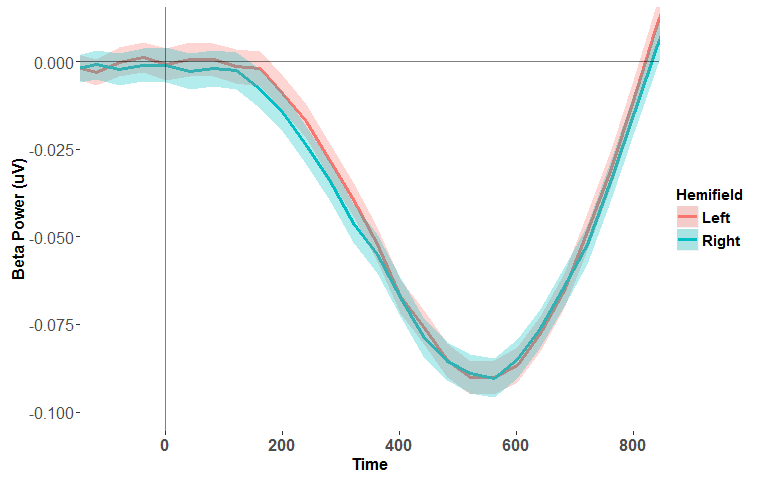<!-- -->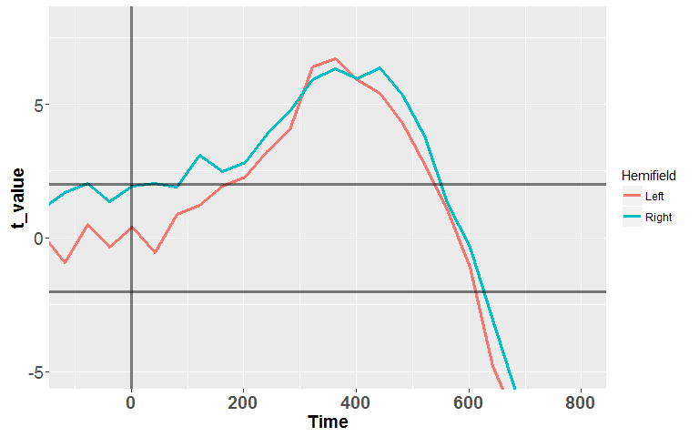<!-- -->

#Resp Locked Beta Slope (short time fourier transform - STFT)


```r
###########################################################################################################
###### Import trial sample level data Resp locked Beta
if (location=="Monash") {
data_Resp_locked_Beta <- read.csv("S:/R-MNHS-SPP/Bellgrove-data/4. Dan Newman/big_dots/master_matrix_R_Resp_locked_beta.csv", header=FALSE)
ID <- read.table("S:/R-MNHS-SPP/Bellgrove-data/4. Dan Newman/big_dots/ID_vector_Resp_locked_beta.csv", quote="\"")
} else if (location=="DansLaptop") {
data_Resp_locked_Beta <- read.csv("C:/Users/Dan/Documents/GitHub/big_dots/master_matrix_R_Resp_locked_beta.csv", header=FALSE)
ID <- read.table("C:/Users/Dan/Documents/GitHub/big_dots/ID_vector_Resp_locked_beta.csv", quote="\"")
} else setwd(("~"))

data_Resp_locked_Beta$ID<-data_Resp_locked_Beta[,1]
#Replace the participant numbers with IDs:
data_Resp_locked_Beta[,1]<-ID[,1]
#Remove the seperate ID vector now it has been included into data dataframe
rm(ID)
drops <- c("ID")
data_Resp_locked_Beta<-data_Resp_locked_Beta[,!(names(data_Resp_locked_Beta) %in% drops)]

#Merge with the RT, Accuracy, Hemifield data 
data_Resp_locked_Beta<- data_Resp_locked_Beta %>% #Rename data columns:
    rename(., 
           ID=V1,
           TotalTrialNumber=V2,
           Trial=V3,
           Time=V4,
           Resp_locked_Beta=V5,
           Resp_locked_Beta_NOTbaselined=V6) %>%
    merge(., data, by = c("ID", "Trial")) 

#Filter out artifacts
data_Resp_locked_Beta<- data_Resp_locked_Beta %>% filter(!Art_neg100_100PR)
###########################################################################################################

#Plot response locked 
plotdata_Resp_locked_Beta <- summarySEwithin(data_Resp_locked_Beta, measurevar="Resp_locked_Beta", withinvars=c("Time", "Hemifield"), idvar="ID")
```

```
## Automatically converting the following non-factors to factors: Time, Hemifield
```

```r
plotdata_Resp_locked_Beta_NOTbaselined <- summarySEwithin(data_Resp_locked_Beta, measurevar="Resp_locked_Beta_NOTbaselined", withinvars=c("Time", "Hemifield"), idvar="ID")
```

```
## Automatically converting the following non-factors to factors: Time, Hemifield
```

```r
plotdata_Resp_locked_Beta$Time<-as.numeric(as.character(plotdata_Resp_locked_Beta$Time))
plotdata_Resp_locked_Beta_NOTbaselined$Time<-as.numeric(as.character(plotdata_Resp_locked_Beta_NOTbaselined$Time))
summary(plotdata_Resp_locked_Beta$Time)
```

```
##    Min. 1st Qu.  Median    Mean 3rd Qu.    Max. 
##    -600    -440    -260    -260     -80      80
```

```r
#Resp_locked_Beta Group on same plot
ggplot(plotdata_Resp_locked_Beta, aes(x=Time, y=Resp_locked_Beta, color=Hemifield,fill=Hemifield)) + 
    geom_line(size=1.4) + geom_ribbon(aes(ymin=Resp_locked_Beta-ci, ymax=Resp_locked_Beta+ci), alpha = 0.3, colour=NA) + 
        geom_hline(yintercept=0, alpha = 0.5) + geom_vline(xintercept=0, alpha = 0.5) +   
    coord_cartesian(xlim = c(-600, 100)) +
    xlab("Time") + ylab("Beta Power (\u00b5V)") +
    theme(axis.title.x = element_text(face="bold", size=12),
          axis.text.x  = element_text(face="bold", angle=0,  size=12)) +
    theme(axis.title.y = element_text(face="bold", size=12),
          axis.text.y  = element_text(angle=0, vjust=0.5, size=12)) +
    theme(legend.title = element_text(size=11, face="bold")) +
    theme(legend.text = element_text(size = 11, face = "bold")) +
    theme(panel.grid.major = element_blank(), panel.grid.minor = element_blank(), 
          panel.background = element_blank(), axis.line = element_line(colour = "black"))
```

<!-- -->

```r
##Pull out mean beta amplitude measures from -300 to -50ms in Resp locked beta
beta_participant_level<- data_Resp_locked_Beta %>% 
                            filter(Time>-300, Time<(-50)) %>% 
                            group_by(ID, Hemifield) %>% 
                            summarise( xyBar =mean(Time*Resp_locked_Beta),
                                       xBar = mean(Time),
                                       yBar = mean(Resp_locked_Beta),
                                       x2Bar =mean(Time^2),
                                       Resp_locked_Beta_Slope = (xyBar - xBar*yBar) / (x2Bar - xBar^2)) %>%
                            select(ID, Hemifield, Resp_locked_Beta_Slope) %>%
                            spread(Hemifield, Resp_locked_Beta_Slope) %>% 
                            select(Beta_slope_LeftTarget = Left,
                                   Beta_slope_RightTarget = Right) %>%
                            mutate(Beta_slope_Asym = (Beta_slope_LeftTarget-Beta_slope_RightTarget)/(Beta_slope_LeftTarget+Beta_slope_RightTarget)) 
```

```
## Adding missing grouping variables: `ID`
```

```r
#Merge with participant_level data.frame (note don't worry that it coerces ID from factor to character vector)
participant_level<-left_join(participant_level, beta_participant_level, by = "ID")
```

```
## Warning in left_join_impl(x, y, by$x, by$y, suffix$x, suffix$y): joining
## factor and character vector, coercing into character vector
```


#Run tests of normality on the RT, CPPonset, N2c, etc. measures 

Table: Normality tests

key                        ShapiroWilk_p_value   Anderson_Darling_p_value   CramerVonMises_p_value   Shapiro_Francia_p_value   Kolmogorov_Smirnov_p_value   average_p_value
------------------------  --------------------  -------------------------  -----------------------  ------------------------  ---------------------------  ----------------
Beta_LeftTarget                         0.0000                     0.0000                   0.0000                    0.0000                       0.0001            0.0000
PreAlpha_LeftHemi                       0.0000                     0.0000                   0.0000                    0.0000                       0.0004            0.0001
Beta_RightTarget                        0.0000                     0.0001                   0.0004                    0.0000                       0.0015            0.0004
PreAlpha_RightHemi                      0.0000                     0.0000                   0.0002                    0.0001                       0.0075            0.0015
RT_Right                                0.0040                     0.0007                   0.0005                    0.0064                       0.0001            0.0024
Beta_slope_LeftTarget                   0.0002                     0.0028                   0.0044                    0.0002                       0.0367            0.0088
RT_Left                                 0.0117                     0.0104                   0.0167                    0.0170                       0.0272            0.0166
N2i_latency_LeftTarget                  0.0007                     0.0042                   0.0354                    0.0034                       0.0433            0.0174
N2c_latency_LeftTarget                  0.0083                     0.0109                   0.0230                    0.0056                       0.0893            0.0274
N2i_latency_RightTarget                 0.0076                     0.0623                   0.2376                    0.0286                       0.1096            0.0891
CPPslope_LeftTarget                     0.0377                     0.0656                   0.1420                    0.0606                       0.2513            0.1114
CPPslope_RightTarget                    0.0351                     0.1298                   0.2725                    0.0539                       0.3711            0.1725
CPPonset_RightTarget                    0.2139                     0.1895                   0.2498                    0.1315                       0.1696            0.1909
N2c_RightTarget                         0.2879                     0.2095                   0.1371                    0.1603                       0.1843            0.1958
Beta_slope_RightTarget                  0.4383                     0.1343                   0.0781                    0.4206                       0.0207            0.2184
N2c_latency_RightTarget                 0.2438                     0.2264                   0.2309                    0.3622                       0.1606            0.2448
N2i_RightTarget                         0.3630                     0.2339                   0.2747                    0.2328                       0.1822            0.2573
N2i_LeftTarget                          0.6712                     0.3869                   0.2963                    0.5805                       0.3230            0.4516
CPPonset_LeftTarget                     0.7936                     0.7163                   0.6855                    0.5357                       0.6155            0.6693
N2c_LeftTarget                          0.6444                     0.8331                   0.8611                    0.8311                       0.7265            0.7793


#Test the effect of Target Hemifield on RT, CPPonset, N2c, etc. using repeated measures ANOVA

##In cases where the assumption of normality was violated, a factorial permutation test for the effect of Target Hemifield was performed with 1000 permutations and the permuted p-value also reported

```
## [1] "Repeated Measures ANOVA  for the effect of Hemifield on RT:"
```

```
## $ANOVA
##      Effect DFn DFd    F       p p<.05     ges
## 2 Hemifield   1  79 11.3 0.00122     * 0.00628
```


Hemifield    mean      sd
----------  -----  ------
RT_Left       561    91.1
RT_Right      577   105.7

```
## [1] "Factorial Permutation test for the effect of Hemifield on RT:"
```

```
##      Effect     p p<.05
## 1 Hemifield 0.001     *
```

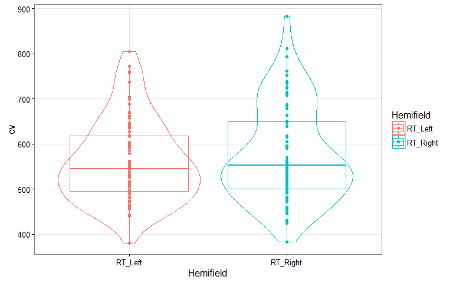<!-- -->

```
## [1] "Repeated Measures ANOVA  for the effect of Hemifield on Stim Locked Beta Amplitude:"
```

```
## $ANOVA
##      Effect DFn DFd     F     p p<.05     ges
## 2 Hemifield   1  79 0.303 0.584       0.00032
```


Hemifield             mean      sd
-----------------  -------  ------
Beta_LeftTarget     -0.064   0.049
Beta_RightTarget    -0.066   0.057

```
## [1] "Factorial Permutation test for the effect of Hemifield on Stim Locked Beta Amplitude:"
```

```
##      Effect     p p<.05
## 1 Hemifield 0.588
```

```
## [1] "Repeated Measures ANOVA  for the effect of Hemifield on Resp Locked Beta Slope:"
```

```
## $ANOVA
##      Effect DFn DFd     F     p p<.05      ges
## 2 Hemifield   1  79 0.283 0.596       0.000359
```


Hemifield                 mean   sd
-----------------------  -----  ---
Beta_slope_LeftTarget        0    0
Beta_slope_RightTarget       0    0

```
## [1] "Factorial Permutation test for the effect of Hemifield on Resp Locked Beta Slope:"
```

```
##      Effect    p p<.05
## 1 Hemifield 0.59
```

```
## [1] "Repeated Measures ANOVA  for the effect of Hemifield on CPP Onset:"
```

```
## $ANOVA
##      Effect DFn DFd    F     p p<.05    ges
## 2 Hemifield   1  79 5.46 0.022     * 0.0262
```


Hemifield               mean     sd
---------------------  -----  -----
CPPonset_LeftTarget      317   73.8
CPPonset_RightTarget     340   66.7

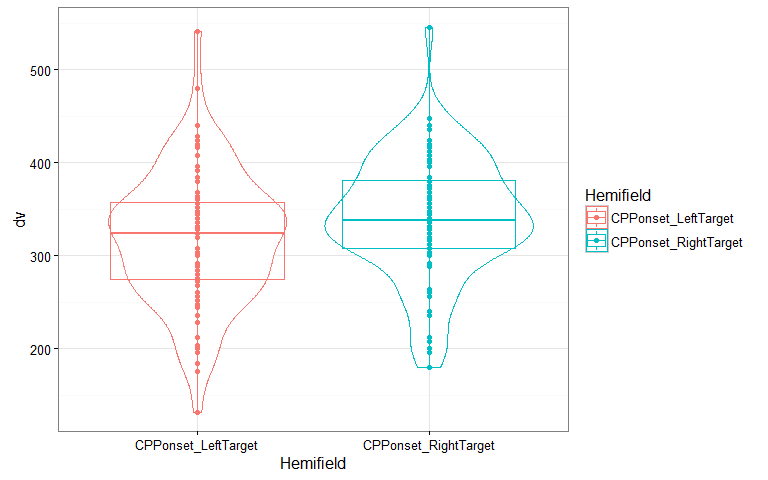<!-- -->

```
## [1] "Repeated Measures ANOVA  for the effect of Hemifield on CPP Slope:"
```

```
## $ANOVA
##      Effect DFn DFd    F     p p<.05      ges
## 2 Hemifield   1  79 1.24 0.269       0.000793
```


Hemifield                mean      sd
---------------------  ------  ------
CPPslope_LeftTarget     0.042   0.026
CPPslope_RightTarget    0.043   0.026

```
## [1] "Repeated Measures ANOVA  for the effect of Hemifield on N2i_latency:"
```

```
## $ANOVA
##      Effect DFn DFd     F     p p<.05     ges
## 2 Hemifield   1  79 0.281 0.597       0.00133
```


Hemifield                  mean     sd
------------------------  -----  -----
N2i_latency_LeftTarget      347   76.1
N2i_latency_RightTarget     341   72.9

```
## [1] "Factorial Permutation test for the effect of Hemifield on N2i_latency:"
```

```
##      Effect     p p<.05
## 1 Hemifield 0.585
```

```
## [1] "Repeated Measures ANOVA  for the effect of Hemifield on N2i Amplitude:"
```

```
## $ANOVA
##      Effect DFn DFd    F   p p<.05     ges
## 2 Hemifield   1  79 1.67 0.2       0.00682
```


Hemifield            mean     sd
----------------  -------  -----
N2i_LeftTarget     -0.612   1.66
N2i_RightTarget    -0.852   1.23

```
## [1] "Repeated Measures ANOVA  for the effect of Hemifield on N2c_latency:"
```

```
## $ANOVA
##      Effect DFn DFd      F     p p<.05      ges
## 2 Hemifield   1  79 0.0705 0.791       0.000248
```


Hemifield                  mean     sd
------------------------  -----  -----
N2c_latency_LeftTarget      278   43.1
N2c_latency_RightTarget     277   58.1

```
## [1] "Factorial Permutation test for the effect of Hemifield on N2c_latency:"
```

```
##      Effect     p p<.05
## 1 Hemifield 0.782
```

```
## [1] "Repeated Measures ANOVA  for the effect of Hemifield on N2c Amplitude:"
```

```
## $ANOVA
##      Effect DFn DFd      F     p p<.05      ges
## 2 Hemifield   1  79 0.0772 0.782       0.000325
```


Hemifield           mean    sd
----------------  ------  ----
N2c_LeftTarget     -2.04   1.7
N2c_RightTarget    -1.98   1.9

```
## [1] "Repeated Measures ANOVA for the effects of Hemifield*Hemisphere on N2 Amplitude:"
```

```
## $ANOVA
##                 Effect DFn DFd      F               p p<.05      ges
## 2            Hemifield   1  79  0.557 0.4577284428336       0.000726
## 3           Hemisphere   1  79 62.053 0.0000000000151     * 0.133473
## 4 Hemifield:Hemisphere   1  79  0.763 0.3849420375302       0.002184
```

```
## [1] "Repeated Measures ANOVA for the effects of Hemifield*Hemisphere on N2 Latency:"
```

```
## $ANOVA
##                 Effect DFn DFd       F                   p p<.05      ges
## 2            Hemifield   1  79  0.3813 0.53869594081169470       0.000759
## 3           Hemisphere   1  79 99.5097 0.00000000000000123     * 0.215405
## 4 Hemifield:Hemisphere   1  79  0.0953 0.75832441089747826       0.000224
```

```
## [1] "Factorial Permutation test  for the effects of Hemifield*Hemisphere on N2 Latency:"
```

```
##                 Effect     p p<.05
## 1           Hemisphere 0.000     *
## 2            Hemifield 0.521      
## 3 Hemisphere:Hemifield 0.728
```

```
## [1] "Repeated Measures ANOVA  for the effect of Hemisphere on Pre-target Alpha Power:"
```

```
## $ANOVA
##       Effect DFn DFd    F       p p<.05    ges
## 2 Hemisphere   1  79 11.2 0.00128     * 0.0041
```


Hemisphere            mean      sd
-------------------  -----  ------
PreAlpha_LeftHemi     1.85   0.963
PreAlpha_RightHemi    1.98   0.954

```
## [1] "Factorial Permutation test for the effect of Hemisphere on Pre-target Alpha Power:"
```

```
##       Effect     p p<.05
## 1 Hemisphere 0.001     *
```

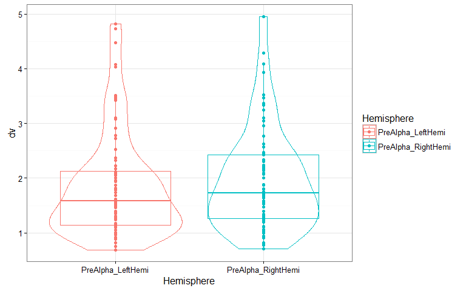<!-- -->


#Make multi panel plots for manuscript

```r
# 
# Paradigm2<-ggplot(data_frame(y=c(1,460,920), x=c(1,490,985)), aes(x, y))  +
#             annotation_custom(Paradigm, xmin = 0, xmax = 980, ymin = -19, ymax = 890) +
#              theme(axis.title.x = element_blank(),
#                   axis.text.x  = element_blank(), 
#                   axis.title.y = element_blank(),
#                   axis.text.y  = element_blank(),
#                   axis.ticks.x = element_blank(),
#                   axis.ticks.y = element_blank(),
#                   panel.background = element_blank()) +
#             annotate("text", x = 140, y = 930, label = "[A]", size=6)
# Paradigm2
# 
# # png("Figure 2.png", width = 10*600, height = 15*600,  units = "px", res = 600)
# # source("multiplot.R")
# # multiplot(p_violin,p_CPP,p_scatter_CPP,p_Beta,p_N2,p_Alpha,layout= matrix(c(1,2,2,3,3,5,5,1,2,2,4,4,6,6), nrow = 7, ncol = 2))        
# # dev.off()
# # multiplot(p_violin,p_CPP,p_scatter_CPP,p_Beta,p_N2,p_Alpha,layout= matrix(c(1,2,2,3,3,5,5,1,2,2,4,4,6,6), nrow = 7, ncol = 2))  
# 
# 
# 
# multiplot(p_violin,p_CPP,Paradigm2,p_Beta,p_N2,p_Alpha,layout= matrix(c(1,2,2,3,3,5,5,1,2,2,4,4,6,6), nrow = 7, ncol = 2)) 
# 
# 
# multiplot(Paradigm2,p_Alpha,p_N2,p_Beta,p_violin,p_CPP, layout=  matrix(c(1,1,3,3,5,6,6,2,2,4,4,5,6,6), nrow = 7, ncol = 2))
# 
# 
# png("Figure 1.png", width = 10*600, height = 7*600,  units = "px", res = 600)
# source("multiplot.R")
# multiplot(Paradigm2,p_Alpha,p_N2,p_Beta, layout=  matrix(c(1,1,3,3,2,2,4,4),  ncol = 2))
# dev.off()
# multiplot(Paradigm2,p_Alpha,p_N2,p_Beta, layout=  matrix(c(1,1,3,3,2,2,4,4),  ncol = 2))
# 
# png("Figure 2.png", width = 10*600, height = 6*600,  units = "px", res = 600)
# source("multiplot.R")
# multiplot(p_violin, p_CPP, layout=  matrix(c(1,2,2,1,2,2), ncol = 2))
# dev.off()
# multiplot(p_violin, p_CPP, layout=  matrix(c(1,2,2,1,2,2), ncol = 2))
# 
# 
# 
# 
# 
# p_scatter_CPP<-ggplot(participant_level, aes(x=RT_Asym, y=CPPonset_Asym)) +
#         geom_point(shape=1, size=2) +    
#         geom_smooth(method=lm, se=FALSE, colour="black") + # Add linear regression line # Don't add shaded confidence region
#         xlab("RT Asymmetry") + ylab("CPP-onset Asymmetry") +
#         theme(axis.title.x = element_text(face="bold", size=14),
#               axis.text.x  = element_text(face="bold", angle=0,  size=14), #element_text(face="bold", angle=0,  size=14),
#               axis.title.y = element_text(face="bold", size=14),
#               axis.text.y  = element_text(face="bold", angle=0, size=14),
#               panel.background = element_blank()) +
#         geom_hline(yintercept=0, alpha = 0.4) + 
#         geom_vline(xintercept=0, alpha = 0.4) + #add black likes at 0 on x and y axis 
#         annotate("text", x = -0.1, y = 0.40, label = "[C]", size=6)
# p_scatter_CPP                   
# 
# 
# 
# p_scatter_Alpha<-ggplot(participant_level, aes(x=RT_Asym, y=PreAlphaAsym)) +
#         geom_point(shape=1, size=2) +    
#         geom_smooth(method=lm, se=FALSE, colour="black") + # Add linear regression line # Don't add shaded confidence region
#         xlab("RT Asymmetry") + ylab("Pre-target Alpha Asymmetry") +
#         theme(axis.title.x = element_text(face="bold", size=14),
#               axis.text.x  = element_text(face="bold", angle=0,  size=14), #element_text(face="bold", angle=0,  size=14),
#               axis.title.y = element_text(face="bold", size=14),
#               axis.text.y  = element_text(face="bold", angle=0, size=14),
#               panel.background = element_blank()) +
#         geom_hline(yintercept=0, alpha = 0.4) + 
#         geom_vline(xintercept=0, alpha = 0.4) + #add black likes at 0 on x and y axis 
#         annotate("text", x = -0.1, y = 0.35, label = "[A]", size=6)
# p_scatter_Alpha  
# 
# 
# p_scatter_N2<-ggplot(participant_level, aes(x=RT_Asym, y=N2c_latency_Asym)) +
#         geom_point(shape=1, size=2) +    
#         geom_smooth(method=lm, se=FALSE, colour="black") + # Add linear regression line # Don't add shaded confidence region
#         xlab("RT Asymmetry") + ylab("N2c-latency Asymmetry") +
#         theme(axis.title.x = element_text(face="bold", size=14),
#               axis.text.x  = element_text(face="bold", angle=0,  size=14), #element_text(face="bold", angle=0,  size=14),
#               axis.title.y = element_text(face="bold", size=14),
#               axis.text.y  = element_text(face="bold", angle=0, size=14),
#               panel.background = element_blank()) +
#         geom_hline(yintercept=0, alpha = 0.4) + 
#         geom_vline(xintercept=0, alpha = 0.4) + #add black likes at 0 on x and y axis 
#         annotate("text", x = -0.1, y = 0.3, label = "[B]", size=6)
# p_scatter_N2    
# 
# 
# png("Figure 3.png", width = 12*600, height = 4.3*600,  units = "px", res = 600)
# source("multiplot.R")
# multiplot(p_scatter_Alpha, p_scatter_N2, p_scatter_CPP, layout= matrix(c(1,2,3),nrow = 1, ncol = 3))     
# dev.off()
# multiplot(p_scatter_Alpha, p_scatter_N2, p_scatter_CPP, layout= matrix(c(1,2,3),nrow = 1, ncol = 3))  
```

#test normality of all the Asymmetry measures (i.e. RT, N2, CPP, alpha, asymmetry) 


#Look at multiple regression to predice RT_Asym 
Fit the regression modles in a hierarchical fashion with their entry order determined by their temporal order in the perceptual decision making process. This allowed us to model individual differences in RT-asymmetry as a function of asymmetries in neural signals representing each temporal stage of perceptual decision making, from a pre-target preparatory signal (alpha power), to target selection (N2c), to evidence accumulation (CPP) to motor preparation (LHB). The hierarchical entry method allowed us to assess whether each of the different signals improved the model fit for RT-asymmetry over-and-above the signals which temporally proceed it. Only those signals that explained unique variation in RT-asymmetry were then selected for forced input into a final simplified RT-asymmetry model, to obtain accurate parameter estimates not influenced by other signals shown not improve model fit.

```
## Analysis of Variance Table
## 
## Model 1: RT_Asym ~ 1
## Model 2: RT_Asym ~ Location + Sex + Age
## Model 3: RT_Asym ~ Location + Sex + Age + PreAlphaAsym
## Model 4: RT_Asym ~ Location + Sex + Age + PreAlphaAsym + N2c_Asym
## Model 5: RT_Asym ~ Location + Sex + Age + PreAlphaAsym + N2c_Asym + N2c_latency_Asym
## Model 6: RT_Asym ~ Location + Sex + Age + PreAlphaAsym + N2c_Asym + N2c_latency_Asym + 
##     CPPonset_Asym
## Model 7: RT_Asym ~ Location + Sex + Age + PreAlphaAsym + N2c_Asym + N2c_latency_Asym + 
##     CPPonset_Asym + CPPslope_Asym
## Model 8: RT_Asym ~ Location + Sex + Age + PreAlphaAsym + N2c_Asym + N2c_latency_Asym + 
##     CPPonset_Asym + CPPslope_Asym + Beta_Asym
## Model 9: RT_Asym ~ Location + Sex + Age + PreAlphaAsym + N2c_Asym + N2c_latency_Asym + 
##     CPPonset_Asym + CPPslope_Asym + Beta_Asym + Beta_slope_Asym
##   Res.Df    RSS Df Sum of Sq    F Pr(>F)   
## 1     79 0.0818                            
## 2     76 0.0785  3   0.00324 1.29 0.2834   
## 3     75 0.0744  1   0.00409 4.90 0.0302 * 
## 4     74 0.0737  1   0.00070 0.84 0.3626   
## 5     73 0.0694  1   0.00436 5.23 0.0253 * 
## 6     72 0.0620  1   0.00738 8.84 0.0041 **
## 7     71 0.0605  1   0.00149 1.78 0.1862   
## 8     70 0.0579  1   0.00261 3.13 0.0813 . 
## 9     69 0.0576  1   0.00033 0.39 0.5325   
## ---
## Signif. codes:  0 '***' 0.001 '**' 0.01 '*' 0.05 '.' 0.1 ' ' 1
```

```
## 
## Call:
## lm(formula = RT_Asym ~ Location + Sex + Age, data = participant_level)
## 
## Residuals:
##      Min       1Q   Median       3Q      Max 
## -0.10017 -0.01276  0.00389  0.01627  0.07186 
## 
## Coefficients:
##              Estimate Std. Error t value Pr(>|t|)  
## (Intercept) -0.045946   0.022533   -2.04    0.045 *
## LocationTCD  0.003909   0.008362    0.47    0.642  
## SexMale      0.004599   0.007405    0.62    0.536  
## Age          0.001340   0.000988    1.36    0.179  
## ---
## Signif. codes:  0 '***' 0.001 '**' 0.01 '*' 0.05 '.' 0.1 ' ' 1
## 
## Residual standard error: 0.0321 on 76 degrees of freedom
## Multiple R-squared:  0.0396,	Adjusted R-squared:  0.00171 
## F-statistic: 1.05 on 3 and 76 DF,  p-value: 0.378
```

```
## 
## Call:
## lm(formula = RT_Asym ~ Location + Sex + Age + PreAlphaAsym, data = participant_level)
## 
## Residuals:
##      Min       1Q   Median       3Q      Max 
## -0.10265 -0.01346  0.00316  0.01875  0.06904 
## 
## Coefficients:
##               Estimate Std. Error t value Pr(>|t|)  
## (Intercept)  -0.051631   0.022262   -2.32    0.023 *
## LocationTCD   0.002051   0.008246    0.25    0.804  
## SexMale      -0.000806   0.007731   -0.10    0.917  
## Age           0.001543   0.000974    1.59    0.117  
## PreAlphaAsym  0.112961   0.055674    2.03    0.046 *
## ---
## Signif. codes:  0 '***' 0.001 '**' 0.01 '*' 0.05 '.' 0.1 ' ' 1
## 
## Residual standard error: 0.0315 on 75 degrees of freedom
## Multiple R-squared:  0.0896,	Adjusted R-squared:  0.041 
## F-statistic: 1.85 on 4 and 75 DF,  p-value: 0.129
```

```
## 
## Call:
## lm(formula = RT_Asym ~ Location + Sex + Age + PreAlphaAsym + 
##     N2c_Asym, data = participant_level)
## 
## Residuals:
##      Min       1Q   Median       3Q      Max 
## -0.10151 -0.01303  0.00399  0.01894  0.06640 
## 
## Coefficients:
##               Estimate Std. Error t value Pr(>|t|)  
## (Intercept)  -0.052140   0.022314   -2.34    0.022 *
## LocationTCD   0.002435   0.008275    0.29    0.769  
## SexMale       0.000233   0.007844    0.03    0.976  
## Age           0.001519   0.000976    1.56    0.124  
## PreAlphaAsym  0.110192   0.055882    1.97    0.052 .
## N2c_Asym      0.002128   0.002537    0.84    0.404  
## ---
## Signif. codes:  0 '***' 0.001 '**' 0.01 '*' 0.05 '.' 0.1 ' ' 1
## 
## Residual standard error: 0.0316 on 74 degrees of freedom
## Multiple R-squared:  0.0982,	Adjusted R-squared:  0.0372 
## F-statistic: 1.61 on 5 and 74 DF,  p-value: 0.168
```

```
## 
## Call:
## lm(formula = RT_Asym ~ Location + Sex + Age + PreAlphaAsym + 
##     N2c_Asym + N2c_latency_Asym, data = participant_level)
## 
## Residuals:
##      Min       1Q   Median       3Q      Max 
## -0.10330 -0.01676  0.00381  0.01815  0.05961 
## 
## Coefficients:
##                   Estimate Std. Error t value Pr(>|t|)  
## (Intercept)      -0.054560   0.021821   -2.50    0.015 *
## LocationTCD       0.003195   0.008090    0.39    0.694  
## SexMale           0.000843   0.007666    0.11    0.913  
## Age               0.001593   0.000954    1.67    0.099 .
## PreAlphaAsym      0.115539   0.054631    2.11    0.038 *
## N2c_Asym          0.000161   0.002643    0.06    0.952  
## N2c_latency_Asym  0.079379   0.037057    2.14    0.036 *
## ---
## Signif. codes:  0 '***' 0.001 '**' 0.01 '*' 0.05 '.' 0.1 ' ' 1
## 
## Residual standard error: 0.0308 on 73 degrees of freedom
## Multiple R-squared:  0.151,	Adjusted R-squared:  0.0818 
## F-statistic: 2.17 on 6 and 73 DF,  p-value: 0.0553
```

```
## 
## Call:
## lm(formula = RT_Asym ~ Location + Sex + Age + PreAlphaAsym + 
##     N2c_Asym + N2c_latency_Asym + CPPonset_Asym, data = participant_level)
## 
## Residuals:
##      Min       1Q   Median       3Q      Max 
## -0.09839 -0.01445  0.00379  0.01949  0.05954 
## 
## Coefficients:
##                   Estimate Std. Error t value Pr(>|t|)   
## (Intercept)      -0.043753   0.021097   -2.07   0.0417 * 
## LocationTCD       0.000364   0.007761    0.05   0.9627   
## SexMale           0.000223   0.007300    0.03   0.9757   
## Age               0.001317   0.000913    1.44   0.1533   
## PreAlphaAsym      0.101354   0.052228    1.94   0.0562 . 
## N2c_Asym         -0.000265   0.002520   -0.11   0.9166   
## N2c_latency_Asym  0.079668   0.035274    2.26   0.0269 * 
## CPPonset_Asym     0.072072   0.024622    2.93   0.0046 **
## ---
## Signif. codes:  0 '***' 0.001 '**' 0.01 '*' 0.05 '.' 0.1 ' ' 1
## 
## Residual standard error: 0.0293 on 72 degrees of freedom
## Multiple R-squared:  0.242,	Adjusted R-squared:  0.168 
## F-statistic: 3.28 on 7 and 72 DF,  p-value: 0.00442
```

```
## 
## Call:
## lm(formula = RT_Asym ~ Location + Sex + Age + PreAlphaAsym + 
##     N2c_Asym + N2c_latency_Asym + CPPonset_Asym + CPPslope_Asym, 
##     data = participant_level)
## 
## Residuals:
##      Min       1Q   Median       3Q      Max 
## -0.09181 -0.01574  0.00354  0.01976  0.05862 
## 
## Coefficients:
##                   Estimate Std. Error t value Pr(>|t|)   
## (Intercept)      -0.038145   0.021413   -1.78   0.0791 . 
## LocationTCD      -0.000619   0.007757   -0.08   0.9366   
## SexMale           0.002212   0.007417    0.30   0.7664   
## Age               0.001060   0.000929    1.14   0.2577   
## PreAlphaAsym      0.092790   0.052362    1.77   0.0807 . 
## N2c_Asym          0.000240   0.002536    0.09   0.9250   
## N2c_latency_Asym  0.076846   0.035157    2.19   0.0321 * 
## CPPonset_Asym     0.066735   0.024827    2.69   0.0089 **
## CPPslope_Asym     0.013932   0.010545    1.32   0.1907   
## ---
## Signif. codes:  0 '***' 0.001 '**' 0.01 '*' 0.05 '.' 0.1 ' ' 1
## 
## Residual standard error: 0.0292 on 71 degrees of freedom
## Multiple R-squared:  0.26,	Adjusted R-squared:  0.177 
## F-statistic: 3.12 on 8 and 71 DF,  p-value: 0.00449
```

```
## 
## Call:
## lm(formula = RT_Asym ~ Location + Sex + Age + PreAlphaAsym + 
##     N2c_Asym + N2c_latency_Asym + CPPonset_Asym + CPPslope_Asym + 
##     Beta_Asym, data = participant_level)
## 
## Residuals:
##      Min       1Q   Median       3Q      Max 
## -0.09286 -0.01573  0.00181  0.02053  0.05685 
## 
## Coefficients:
##                   Estimate Std. Error t value Pr(>|t|)  
## (Intercept)      -0.033955   0.021226   -1.60    0.114  
## LocationTCD       0.000965   0.007693    0.13    0.901  
## SexMale           0.002299   0.007307    0.31    0.754  
## Age               0.000886   0.000920    0.96    0.339  
## PreAlphaAsym      0.094869   0.051598    1.84    0.070 .
## N2c_Asym          0.000688   0.002511    0.27    0.785  
## N2c_latency_Asym  0.081133   0.034719    2.34    0.022 *
## CPPonset_Asym     0.064545   0.024489    2.64    0.010 *
## CPPslope_Asym     0.013669   0.010389    1.32    0.193  
## Beta_Asym        -0.007858   0.004423   -1.78    0.080 .
## ---
## Signif. codes:  0 '***' 0.001 '**' 0.01 '*' 0.05 '.' 0.1 ' ' 1
## 
## Residual standard error: 0.0288 on 70 degrees of freedom
## Multiple R-squared:  0.292,	Adjusted R-squared:  0.201 
## F-statistic: 3.21 on 9 and 70 DF,  p-value: 0.00264
```

```
## 
## Call:
## lm(formula = RT_Asym ~ Location + Sex + Age + PreAlphaAsym + 
##     N2c_Asym + N2c_latency_Asym + CPPonset_Asym + CPPslope_Asym + 
##     Beta_Asym + Beta_slope_Asym, data = participant_level)
## 
## Residuals:
##      Min       1Q   Median       3Q      Max 
## -0.09328 -0.01587  0.00267  0.02021  0.05611 
## 
## Coefficients:
##                   Estimate Std. Error t value Pr(>|t|)  
## (Intercept)      -0.034128   0.021321   -1.60    0.114  
## LocationTCD       0.001049   0.007728    0.14    0.892  
## SexMale           0.001747   0.007392    0.24    0.814  
## Age               0.000891   0.000924    0.96    0.338  
## PreAlphaAsym      0.099634   0.052376    1.90    0.061 .
## N2c_Asym          0.001162   0.002632    0.44    0.660  
## N2c_latency_Asym  0.083072   0.035007    2.37    0.020 *
## CPPonset_Asym     0.061181   0.025174    2.43    0.018 *
## CPPslope_Asym     0.014438   0.010506    1.37    0.174  
## Beta_Asym        -0.007420   0.004497   -1.65    0.103  
## Beta_slope_Asym   0.001456   0.002321    0.63    0.533  
## ---
## Signif. codes:  0 '***' 0.001 '**' 0.01 '*' 0.05 '.' 0.1 ' ' 1
## 
## Residual standard error: 0.0289 on 69 degrees of freedom
## Multiple R-squared:  0.296,	Adjusted R-squared:  0.194 
## F-statistic:  2.9 on 10 and 69 DF,  p-value: 0.0044
```


term                estimate   std.error   statistic   p.value
-----------------  ---------  ----------  ----------  --------
(Intercept)           -0.013       0.004       -3.33     0.001
PreAlphaAsym           0.100       0.048        2.07     0.042
N2c_latency_Asym       0.075       0.032        2.32     0.023
CPPonset_Asym          0.077       0.024        3.21     0.002

```
## 
## Attaching package: 'car'
```

```
## The following object is masked from 'package:dplyr':
## 
##     recode
```

```
## The following object is masked from 'package:psych':
## 
##     logit
```

```
## Loading required package: boot
```

```
## 
## Attaching package: 'boot'
```

```
## The following object is masked from 'package:car':
## 
##     logit
```

```
## The following object is masked from 'package:psych':
## 
##     logit
```

```
## Loading required package: MASS
```

```
## 
## Attaching package: 'MASS'
```

```
## The following object is masked from 'package:dplyr':
## 
##     select
```

```
## 
## Attaching package: 'QuantPsyc'
```

```
## The following object is masked from 'package:Matrix':
## 
##     norm
```

```
## The following object is masked from 'package:base':
## 
##     norm
```

```
##     PreAlphaAsym N2c_latency_Asym    CPPonset_Asym 
##            0.212            0.236            0.328
```

```
##                     2.5 %   97.5 %
## (Intercept)      -0.02044 -0.00514
## PreAlphaAsym      0.00365  0.19636
## N2c_latency_Asym  0.01075  0.14011
## CPPonset_Asym     0.02911  0.12441
```

<!-- -->

```
## Percentage of sample with standardized residuals greater than abs 2:
```

```
## 3.75 %
```

```
##             ID standardized.residuals cooks.distance leverage
## 11     114M_CS                  -2.19         0.0478   0.0385
## 53     414M_LA                  -2.61         0.2257   0.1170
## 61 AA_15_04_14                  -3.47         0.0746   0.0241
##    covariance.ratios
## 11             0.846
## 53             0.820
## 61             0.541
```

```
##  lag Autocorrelation D-W Statistic p-value
##    1         -0.0719          2.13   0.492
##  Alternative hypothesis: rho != 0
```

```
##     PreAlphaAsym N2c_latency_Asym    CPPonset_Asym 
##             1.02             1.00             1.01
```

```
##     PreAlphaAsym N2c_latency_Asym    CPPonset_Asym 
##            0.982            0.996            0.986
```

```
## Start:  AIC=-557
## RT_Asym ~ Location + Sex + Age + PreAlphaAsym + N2c_Asym + N2c_latency_Asym + 
##     CPPonset_Asym + CPPslope_Asym + Beta_Asym + Beta_slope_Asym
## 
##                    Df Sum of Sq    RSS  AIC
## - Location          1   0.00002 0.0576 -559
## - Sex               1   0.00005 0.0576 -559
## - N2c_Asym          1   0.00016 0.0577 -559
## - Beta_slope_Asym   1   0.00033 0.0579 -558
## - Age               1   0.00078 0.0583 -558
## <none>                          0.0576 -557
## - CPPslope_Asym     1   0.00158 0.0591 -557
## - Beta_Asym         1   0.00227 0.0598 -556
## - PreAlphaAsym      1   0.00302 0.0606 -555
## - N2c_latency_Asym  1   0.00470 0.0623 -553
## - CPPonset_Asym     1   0.00493 0.0625 -552
## 
## Step:  AIC=-559
## RT_Asym ~ Sex + Age + PreAlphaAsym + N2c_Asym + N2c_latency_Asym + 
##     CPPonset_Asym + CPPslope_Asym + Beta_Asym + Beta_slope_Asym
## 
##                    Df Sum of Sq    RSS  AIC
## - Sex               1   0.00004 0.0576 -561
## - N2c_Asym          1   0.00016 0.0577 -561
## - Beta_slope_Asym   1   0.00033 0.0579 -560
## - Age               1   0.00081 0.0584 -560
## <none>                          0.0576 -559
## - CPPslope_Asym     1   0.00162 0.0592 -559
## - Beta_Asym         1   0.00226 0.0598 -558
## + Location          1   0.00002 0.0576 -557
## - PreAlphaAsym      1   0.00307 0.0607 -557
## - N2c_latency_Asym  1   0.00468 0.0623 -555
## - CPPonset_Asym     1   0.00506 0.0626 -554
## 
## Step:  AIC=-561
## RT_Asym ~ Age + PreAlphaAsym + N2c_Asym + N2c_latency_Asym + 
##     CPPonset_Asym + CPPslope_Asym + Beta_Asym + Beta_slope_Asym
## 
##                    Df Sum of Sq    RSS  AIC
## - N2c_Asym          1   0.00014 0.0578 -563
## - Beta_slope_Asym   1   0.00036 0.0580 -562
## - Age               1   0.00098 0.0586 -562
## <none>                          0.0576 -561
## - CPPslope_Asym     1   0.00158 0.0592 -561
## - Beta_Asym         1   0.00225 0.0599 -560
## + Sex               1   0.00004 0.0576 -559
## + Location          1   0.00001 0.0576 -559
## - PreAlphaAsym      1   0.00386 0.0615 -558
## - N2c_latency_Asym  1   0.00468 0.0623 -557
## - CPPonset_Asym     1   0.00508 0.0627 -556
## 
## Step:  AIC=-563
## RT_Asym ~ Age + PreAlphaAsym + N2c_latency_Asym + CPPonset_Asym + 
##     CPPslope_Asym + Beta_Asym + Beta_slope_Asym
## 
##                    Df Sum of Sq    RSS  AIC
## - Beta_slope_Asym   1   0.00026 0.0580 -564
## - Age               1   0.00101 0.0588 -563
## <none>                          0.0578 -563
## - CPPslope_Asym     1   0.00147 0.0592 -563
## - Beta_Asym         1   0.00220 0.0600 -562
## + N2c_Asym          1   0.00014 0.0576 -561
## + Sex               1   0.00003 0.0577 -561
## + Location          1   0.00001 0.0578 -561
## - PreAlphaAsym      1   0.00384 0.0616 -560
## - CPPonset_Asym     1   0.00541 0.0632 -557
## - N2c_latency_Asym  1   0.00573 0.0635 -557
## 
## Step:  AIC=-564
## RT_Asym ~ Age + PreAlphaAsym + N2c_latency_Asym + CPPonset_Asym + 
##     CPPslope_Asym + Beta_Asym
## 
##                    Df Sum of Sq    RSS  AIC
## - Age               1   0.00103 0.0591 -565
## - CPPslope_Asym     1   0.00136 0.0594 -564
## <none>                          0.0580 -564
## - Beta_Asym         1   0.00257 0.0606 -563
## + Beta_slope_Asym   1   0.00026 0.0578 -563
## + Sex               1   0.00006 0.0580 -562
## + N2c_Asym          1   0.00004 0.0580 -562
## + Location          1   0.00001 0.0580 -562
## - PreAlphaAsym      1   0.00366 0.0617 -561
## - N2c_latency_Asym  1   0.00547 0.0635 -559
## - CPPonset_Asym     1   0.00608 0.0641 -558
## 
## Step:  AIC=-565
## RT_Asym ~ PreAlphaAsym + N2c_latency_Asym + CPPonset_Asym + CPPslope_Asym + 
##     Beta_Asym
## 
##                    Df Sum of Sq    RSS  AIC
## <none>                          0.0591 -565
## - CPPslope_Asym     1   0.00184 0.0609 -564
## + Age               1   0.00103 0.0580 -564
## + Beta_slope_Asym   1   0.00027 0.0588 -563
## + Sex               1   0.00025 0.0588 -563
## - Beta_Asym         1   0.00292 0.0620 -563
## + N2c_Asym          1   0.00005 0.0590 -563
## + Location          1   0.00003 0.0590 -563
## - PreAlphaAsym      1   0.00354 0.0626 -562
## - N2c_latency_Asym  1   0.00527 0.0643 -560
## - CPPonset_Asym     1   0.00660 0.0657 -558
```

```
## Stepwise Model Path 
## Analysis of Deviance Table
## 
## Initial Model:
## RT_Asym ~ Location + Sex + Age + PreAlphaAsym + N2c_Asym + N2c_latency_Asym + 
##     CPPonset_Asym + CPPslope_Asym + Beta_Asym + Beta_slope_Asym
## 
## Final Model:
## RT_Asym ~ PreAlphaAsym + N2c_latency_Asym + CPPonset_Asym + CPPslope_Asym + 
##     Beta_Asym
## 
## 
##                Step Df  Deviance Resid. Df Resid. Dev  AIC
## 1                                       69     0.0576 -557
## 2        - Location  1 0.0000154        70     0.0576 -559
## 3             - Sex  1 0.0000428        71     0.0576 -561
## 4        - N2c_Asym  1 0.0001418        72     0.0578 -563
## 5 - Beta_slope_Asym  1 0.0002598        73     0.0580 -564
## 6             - Age  1 0.0010253        74     0.0591 -565
```

```
##               term estimate std.error statistic p.value
## 1      (Intercept) -0.01183   0.00376     -3.14 0.00239
## 2     PreAlphaAsym  0.09945   0.04722      2.11 0.03857
## 3 N2c_latency_Asym  0.08173   0.03182      2.57 0.01222
## 4    CPPonset_Asym  0.06818   0.02370      2.88 0.00525
## 5    CPPslope_Asym  0.01473   0.00971      1.52 0.13338
## 6        Beta_Asym -0.00818   0.00427     -1.91 0.05951
```

```
## Simple Bootstrap Routines (1.1-3 2008-04-30)
```

```
## BOOTSTRAP CONFIDENCE INTERVAL CALCULATIONS
## Based on 5000 bootstrap replicates
## 
## CALL : 
## boot.ci(boot.out = bootResults, type = "bca", index = 1)
## 
## Intervals : 
## Level       BCa          
## 95%   (-0.0199, -0.0069 )  
## Calculations and Intervals on Original Scale
```

```
## BOOTSTRAP CONFIDENCE INTERVAL CALCULATIONS
## Based on 5000 bootstrap replicates
## 
## CALL : 
## boot.ci(boot.out = bootResults, type = "bca", index = 2)
## 
## Intervals : 
## Level       BCa          
## 95%   ( 0.0055,  0.1865 )  
## Calculations and Intervals on Original Scale
```

```
## BOOTSTRAP CONFIDENCE INTERVAL CALCULATIONS
## Based on 5000 bootstrap replicates
## 
## CALL : 
## boot.ci(boot.out = bootResults, type = "bca", index = 3)
## 
## Intervals : 
## Level       BCa          
## 95%   ( 0.0092,  0.1431 )  
## Calculations and Intervals on Original Scale
```

```
## BOOTSTRAP CONFIDENCE INTERVAL CALCULATIONS
## Based on 5000 bootstrap replicates
## 
## CALL : 
## boot.ci(boot.out = bootResults, type = "bca", index = 4)
## 
## Intervals : 
## Level       BCa          
## 95%   ( 0.0371,  0.1392 )  
## Calculations and Intervals on Original Scale
```

```
## BOOTSTRAP OF LINEAR MODEL  (method = rows)
## 
## Original Model Fit
## ------------------
## Call:
## lm(formula = RT_Asym ~ PreAlphaAsym + N2c_latency_Asym + CPPonset_Asym, 
##     data = participant_level)
## 
## Coefficients:
##      (Intercept)      PreAlphaAsym  N2c_latency_Asym     CPPonset_Asym  
##          -0.0128            0.1000            0.0754            0.0768
```

<!-- -->

##Address Review 1's question "Is there scope of looking at the correlation between the different EEG measures to assess to what extent they independently (or not) contribute to the RT bias?"

```r
##grab the Asym EEG measures of interest for 
# data_for_cor<-select(participant_level, ends_with("Asym"), -N2i_Asym, -N2i_latency_Asym, -RT_Asym) %>%
#     rename(`CPP onset Asym` = CPPonset_Asym,
#            `CPP slope Asym` = CPPslope_Asym,
#            `N2c Amplitude Asym` = N2c_Asym,
#            `N2c latency Asym` = N2c_latency_Asym,
#            `Pretarget Alpha Asym` = PreAlphaAsym, 
#            `LHB Amplitude Asym` = Beta_Asym,
#            `LHB slope Asym` = Beta_slope_Asym)
# 
# ###################################################################
# #Make a function to compute the matrix of p-value from the correlation matrix:
# cor.mtest <- function(mat, ...) {
#     mat <- as.matrix(mat)
#     n <- ncol(mat)
#     p_mat<- matrix(NA, n, n)
#     diag(p_mat) <- 0
#     for (i in 1:(n - 1)) {
#         for (j in (i + 1):n) {
#             tmp <- cor.test(mat[, i], mat[, j], ...)
#             p_mat[i, j] <- p_mat[j, i] <- tmp$p.value
#         }
#     }
#   colnames(p_mat) <- rownames(p_mat) <- colnames(mat)
#   p_mat
# }
# ###################################################################
# 
# # matrix of the p-value of the correlation - "p_mat"
# p_mat <- cor.mtest(data_for_cor)
# head(p_mat[, 1:5])
# 
# 
# corrplot::corrplot(corr = cor(data_for_cor), 
#              method="color", 
#              type="upper", 
#              order="hclust", 
#              addCoef.col = "black", # Add coefficient of correlation
#              tl.col="black", tl.srt=45, #Text label color and rotation
#              # Combine with significance
#              p.mat = p_mat, sig.level = 0.05, insig = "blank", 
#              # hide correlation coefficient on the principal diagonal
#              diag=FALSE)
# 
# 
# source("multiplot.R")
# 
# png("Review_Figure_corrplot.png", width = 10*600, height = 10*600,  units = "px", res = 600) 
# corrplot::corrplot(corr = cor(data_for_cor), 
#              method="color", 
#              type="upper", 
#              order="hclust", 
#              addCoef.col = "black", # Add coefficient of correlation
#              tl.col="black", tl.srt=45, #Text label color and rotation
#              # Combine with significance
#              p.mat = p_mat, sig.level = 0.05, insig = "blank", 
#              # hide correlation coefficient on the principal diagonal
#              diag=FALSE)
# dev.off()
```


#Test the effect of RT_bin on pre-target alpha power


```r
library(broom)
library(modelr)
```

```
## 
## Attaching package: 'modelr'
```

```
## The following object is masked from 'package:broom':
## 
##     bootstrap
```

```
## The following object is masked from 'package:psych':
## 
##     heights
```

```r
data %>% 
    filter(!Art_neg500_0) %>%
    group_by(ID, RT_bin) %>%
    summarise(PreAlphaPower = mean(PreAlphaPower)) %>%
    ezANOVA(.
            , dv = .(PreAlphaPower)
            , wid = .(ID)
            , within = .(RT_bin)
            , type = 3)
```

```
## Warning: Converting "RT_bin" to factor for ANOVA.
```

```
## $ANOVA
##   Effect DFn DFd    F      p p<.05      ges
## 2 RT_bin   1  79 4.49 0.0373     * 0.000507
```

```r
log <- capture.output({
alpha_perm <- data %>% 
                filter(!Art_neg500_0) %>%
                group_by(ID, RT_bin) %>%
                summarise(PreAlphaPower = mean(PreAlphaPower)) %>%
                    ezPerm(.
                        , dv = .(PreAlphaPower)
                        , wid = .(ID)
                        , within = .(RT_bin)
                        , perms = 1000);
})
```

```
## Warning: Converting "RT_bin" to factor for ANOVA.
```

```r
print("Factorial Permutation test for the effect of RT_bin on Pre-target Alpha Power:")
```

```
## [1] "Factorial Permutation test for the effect of RT_bin on Pre-target Alpha Power:"
```

```r
print(alpha_perm)
```

```
##   Effect     p p<.05
## 1 RT_bin 0.038     *
```

```r
data %>% 
    filter(!Art_neg500_0) %>%
    group_by(ID, RT_bin) %>%
    summarise(PreAlphaPower = mean(PreAlphaPower)) %>% 
    group_by(RT_bin) %>% 
    summarise(mean=mean(PreAlphaPower),
              sd=sd(PreAlphaPower))
```

```
## # A tibble: 2 × 3
##   RT_bin  mean    sd
##    <chr> <dbl> <dbl>
## 1   Fast  1.90 0.914
## 2   Slow  1.94 1.018
```

```r
alpha_sup <- data %>%
            filter(!Art_neg500_0) %>%
            ggplot(., aes(x = PreAlphaPower, y = RT, colour = RT_bin)) +
            geom_smooth() +
    theme(axis.title.x = element_text(face="bold", size=12),
          axis.text.x  = element_text(face="bold", angle=0,  size=12), #element_text(face="bold", angle=0,  size=12),
          axis.title.y = element_text(face="bold", size=12),
          axis.text.y  = element_text(angle=0, vjust=0.5, size=12),
          legend.title = element_text(size=12, face="bold"),
          legend.text = element_text(size = 12, face = "bold"),
          panel.background = element_blank()) + #remove grey background 
    ylab("Reaction-time (RT), ms") +
    xlab("Pre-target Alpha Power (\u00b5V)") +
    ggtitle("[A]")

data %>%
    filter(!Art_neg500_0) %>%
    ggplot(., aes(x = log(PreAlphaPower), y = log(RT), colour = RT_bin)) +
    geom_smooth() + 
    xlim(0, 2.5)
```

```
## `geom_smooth()` using method = 'gam'
```

```
## Warning: Removed 4377 rows containing non-finite values (stat_smooth).
```

<!-- -->

```r
RT_random_intercepts_only<-lmer(log(RT) ~ 1 + (log(PreAlphaPower)|ID) + (1|Hemifield) + (1|ITI), data = filter(data, !Art_neg500_0), REML=FALSE, na.action = na.omit)
PreAlphaPower <- update(RT_random_intercepts_only, .~. + log(PreAlphaPower))

anova(RT_random_intercepts_only, PreAlphaPower)
```

```
## Data: filter(data, !Art_neg500_0)
## Models:
## RT_random_intercepts_only: log(RT) ~ 1 + (log(PreAlphaPower) | ID) + (1 | Hemifield) + (1 | 
## RT_random_intercepts_only:     ITI)
## PreAlphaPower: log(RT) ~ (log(PreAlphaPower) | ID) + (1 | Hemifield) + (1 | 
## PreAlphaPower:     ITI) + log(PreAlphaPower)
##                           Df   AIC   BIC logLik deviance Chisq Chi Df
## RT_random_intercepts_only  7 -8596 -8540   4305    -8610             
## PreAlphaPower              8 -8598 -8534   4307    -8614  4.09      1
##                           Pr(>Chisq)  
## RT_random_intercepts_only             
## PreAlphaPower                  0.043 *
## ---
## Signif. codes:  0 '***' 0.001 '**' 0.01 '*' 0.05 '.' 0.1 ' ' 1
```

```r
summary(PreAlphaPower)
```

```
## Linear mixed model fit by maximum likelihood  ['lmerMod']
## Formula: log(RT) ~ (log(PreAlphaPower) | ID) + (1 | Hemifield) + (1 |  
##     ITI) + log(PreAlphaPower)
##    Data: filter(data, !Art_neg500_0)
## 
##      AIC      BIC   logLik deviance df.resid 
##    -8598    -8534     4307    -8614    20306 
## 
## Scaled residuals: 
##    Min     1Q Median     3Q    Max 
## -5.406 -0.666 -0.095  0.564  5.282 
## 
## Random effects:
##  Groups    Name               Variance Std.Dev. Corr
##  ID        (Intercept)        0.023958 0.1548       
##            log(PreAlphaPower) 0.000495 0.0223   0.39
##  ITI       (Intercept)        0.003716 0.0610       
##  Hemifield (Intercept)        0.000172 0.0131       
##  Residual                     0.037454 0.1935       
## Number of obs: 20314, groups:  ID, 80; ITI, 3; Hemifield, 2
## 
## Fixed effects:
##                    Estimate Std. Error t value
## (Intercept)         6.30087    0.04036   156.1
## log(PreAlphaPower)  0.00887    0.00423     2.1
## 
## Correlation of Fixed Effects:
##             (Intr)
## lg(PrAlphP) 0.071
```

```r
plot(residuals(PreAlphaPower))
```

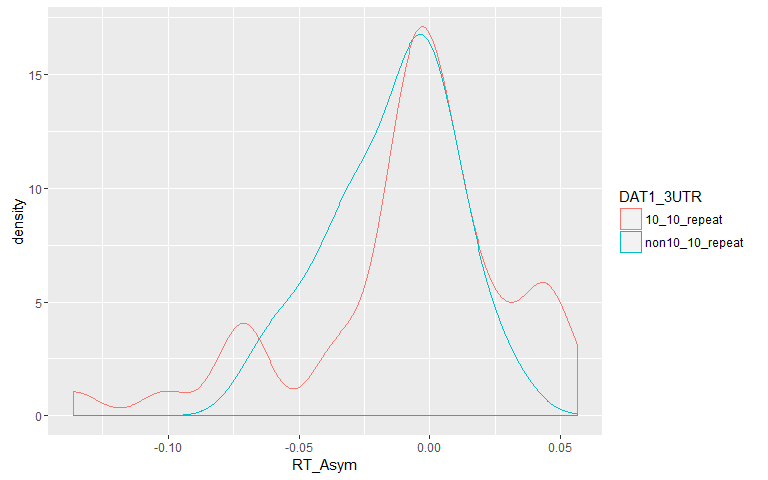<!-- -->

```r
hist(residuals(PreAlphaPower))
```

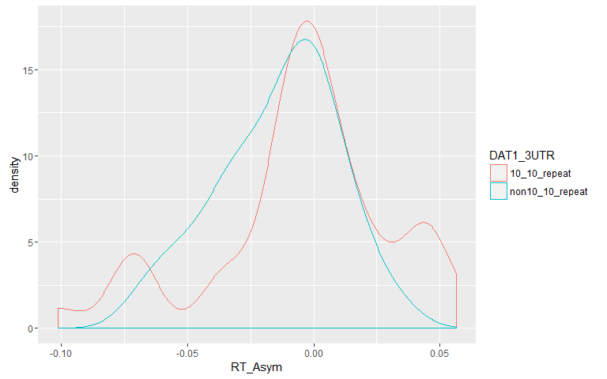<!-- -->

```r
qqnorm(residuals(PreAlphaPower))
qqline(residuals(PreAlphaPower))
```

<!-- -->

```r
    ## note: Subjects are ordered by mean distance
    ggplot(fortify(PreAlphaPower), aes(ID,.resid)) + 
        geom_boxplot() + 
        coord_flip()
```

<!-- -->


#Test the effect of RT_bin on N2c

```r
#plot stim-locked N2c binned by RT
data_Stim_locked_ERP %>% summarySEwithin(., measurevar="N2c", 
                                         withinvars=c("Time", "RT_bin"), 
                                         idvar="ID") %>%
    mutate(Time = as.numeric(as.character(Time))) %>%
    ggplot(., aes(x=Time, y=N2c, color=RT_bin,fill=RT_bin)) + 
    geom_line(size=1) + 
    geom_ribbon(aes(ymin=N2c-ci, ymax=N2c+ci), alpha = 0.5, colour=NA) + 
    coord_cartesian(ylim = c(-3, 0.5),  xlim = c(-100, 450)) +
    xlab("Time (ms)") + ylab("N2c Amplitude (\u00b5V)") + # \u00b5 makes the "u" symbol for 'micro'V
    theme(axis.title.x = element_text(face="bold", size=12),
          axis.text.x  = element_text(face="bold", angle=0,  size=12), #element_text(face="bold", angle=0,  size=12),
          axis.title.y = element_text(face="bold", size=12),
          axis.text.y  = element_text(angle=0, vjust=0.5, size=12),
          legend.title = element_text(size=12, face="bold"),
          legend.text = element_text(size = 12, face = "bold"),
          panel.background = element_blank(), #remove grey background 
          legend.position= c(0.1,0.5)) + #Move ledgend position
    guides(color=FALSE) +
    geom_hline(yintercept=0, alpha = 0.5) + 
    geom_vline(xintercept=0, alpha = 0.5) + #add black likes at 0 on x and y axis 
    scale_x_continuous(breaks = seq(-100, 500, 50)) +
    ggtitle("[B]") -> N2c_sup
```

```
## Automatically converting the following non-factors to factors: Time, RT_bin
```

```r
    ggsave("N2c_RTbin.png")
```

```
## Saving 8 x 5 in image
```

```r
###Find participant level N2c peak latency for each RT_bin and run ANOVA to test effect of RT_bin###
data_Stim_locked_ERP %>% 
            filter(Time>100, Time<(450)) %>% 
            group_by(ID, RT_bin, Time) %>% 
            summarise(N2c = mean(N2c)) %>%
            group_by(ID, RT_bin) %>%
            mutate(peak_latency = ifelse(N2c==min(N2c), TRUE, FALSE)) %>%
     filter(peak_latency) %>%
    rename(N2c_latency = Time) -> N2c_latency_RTbin 

ezANOVA(data = as.data.frame(N2c_latency_RTbin)
                        , dv = .(N2c_latency)
                        , wid = .(ID)
                        , within = .(RT_bin)
                        , type = 3)
```

```
## Warning: Converting "RT_bin" to factor for ANOVA.
```

```
## $ANOVA
##   Effect DFn DFd    F      p p<.05    ges
## 2 RT_bin   1  79 4.69 0.0334     * 0.0167
```

```r
ggplot(N2c_latency_RTbin) +
    geom_density(aes(x=N2c_latency, colour=RT_bin))
```

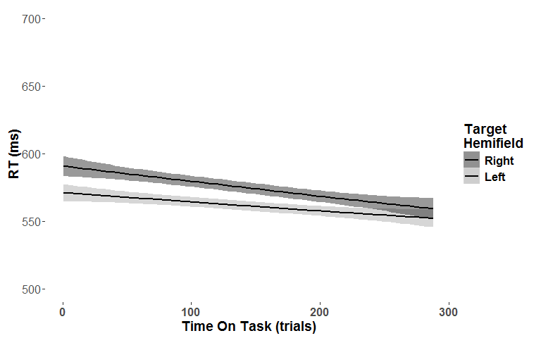<!-- -->

```r
###Find participant level N2c amplitude for each RT_bin and run ANOVA to test effect of RT_bin###

#First find grand average N2c peak latency for each RT_bin
data_Stim_locked_ERP %>% 
            filter(Time>100, Time<(450)) %>% 
            group_by(RT_bin, Time) %>% 
            summarise(N2c = mean(N2c)) %>%
            group_by(RT_bin) %>%
            mutate(peak_latency = ifelse(N2c==min(N2c), TRUE, FALSE)) %>%
     filter(peak_latency) %>%
    rename(N2c_latency = Time) -> N2c_latency

#Now find mean amplitude around those 2 peak latencies for each participant 
data_Stim_locked_ERP %>% 
    filter(RT_bin =="Fast") %>%
    group_by(ID) %>%
    summarise(Fast = mean(N2c[Time>=(N2c_latency$N2c_latency[N2c_latency$RT_bin=="Fast"]-50) & 
                                    Time<=(N2c_latency$N2c_latency[N2c_latency$RT_bin=="Fast"]+50)])) %>%
    full_join(., data_Stim_locked_ERP %>% 
                  filter(RT_bin =="Slow") %>%
                  group_by(ID) %>%
                  summarise(Slow = mean(N2c[Time>=(N2c_latency$N2c_latency[N2c_latency$RT_bin=="Slow"]-50) & 
                                    Time<=(N2c_latency$N2c_latency[N2c_latency$RT_bin=="Slow"]+50)])), by = "ID") %>% 
    gather(RT_bin, N2c, -ID) -> N2c_Amp
    

ezANOVA(data = N2c_Amp
                    , dv = .(N2c)
                    , wid = .(ID)
                    , within = .(RT_bin)
                    , type = 3)
```

```
## Warning: Converting "RT_bin" to factor for ANOVA.
```

```
## $ANOVA
##   Effect DFn DFd    F           p p<.05  ges
## 2 RT_bin   1  79 29.3 0.000000641     * 0.02
```

```r
ggplot(N2c_Amp) +
    geom_density(aes(x=N2c, colour=RT_bin))
```

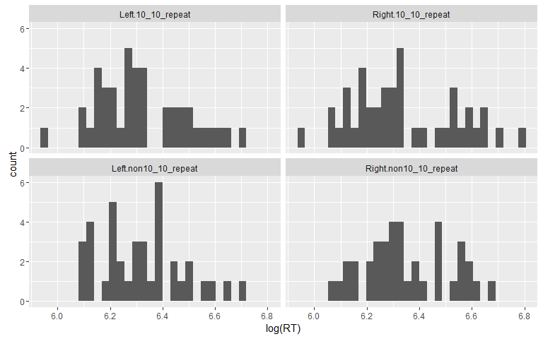<!-- -->


#plot stim-locked N2i binned by RT

```r
data_Stim_locked_ERP %>% summarySEwithin(., measurevar="N2i", 
                                         withinvars=c("Time", "RT_bin"), 
                                         idvar="ID") %>%
    mutate(Time = as.numeric(as.character(Time))) %>%
    ggplot(., aes(x=Time, y=N2i, color=RT_bin,fill=RT_bin)) + 
    geom_line(size=1) + 
    geom_ribbon(aes(ymin=N2i-ci, ymax=N2i+ci), alpha = 0.5, colour=NA) + 
    coord_cartesian(ylim = c(-1.5, 0.5),  xlim = c(-100, 450)) +
    xlab("Time (ms)") + ylab("N2i Amplitude (\u00b5V)") + # \u00b5 makes the "u" symbol for 'micro'V
    theme(axis.title.x = element_text(face="bold", size=12),
          axis.text.x  = element_text(face="bold", angle=0,  size=12), #element_text(face="bold", angle=0,  size=12),
          axis.title.y = element_text(face="bold", size=12),
          axis.text.y  = element_text(angle=0, vjust=0.5, size=12),
          legend.title = element_text(size=12, face="bold"),
          legend.text = element_text(size = 12, face = "bold"),
          panel.background = element_blank(), #remove grey background 
          legend.position= c(0.1,0.5)) + #Move ledgend position
    guides(color=FALSE) +
    geom_hline(yintercept=0, alpha = 0.5) + 
    geom_vline(xintercept=0, alpha = 0.5) + #add black likes at 0 on x and y axis 
    scale_x_continuous(breaks = seq(-100, 500, 50)) +
    ggtitle("[C]") -> N2i_sup
```

```
## Automatically converting the following non-factors to factors: Time, RT_bin
```

```r
    ggsave("N2i_RTbin.png")
```

```
## Saving 8 x 5 in image
```

```r
###Find participant level N2i peak latency for each RT_bin and run ANOVA to test effect of RT_bin###
data_Stim_locked_ERP %>% 
            filter(Time>100, Time<(450)) %>% 
            group_by(ID, RT_bin, Time) %>% 
            summarise(N2i = mean(N2i)) %>%
            group_by(ID, RT_bin) %>%
            mutate(peak_latency = ifelse(N2i==min(N2i), TRUE, FALSE)) %>%
     filter(peak_latency) %>%
    rename(N2i_latency = Time) -> N2i_latency_RTbin 

ezANOVA(data = as.data.frame(N2i_latency_RTbin)
                        , dv = .(N2i_latency)
                        , wid = .(ID)
                        , within = .(RT_bin)
                        , type = 3)
```

```
## Warning: Converting "RT_bin" to factor for ANOVA.
```

```
## $ANOVA
##   Effect DFn DFd   F     p p<.05     ges
## 2 RT_bin   1  79 0.5 0.481       0.00194
```

```r
ggplot(N2i_latency_RTbin) +
    geom_density(aes(x=N2i_latency, colour=RT_bin))
```

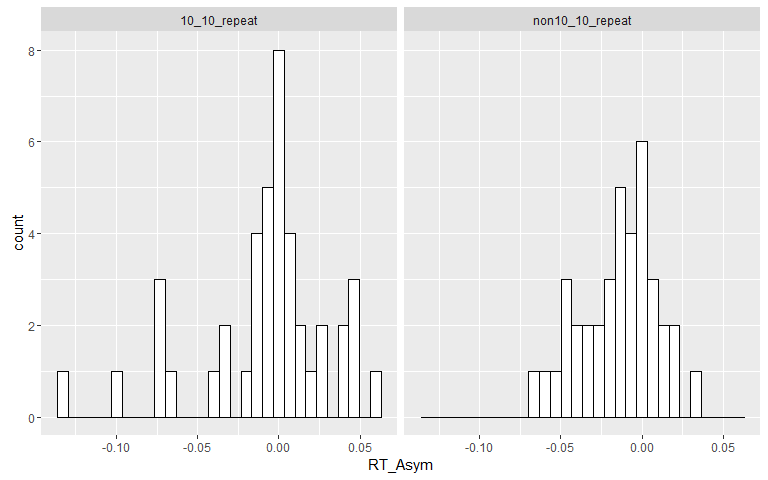<!-- -->

```r
log <- capture.output({
N2i_latency_RTbin_Perm<-ezPerm(as.data.frame(N2i_latency_RTbin)
        , dv = .(N2i_latency)
        , wid = .(ID)
        , within = .(RT_bin)
        , perms = 1000
)
 })
```

```
## Warning: Converting "RT_bin" to factor for ANOVA.
```

```r
print("Factorial Permutation test for the relationship between N2i_latency and RT_bin:")
```

```
## [1] "Factorial Permutation test for the relationship between N2i_latency and RT_bin:"
```

```r
kable(N2i_latency_RTbin_Perm)
```


Effect        p  p<.05 
-------  ------  ------
RT_bin    0.493        

```r
###Find participant level N2i amplitude for each RT_bin and run ANOVA to test effect of RT_bin###

#First find grand average N2i peak latency for each RT_bin
data_Stim_locked_ERP %>% 
            filter(Time>100, Time<(450)) %>% 
            group_by(RT_bin, Time) %>% 
            summarise(N2i = mean(N2i)) %>%
            group_by(RT_bin) %>%
            mutate(peak_latency = ifelse(N2i==min(N2i), TRUE, FALSE)) %>%
     filter(peak_latency) %>%
    rename(N2i_latency = Time) -> N2i_latency

#Now find mean amplitude around those 2 peak latencies for each participant 
data_Stim_locked_ERP %>% 
    filter(RT_bin =="Fast") %>%
    group_by(ID) %>%
    summarise(Fast = mean(N2i[Time>=(N2i_latency$N2i_latency[N2i_latency$RT_bin=="Fast"]-50) & 
                                    Time<=(N2i_latency$N2i_latency[N2i_latency$RT_bin=="Fast"]+50)])) %>%
    full_join(., data_Stim_locked_ERP %>% 
                  filter(RT_bin =="Slow") %>%
                  group_by(ID) %>%
                  summarise(Slow = mean(N2i[Time>=(N2i_latency$N2i_latency[N2i_latency$RT_bin=="Slow"]-50) & 
                                    Time<=(N2i_latency$N2i_latency[N2i_latency$RT_bin=="Slow"]+50)])), by = "ID") %>% 
    gather(RT_bin, N2i, -ID) -> N2i_Amp
    

ezANOVA(data = N2i_Amp
        , dv = .(N2i)
        , wid = .(ID)
        , within = .(RT_bin)
        , type = 3)
```

```
## Warning: Converting "RT_bin" to factor for ANOVA.
```

```
## $ANOVA
##   Effect DFn DFd    F      p p<.05     ges
## 2 RT_bin   1  79 6.53 0.0125     * 0.00947
```

```r
ezPerm(data = N2i_Amp
    , dv = .(N2i)
    , wid = .(ID)
    , within = .(RT_bin)
    , perms = 1000
)
```

```
## Warning: Converting "RT_bin" to factor for ANOVA.
```

```
## 
|                                               |  0%                      
|                                               |0.1% ~9 m remaining       
|                                               |0.2% ~53 m remaining      
|                                               |0.3% ~36 m remaining      
|                                               |0.4% ~28 m remaining      
|                                               |0.5% ~22 m remaining      
|                                               |0.6% ~19 m remaining      
|                                               |0.7% ~16 m remaining      
|                                               |0.8% ~14 m remaining      
|                                               |0.9% ~13 m remaining      
|                                               |  1% ~12 m remaining      
|                                               |1.1% ~11 m remaining      
|                                               |1.2% ~11 m remaining      
|                                               |1.3% ~10 m remaining      
|                                               |1.4% ~10 m remaining      
|                                               |1.5% ~9 m remaining       
|                                               |1.6% ~9 m remaining       
|                                               |1.7% ~8 m remaining       
|                                               |1.8% ~8 m remaining       
|                                               |1.9% ~8 m remaining       
|                                               |  2% ~7 m remaining       
|                                               |2.1% ~7 m remaining       
|=                                              |2.2% ~7 m remaining       
|=                                              |2.3% ~6 m remaining       
|=                                              |2.4% ~6 m remaining       
|=                                              |2.5% ~6 m remaining       
|=                                              |2.6% ~6 m remaining       
|=                                              |2.7% ~6 m remaining       
|=                                              |2.8% ~6 m remaining       
|=                                              |2.9% ~6 m remaining       
|=                                              |  3% ~5 m remaining       
|=                                              |3.1% ~5 m remaining       
|=                                              |3.2% ~5 m remaining       
|=                                              |3.3% ~5 m remaining       
|=                                              |3.4% ~5 m remaining       
|=                                              |3.5% ~5 m remaining       
|=                                              |3.6% ~5 m remaining       
|=                                              |3.7% ~5 m remaining       
|=                                              |3.8% ~5 m remaining       
|=                                              |3.9% ~5 m remaining       
|=                                              |  4% ~4 m remaining       
|=                                              |4.1% ~4 m remaining       
|=                                              |4.2% ~4 m remaining       
|==                                             |4.3% ~4 m remaining       
|==                                             |4.4% ~4 m remaining       
|==                                             |4.5% ~4 m remaining       
|==                                             |4.6% ~4 m remaining       
|==                                             |4.7% ~4 m remaining       
|==                                             |4.8% ~4 m remaining       
|==                                             |4.9% ~4 m remaining       
|==                                             |  5% ~4 m remaining       
|==                                             |5.1% ~4 m remaining       
|==                                             |5.2% ~4 m remaining       
|==                                             |5.3% ~4 m remaining       
|==                                             |5.4% ~4 m remaining       
|==                                             |5.5% ~4 m remaining       
|==                                             |5.6% ~3 m remaining       
|==                                             |5.7% ~3 m remaining       
|==                                             |5.8% ~3 m remaining       
|==                                             |5.9% ~3 m remaining       
|==                                             |  6% ~3 m remaining       
|==                                             |6.1% ~3 m remaining       
|==                                             |6.2% ~3 m remaining       
|==                                             |6.3% ~3 m remaining       
|===                                            |6.4% ~3 m remaining       
|===                                            |6.5% ~3 m remaining       
|===                                            |6.6% ~3 m remaining       
|===                                            |6.7% ~3 m remaining       
|===                                            |6.8% ~3 m remaining       
|===                                            |6.9% ~3 m remaining       
|===                                            |  7% ~3 m remaining       
|===                                            |7.1% ~3 m remaining       
|===                                            |7.2% ~3 m remaining       
|===                                            |7.3% ~3 m remaining       
|===                                            |7.4% ~3 m remaining       
|===                                            |7.5% ~3 m remaining       
|===                                            |7.6% ~3 m remaining       
|===                                            |7.7% ~3 m remaining       
|===                                            |7.8% ~3 m remaining       
|===                                            |7.9% ~3 m remaining       
|===                                            |  8% ~3 m remaining       
|===                                            |8.1% ~3 m remaining       
|===                                            |8.2% ~3 m remaining       
|===                                            |8.3% ~3 m remaining       
|===                                            |8.4% ~3 m remaining       
|===                                            |8.5% ~3 m remaining       
|====                                           |8.6% ~3 m remaining       
|====                                           |8.7% ~3 m remaining       
|====                                           |8.8% ~3 m remaining       
|====                                           |8.9% ~2 m remaining       
|====                                           |  9% ~2 m remaining       
|====                                           |9.1% ~2 m remaining       
|====                                           |9.2% ~2 m remaining       
|====                                           |9.3% ~2 m remaining       
|====                                           |9.4% ~2 m remaining       
|====                                           |9.5% ~2 m remaining       
|====                                           |9.6% ~2 m remaining       
|====                                           |9.7% ~2 m remaining       
|====                                           |9.8% ~2 m remaining       
|====                                           |9.9% ~2 m remaining       
|====                                           | 10% ~2 m remaining       
|====                                           |10.1% ~2 m remaining      
|====                                           |10.2% ~2 m remaining      
|====                                           |10.3% ~2 m remaining      
|====                                           |10.4% ~2 m remaining      
|====                                           |10.5% ~2 m remaining      
|====                                           |10.6% ~2 m remaining      
|=====                                          |10.7% ~2 m remaining      
|=====                                          |10.8% ~2 m remaining      
|=====                                          |10.9% ~2 m remaining      
|=====                                          | 11% ~2 m remaining       
|=====                                          |11.1% ~2 m remaining      
|=====                                          |11.2% ~2 m remaining      
|=====                                          |11.3% ~2 m remaining      
|=====                                          |11.4% ~2 m remaining      
|=====                                          |11.5% ~2 m remaining      
|=====                                          |11.6% ~2 m remaining      
|=====                                          |11.7% ~2 m remaining      
|=====                                          |11.8% ~2 m remaining      
|=====                                          |11.9% ~2 m remaining      
|=====                                          | 12% ~2 m remaining       
|=====                                          |12.1% ~2 m remaining      
|=====                                          |12.2% ~2 m remaining      
|=====                                          |12.3% ~2 m remaining      
|=====                                          |12.4% ~2 m remaining      
|=====                                          |12.5% ~2 m remaining      
|=====                                          |12.6% ~2 m remaining      
|=====                                          |12.7% ~2 m remaining      
|======                                         |12.8% ~2 m remaining      
|======                                         |12.9% ~2 m remaining      
|======                                         | 13% ~2 m remaining       
|======                                         |13.1% ~2 m remaining      
|======                                         |13.2% ~2 m remaining      
|======                                         |13.3% ~2 m remaining      
|======                                         |13.4% ~2 m remaining      
|======                                         |13.5% ~2 m remaining      
|======                                         |13.6% ~2 m remaining      
|======                                         |13.7% ~2 m remaining      
|======                                         |13.8% ~2 m remaining      
|======                                         |13.9% ~2 m remaining      
|======                                         | 14% ~2 m remaining       
|======                                         |14.1% ~2 m remaining      
|======                                         |14.2% ~2 m remaining      
|======                                         |14.3% ~2 m remaining      
|======                                         |14.4% ~2 m remaining      
|======                                         |14.5% ~2 m remaining      
|======                                         |14.6% ~2 m remaining      
|======                                         |14.7% ~2 m remaining      
|======                                         |14.8% ~2 m remaining      
|=======                                        |14.9% ~2 m remaining      
|=======                                        | 15% ~2 m remaining       
|=======                                        |15.1% ~2 m remaining      
|=======                                        |15.2% ~2 m remaining      
|=======                                        |15.3% ~2 m remaining      
|=======                                        |15.4% ~2 m remaining      
|=======                                        |15.5% ~2 m remaining      
|=======                                        |15.6% ~2 m remaining      
|=======                                        |15.7% ~2 m remaining      
|=======                                        |15.8% ~2 m remaining      
|=======                                        |15.9% ~2 m remaining      
|=======                                        | 16% ~2 m remaining       
|=======                                        |16.1% ~2 m remaining      
|=======                                        |16.2% ~2 m remaining      
|=======                                        |16.3% ~2 m remaining      
|=======                                        |16.4% ~2 m remaining      
|=======                                        |16.5% ~2 m remaining      
|=======                                        |16.6% ~2 m remaining      
|=======                                        |16.7% ~2 m remaining      
|=======                                        |16.8% ~2 m remaining      
|=======                                        |16.9% ~2 m remaining      
|=======                                        | 17% ~2 m remaining       
|========                                       |17.1% ~1 m remaining      
|========                                       |17.2% ~1 m remaining      
|========                                       |17.3% ~1 m remaining      
|========                                       |17.4% ~1 m remaining      
|========                                       |17.5% ~1 m remaining      
|========                                       |17.6% ~1 m remaining      
|========                                       |17.7% ~1 m remaining      
|========                                       |17.8% ~1 m remaining      
|========                                       |17.9% ~1 m remaining      
|========                                       | 18% ~1 m remaining       
|========                                       |18.1% ~1 m remaining      
|========                                       |18.2% ~1 m remaining      
|========                                       |18.3% ~1 m remaining      
|========                                       |18.4% ~1 m remaining      
|========                                       |18.5% ~1 m remaining      
|========                                       |18.6% ~1 m remaining      
|========                                       |18.7% ~1 m remaining      
|========                                       |18.8% ~1 m remaining      
|========                                       |18.9% ~1 m remaining      
|========                                       | 19% ~1 m remaining       
|========                                       |19.1% ~1 m remaining      
|=========                                      |19.2% ~1 m remaining      
|=========                                      |19.3% ~1 m remaining      
|=========                                      |19.4% ~1 m remaining      
|=========                                      |19.5% ~1 m remaining      
|=========                                      |19.6% ~1 m remaining      
|=========                                      |19.7% ~1 m remaining      
|=========                                      |19.8% ~1 m remaining      
|=========                                      |19.9% ~1 m remaining      
|=========                                      | 20% ~1 m remaining       
|=========                                      |20.1% ~1 m remaining      
|=========                                      |20.2% ~1 m remaining      
|=========                                      |20.3% ~1 m remaining      
|=========                                      |20.4% ~1 m remaining      
|=========                                      |20.5% ~1 m remaining      
|=========                                      |20.6% ~1 m remaining      
|=========                                      |20.7% ~1 m remaining      
|=========                                      |20.8% ~1 m remaining      
|=========                                      |20.9% ~1 m remaining      
|=========                                      | 21% ~1 m remaining       
|=========                                      |21.1% ~1 m remaining      
|=========                                      |21.2% ~1 m remaining      
|==========                                     |21.3% ~1 m remaining      
|==========                                     |21.4% ~1 m remaining      
|==========                                     |21.5% ~1 m remaining      
|==========                                     |21.6% ~1 m remaining      
|==========                                     |21.7% ~1 m remaining      
|==========                                     |21.8% ~1 m remaining      
|==========                                     |21.9% ~1 m remaining      
|==========                                     | 22% ~1 m remaining       
|==========                                     |22.1% ~1 m remaining      
|==========                                     |22.2% ~1 m remaining      
|==========                                     |22.3% ~1 m remaining      
|==========                                     |22.4% ~1 m remaining      
|==========                                     |22.5% ~1 m remaining      
|==========                                     |22.6% ~1 m remaining      
|==========                                     |22.7% ~1 m remaining      
|==========                                     |22.8% ~1 m remaining      
|==========                                     |22.9% ~1 m remaining      
|==========                                     | 23% ~1 m remaining       
|==========                                     |23.1% ~1 m remaining      
|==========                                     |23.2% ~1 m remaining      
|==========                                     |23.3% ~1 m remaining      
|==========                                     |23.4% ~1 m remaining      
|===========                                    |23.5% ~1 m remaining      
|===========                                    |23.6% ~1 m remaining      
|===========                                    |23.7% ~1 m remaining      
|===========                                    |23.8% ~1 m remaining      
|===========                                    |23.9% ~1 m remaining      
|===========                                    | 24% ~1 m remaining       
|===========                                    |24.1% ~1 m remaining      
|===========                                    |24.2% ~1 m remaining      
|===========                                    |24.3% ~1 m remaining      
|===========                                    |24.4% ~1 m remaining      
|===========                                    |24.5% ~1 m remaining      
|===========                                    |24.6% ~1 m remaining      
|===========                                    |24.7% ~1 m remaining      
|===========                                    |24.8% ~1 m remaining      
|===========                                    |24.9% ~1 m remaining      
|===========                                    | 25% ~1 m remaining       
|===========                                    |25.1% ~1 m remaining      
|===========                                    |25.2% ~1 m remaining      
|===========                                    |25.3% ~1 m remaining      
|===========                                    |25.4% ~1 m remaining      
|===========                                    |25.5% ~1 m remaining      
|============                                   |25.6% ~1 m remaining      
|============                                   |25.7% ~1 m remaining      
|============                                   |25.8% ~1 m remaining      
|============                                   |25.9% ~1 m remaining      
|============                                   | 26% ~1 m remaining       
|============                                   |26.1% ~1 m remaining      
|============                                   |26.2% ~1 m remaining      
|============                                   |26.3% ~1 m remaining      
|============                                   |26.4% ~1 m remaining      
|============                                   |26.5% ~1 m remaining      
|============                                   |26.6% ~1 m remaining      
|============                                   |26.7% ~1 m remaining      
|============                                   |26.8% ~1 m remaining      
|============                                   |26.9% ~1 m remaining      
|============                                   | 27% ~1 m remaining       
|============                                   |27.1% ~1 m remaining      
|============                                   |27.2% ~1 m remaining      
|============                                   |27.3% ~1 m remaining      
|============                                   |27.4% ~1 m remaining      
|============                                   |27.5% ~1 m remaining      
|============                                   |27.6% ~1 m remaining      
|=============                                  |27.7% ~1 m remaining      
|=============                                  |27.8% ~1 m remaining      
|=============                                  |27.9% ~1 m remaining      
|=============                                  | 28% ~1 m remaining       
|=============                                  |28.1% ~1 m remaining      
|=============                                  |28.2% ~1 m remaining      
|=============                                  |28.3% ~1 m remaining      
|=============                                  |28.4% ~1 m remaining      
|=============                                  |28.5% ~1 m remaining      
|=============                                  |28.6% ~1 m remaining      
|=============                                  |28.7% ~1 m remaining      
|=============                                  |28.8% ~1 m remaining      
|=============                                  |28.9% ~1 m remaining      
|=============                                  | 29% ~1 m remaining       
|=============                                  |29.1% ~1 m remaining      
|=============                                  |29.2% ~1 m remaining      
|=============                                  |29.3% ~1 m remaining      
|=============                                  |29.4% ~1 m remaining      
|=============                                  |29.5% ~1 m remaining      
|=============                                  |29.6% ~1 m remaining      
|=============                                  |29.7% ~60 s remaining     
|==============                                 |29.8% ~60 s remaining     
|==============                                 |29.9% ~60 s remaining     
|==============                                 | 30% ~59 s remaining      
|==============                                 |30.1% ~59 s remaining     
|==============                                 |30.2% ~59 s remaining     
|==============                                 |30.3% ~59 s remaining     
|==============                                 |30.4% ~59 s remaining     
|==============                                 |30.5% ~59 s remaining     
|==============                                 |30.6% ~59 s remaining     
|==============                                 |30.7% ~58 s remaining     
|==============                                 |30.8% ~58 s remaining     
|==============                                 |30.9% ~58 s remaining     
|==============                                 | 31% ~58 s remaining      
|==============                                 |31.1% ~58 s remaining     
|==============                                 |31.2% ~58 s remaining     
|==============                                 |31.3% ~57 s remaining     
|==============                                 |31.4% ~57 s remaining     
|==============                                 |31.5% ~57 s remaining     
|==============                                 |31.6% ~57 s remaining     
|==============                                 |31.7% ~57 s remaining     
|==============                                 |31.8% ~1 m remaining      
|==============                                 |31.9% ~1 m remaining      
|===============                                | 32% ~1 m remaining       
|===============                                |32.1% ~1 m remaining      
|===============                                |32.2% ~1 m remaining      
|===============                                |32.3% ~1 m remaining      
|===============                                |32.4% ~60 s remaining     
|===============                                |32.5% ~60 s remaining     
|===============                                |32.6% ~60 s remaining     
|===============                                |32.7% ~59 s remaining     
|===============                                |32.8% ~59 s remaining     
|===============                                |32.9% ~59 s remaining     
|===============                                | 33% ~59 s remaining      
|===============                                |33.1% ~59 s remaining     
|===============                                |33.2% ~59 s remaining     
|===============                                |33.3% ~59 s remaining     
|===============                                |33.4% ~59 s remaining     
|===============                                |33.5% ~59 s remaining     
|===============                                |33.6% ~59 s remaining     
|===============                                |33.7% ~59 s remaining     
|===============                                |33.8% ~59 s remaining     
|===============                                |33.9% ~59 s remaining     
|===============                                | 34% ~58 s remaining      
|================                               |34.1% ~58 s remaining     
|================                               |34.2% ~58 s remaining     
|================                               |34.3% ~58 s remaining     
|================                               |34.4% ~58 s remaining     
|================                               |34.5% ~58 s remaining     
|================                               |34.6% ~57 s remaining     
|================                               |34.7% ~57 s remaining     
|================                               |34.8% ~57 s remaining     
|================                               |34.9% ~57 s remaining     
|================                               | 35% ~57 s remaining      
|================                               |35.1% ~57 s remaining     
|================                               |35.2% ~57 s remaining     
|================                               |35.3% ~57 s remaining     
|================                               |35.4% ~57 s remaining     
|================                               |35.5% ~57 s remaining     
|================                               |35.6% ~56 s remaining     
|================                               |35.7% ~56 s remaining     
|================                               |35.8% ~56 s remaining     
|================                               |35.9% ~56 s remaining     
|================                               | 36% ~56 s remaining      
|================                               |36.1% ~56 s remaining     
|=================                              |36.2% ~56 s remaining     
|=================                              |36.3% ~57 s remaining     
|=================                              |36.4% ~57 s remaining     
|=================                              |36.5% ~57 s remaining     
|=================                              |36.6% ~57 s remaining     
|=================                              |36.7% ~57 s remaining     
|=================                              |36.8% ~57 s remaining     
|=================                              |36.9% ~57 s remaining     
|=================                              | 37% ~57 s remaining      
|=================                              |37.1% ~56 s remaining     
|=================                              |37.2% ~56 s remaining     
|=================                              |37.3% ~56 s remaining     
|=================                              |37.4% ~56 s remaining     
|=================                              |37.5% ~56 s remaining     
|=================                              |37.6% ~56 s remaining     
|=================                              |37.7% ~56 s remaining     
|=================                              |37.8% ~56 s remaining     
|=================                              |37.9% ~56 s remaining     
|=================                              | 38% ~56 s remaining      
|=================                              |38.1% ~56 s remaining     
|=================                              |38.2% ~56 s remaining     
|==================                             |38.3% ~56 s remaining     
|==================                             |38.4% ~55 s remaining     
|==================                             |38.5% ~56 s remaining     
|==================                             |38.6% ~56 s remaining     
|==================                             |38.7% ~55 s remaining     
|==================                             |38.8% ~55 s remaining     
|==================                             |38.9% ~55 s remaining     
|==================                             | 39% ~55 s remaining      
|==================                             |39.1% ~55 s remaining     
|==================                             |39.2% ~55 s remaining     
|==================                             |39.3% ~55 s remaining     
|==================                             |39.4% ~55 s remaining     
|==================                             |39.5% ~54 s remaining     
|==================                             |39.6% ~54 s remaining     
|==================                             |39.7% ~55 s remaining     
|==================                             |39.8% ~55 s remaining     
|==================                             |39.9% ~55 s remaining     
|==================                             | 40% ~55 s remaining      
|==================                             |40.1% ~55 s remaining     
|==================                             |40.2% ~54 s remaining     
|==================                             |40.3% ~54 s remaining     
|==================                             |40.4% ~54 s remaining     
|===================                            |40.5% ~54 s remaining     
|===================                            |40.6% ~54 s remaining     
|===================                            |40.7% ~54 s remaining     
|===================                            |40.8% ~53 s remaining     
|===================                            |40.9% ~53 s remaining     
|===================                            | 41% ~53 s remaining      
|===================                            |41.1% ~53 s remaining     
|===================                            |41.2% ~53 s remaining     
|===================                            |41.3% ~53 s remaining     
|===================                            |41.4% ~53 s remaining     
|===================                            |41.5% ~53 s remaining     
|===================                            |41.6% ~52 s remaining     
|===================                            |41.7% ~52 s remaining     
|===================                            |41.8% ~52 s remaining     
|===================                            |41.9% ~52 s remaining     
|===================                            | 42% ~52 s remaining      
|===================                            |42.1% ~52 s remaining     
|===================                            |42.2% ~52 s remaining     
|===================                            |42.3% ~51 s remaining     
|===================                            |42.4% ~51 s remaining     
|===================                            |42.5% ~51 s remaining     
|====================                           |42.6% ~51 s remaining     
|====================                           |42.7% ~51 s remaining     
|====================                           |42.8% ~51 s remaining     
|====================                           |42.9% ~51 s remaining     
|====================                           | 43% ~50 s remaining      
|====================                           |43.1% ~50 s remaining     
|====================                           |43.2% ~50 s remaining     
|====================                           |43.3% ~50 s remaining     
|====================                           |43.4% ~50 s remaining     
|====================                           |43.5% ~50 s remaining     
|====================                           |43.6% ~50 s remaining     
|====================                           |43.7% ~49 s remaining     
|====================                           |43.8% ~49 s remaining     
|====================                           |43.9% ~49 s remaining     
|====================                           | 44% ~49 s remaining      
|====================                           |44.1% ~49 s remaining     
|====================                           |44.2% ~49 s remaining     
|====================                           |44.3% ~49 s remaining     
|====================                           |44.4% ~48 s remaining     
|====================                           |44.5% ~48 s remaining     
|====================                           |44.6% ~48 s remaining     
|=====================                          |44.7% ~48 s remaining     
|=====================                          |44.8% ~48 s remaining     
|=====================                          |44.9% ~48 s remaining     
|=====================                          | 45% ~48 s remaining      
|=====================                          |45.1% ~47 s remaining     
|=====================                          |45.2% ~47 s remaining     
|=====================                          |45.3% ~47 s remaining     
|=====================                          |45.4% ~47 s remaining     
|=====================                          |45.5% ~47 s remaining     
|=====================                          |45.6% ~47 s remaining     
|=====================                          |45.7% ~47 s remaining     
|=====================                          |45.8% ~46 s remaining     
|=====================                          |45.9% ~46 s remaining     
|=====================                          | 46% ~46 s remaining      
|=====================                          |46.1% ~46 s remaining     
|=====================                          |46.2% ~46 s remaining     
|=====================                          |46.3% ~46 s remaining     
|=====================                          |46.4% ~46 s remaining     
|=====================                          |46.5% ~46 s remaining     
|=====================                          |46.6% ~45 s remaining     
|=====================                          |46.7% ~45 s remaining     
|=====================                          |46.8% ~45 s remaining     
|======================                         |46.9% ~45 s remaining     
|======================                         | 47% ~45 s remaining      
|======================                         |47.1% ~45 s remaining     
|======================                         |47.2% ~45 s remaining     
|======================                         |47.3% ~45 s remaining     
|======================                         |47.4% ~45 s remaining     
|======================                         |47.5% ~44 s remaining     
|======================                         |47.6% ~44 s remaining     
|======================                         |47.7% ~44 s remaining     
|======================                         |47.8% ~44 s remaining     
|======================                         |47.9% ~44 s remaining     
|======================                         | 48% ~44 s remaining      
|======================                         |48.1% ~44 s remaining     
|======================                         |48.2% ~44 s remaining     
|======================                         |48.3% ~43 s remaining     
|======================                         |48.4% ~43 s remaining     
|======================                         |48.5% ~43 s remaining     
|======================                         |48.6% ~43 s remaining     
|======================                         |48.7% ~43 s remaining     
|======================                         |48.8% ~43 s remaining     
|======================                         |48.9% ~43 s remaining     
|=======================                        | 49% ~43 s remaining      
|=======================                        |49.1% ~42 s remaining     
|=======================                        |49.2% ~42 s remaining     
|=======================                        |49.3% ~42 s remaining     
|=======================                        |49.4% ~42 s remaining     
|=======================                        |49.5% ~42 s remaining     
|=======================                        |49.6% ~42 s remaining     
|=======================                        |49.7% ~42 s remaining     
|=======================                        |49.8% ~42 s remaining     
|=======================                        |49.9% ~42 s remaining     
|=======================                        | 50% ~41 s remaining      
|=======================                        |50.1% ~41 s remaining     
|=======================                        |50.2% ~41 s remaining     
|=======================                        |50.3% ~41 s remaining     
|=======================                        |50.4% ~41 s remaining     
|=======================                        |50.5% ~41 s remaining     
|=======================                        |50.6% ~41 s remaining     
|=======================                        |50.7% ~41 s remaining     
|=======================                        |50.8% ~40 s remaining     
|=======================                        |50.9% ~40 s remaining     
|=======================                        | 51% ~40 s remaining      
|========================                       |51.1% ~40 s remaining     
|========================                       |51.2% ~40 s remaining     
|========================                       |51.3% ~40 s remaining     
|========================                       |51.4% ~40 s remaining     
|========================                       |51.5% ~40 s remaining     
|========================                       |51.6% ~40 s remaining     
|========================                       |51.7% ~39 s remaining     
|========================                       |51.8% ~39 s remaining     
|========================                       |51.9% ~39 s remaining     
|========================                       | 52% ~39 s remaining      
|========================                       |52.1% ~39 s remaining     
|========================                       |52.2% ~39 s remaining     
|========================                       |52.3% ~39 s remaining     
|========================                       |52.4% ~39 s remaining     
|========================                       |52.5% ~39 s remaining     
|========================                       |52.6% ~39 s remaining     
|========================                       |52.7% ~38 s remaining     
|========================                       |52.8% ~38 s remaining     
|========================                       |52.9% ~38 s remaining     
|========================                       | 53% ~38 s remaining      
|========================                       |53.1% ~38 s remaining     
|=========================                      |53.2% ~38 s remaining     
|=========================                      |53.3% ~38 s remaining     
|=========================                      |53.4% ~38 s remaining     
|=========================                      |53.5% ~38 s remaining     
|=========================                      |53.6% ~37 s remaining     
|=========================                      |53.7% ~37 s remaining     
|=========================                      |53.8% ~37 s remaining     
|=========================                      |53.9% ~37 s remaining     
|=========================                      | 54% ~37 s remaining      
|=========================                      |54.1% ~37 s remaining     
|=========================                      |54.2% ~37 s remaining     
|=========================                      |54.3% ~37 s remaining     
|=========================                      |54.4% ~37 s remaining     
|=========================                      |54.5% ~36 s remaining     
|=========================                      |54.6% ~36 s remaining     
|=========================                      |54.7% ~36 s remaining     
|=========================                      |54.8% ~36 s remaining     
|=========================                      |54.9% ~36 s remaining     
|=========================                      | 55% ~36 s remaining      
|=========================                      |55.1% ~36 s remaining     
|=========================                      |55.2% ~36 s remaining     
|=========================                      |55.3% ~36 s remaining     
|==========================                     |55.4% ~36 s remaining     
|==========================                     |55.5% ~35 s remaining     
|==========================                     |55.6% ~35 s remaining     
|==========================                     |55.7% ~35 s remaining     
|==========================                     |55.8% ~35 s remaining     
|==========================                     |55.9% ~35 s remaining     
|==========================                     | 56% ~35 s remaining      
|==========================                     |56.1% ~35 s remaining     
|==========================                     |56.2% ~35 s remaining     
|==========================                     |56.3% ~35 s remaining     
|==========================                     |56.4% ~35 s remaining     
|==========================                     |56.5% ~34 s remaining     
|==========================                     |56.6% ~34 s remaining     
|==========================                     |56.7% ~34 s remaining     
|==========================                     |56.8% ~34 s remaining     
|==========================                     |56.9% ~34 s remaining     
|==========================                     | 57% ~34 s remaining      
|==========================                     |57.1% ~34 s remaining     
|==========================                     |57.2% ~34 s remaining     
|==========================                     |57.3% ~34 s remaining     
|==========================                     |57.4% ~33 s remaining     
|===========================                    |57.5% ~33 s remaining     
|===========================                    |57.6% ~33 s remaining     
|===========================                    |57.7% ~33 s remaining     
|===========================                    |57.8% ~33 s remaining     
|===========================                    |57.9% ~33 s remaining     
|===========================                    | 58% ~33 s remaining      
|===========================                    |58.1% ~33 s remaining     
|===========================                    |58.2% ~33 s remaining     
|===========================                    |58.3% ~33 s remaining     
|===========================                    |58.4% ~32 s remaining     
|===========================                    |58.5% ~32 s remaining     
|===========================                    |58.6% ~32 s remaining     
|===========================                    |58.7% ~32 s remaining     
|===========================                    |58.8% ~32 s remaining     
|===========================                    |58.9% ~32 s remaining     
|===========================                    | 59% ~32 s remaining      
|===========================                    |59.1% ~32 s remaining     
|===========================                    |59.2% ~32 s remaining     
|===========================                    |59.3% ~32 s remaining     
|===========================                    |59.4% ~31 s remaining     
|===========================                    |59.5% ~31 s remaining     
|============================                   |59.6% ~31 s remaining     
|============================                   |59.7% ~31 s remaining     
|============================                   |59.8% ~31 s remaining     
|============================                   |59.9% ~31 s remaining     
|============================                   | 60% ~31 s remaining      
|============================                   |60.1% ~31 s remaining     
|============================                   |60.2% ~31 s remaining     
|============================                   |60.3% ~31 s remaining     
|============================                   |60.4% ~30 s remaining     
|============================                   |60.5% ~30 s remaining     
|============================                   |60.6% ~30 s remaining     
|============================                   |60.7% ~30 s remaining     
|============================                   |60.8% ~30 s remaining     
|============================                   |60.9% ~30 s remaining     
|============================                   | 61% ~30 s remaining      
|============================                   |61.1% ~30 s remaining     
|============================                   |61.2% ~30 s remaining     
|============================                   |61.3% ~30 s remaining     
|============================                   |61.4% ~30 s remaining     
|============================                   |61.5% ~29 s remaining     
|============================                   |61.6% ~29 s remaining     
|============================                   |61.7% ~29 s remaining     
|=============================                  |61.8% ~29 s remaining     
|=============================                  |61.9% ~29 s remaining     
|=============================                  | 62% ~29 s remaining      
|=============================                  |62.1% ~29 s remaining     
|=============================                  |62.2% ~29 s remaining     
|=============================                  |62.3% ~29 s remaining     
|=============================                  |62.4% ~29 s remaining     
|=============================                  |62.5% ~29 s remaining     
|=============================                  |62.6% ~28 s remaining     
|=============================                  |62.7% ~28 s remaining     
|=============================                  |62.8% ~28 s remaining     
|=============================                  |62.9% ~28 s remaining     
|=============================                  | 63% ~28 s remaining      
|=============================                  |63.1% ~28 s remaining     
|=============================                  |63.2% ~28 s remaining     
|=============================                  |63.3% ~28 s remaining     
|=============================                  |63.4% ~28 s remaining     
|=============================                  |63.5% ~28 s remaining     
|=============================                  |63.6% ~28 s remaining     
|=============================                  |63.7% ~28 s remaining     
|=============================                  |63.8% ~27 s remaining     
|==============================                 |63.9% ~27 s remaining     
|==============================                 | 64% ~27 s remaining      
|==============================                 |64.1% ~27 s remaining     
|==============================                 |64.2% ~27 s remaining     
|==============================                 |64.3% ~27 s remaining     
|==============================                 |64.4% ~27 s remaining     
|==============================                 |64.5% ~27 s remaining     
|==============================                 |64.6% ~27 s remaining     
|==============================                 |64.7% ~27 s remaining     
|==============================                 |64.8% ~27 s remaining     
|==============================                 |64.9% ~26 s remaining     
|==============================                 | 65% ~26 s remaining      
|==============================                 |65.1% ~26 s remaining     
|==============================                 |65.2% ~26 s remaining     
|==============================                 |65.3% ~26 s remaining     
|==============================                 |65.4% ~26 s remaining     
|==============================                 |65.5% ~26 s remaining     
|==============================                 |65.6% ~26 s remaining     
|==============================                 |65.7% ~26 s remaining     
|==============================                 |65.8% ~26 s remaining     
|==============================                 |65.9% ~26 s remaining     
|===============================                | 66% ~25 s remaining      
|===============================                |66.1% ~25 s remaining     
|===============================                |66.2% ~25 s remaining     
|===============================                |66.3% ~25 s remaining     
|===============================                |66.4% ~25 s remaining     
|===============================                |66.5% ~25 s remaining     
|===============================                |66.6% ~25 s remaining     
|===============================                |66.7% ~25 s remaining     
|===============================                |66.8% ~25 s remaining     
|===============================                |66.9% ~25 s remaining     
|===============================                | 67% ~25 s remaining      
|===============================                |67.1% ~24 s remaining     
|===============================                |67.2% ~24 s remaining     
|===============================                |67.3% ~24 s remaining     
|===============================                |67.4% ~24 s remaining     
|===============================                |67.5% ~24 s remaining     
|===============================                |67.6% ~24 s remaining     
|===============================                |67.7% ~24 s remaining     
|===============================                |67.8% ~24 s remaining     
|===============================                |67.9% ~24 s remaining     
|===============================                | 68% ~24 s remaining      
|================================               |68.1% ~24 s remaining     
|================================               |68.2% ~24 s remaining     
|================================               |68.3% ~23 s remaining     
|================================               |68.4% ~23 s remaining     
|================================               |68.5% ~23 s remaining     
|================================               |68.6% ~23 s remaining     
|================================               |68.7% ~23 s remaining     
|================================               |68.8% ~23 s remaining     
|================================               |68.9% ~23 s remaining     
|================================               | 69% ~23 s remaining      
|================================               |69.1% ~23 s remaining     
|================================               |69.2% ~23 s remaining     
|================================               |69.3% ~23 s remaining     
|================================               |69.4% ~23 s remaining     
|================================               |69.5% ~22 s remaining     
|================================               |69.6% ~22 s remaining     
|================================               |69.7% ~22 s remaining     
|================================               |69.8% ~22 s remaining     
|================================               |69.9% ~22 s remaining     
|================================               | 70% ~22 s remaining      
|================================               |70.1% ~22 s remaining     
|================================               |70.2% ~22 s remaining     
|=================================              |70.3% ~22 s remaining     
|=================================              |70.4% ~22 s remaining     
|=================================              |70.5% ~22 s remaining     
|=================================              |70.6% ~21 s remaining     
|=================================              |70.7% ~21 s remaining     
|=================================              |70.8% ~21 s remaining     
|=================================              |70.9% ~21 s remaining     
|=================================              | 71% ~21 s remaining      
|=================================              |71.1% ~21 s remaining     
|=================================              |71.2% ~21 s remaining     
|=================================              |71.3% ~21 s remaining     
|=================================              |71.4% ~21 s remaining     
|=================================              |71.5% ~21 s remaining     
|=================================              |71.6% ~21 s remaining     
|=================================              |71.7% ~21 s remaining     
|=================================              |71.8% ~21 s remaining     
|=================================              |71.9% ~20 s remaining     
|=================================              | 72% ~20 s remaining      
|=================================              |72.1% ~20 s remaining     
|=================================              |72.2% ~20 s remaining     
|=================================              |72.3% ~20 s remaining     
|==================================             |72.4% ~20 s remaining     
|==================================             |72.5% ~20 s remaining     
|==================================             |72.6% ~20 s remaining     
|==================================             |72.7% ~20 s remaining     
|==================================             |72.8% ~20 s remaining     
|==================================             |72.9% ~20 s remaining     
|==================================             | 73% ~20 s remaining      
|==================================             |73.1% ~19 s remaining     
|==================================             |73.2% ~19 s remaining     
|==================================             |73.3% ~19 s remaining     
|==================================             |73.4% ~19 s remaining     
|==================================             |73.5% ~19 s remaining     
|==================================             |73.6% ~19 s remaining     
|==================================             |73.7% ~19 s remaining     
|==================================             |73.8% ~19 s remaining     
|==================================             |73.9% ~19 s remaining     
|==================================             | 74% ~19 s remaining      
|==================================             |74.1% ~19 s remaining     
|==================================             |74.2% ~19 s remaining     
|==================================             |74.3% ~19 s remaining     
|==================================             |74.4% ~18 s remaining     
|===================================            |74.5% ~18 s remaining     
|===================================            |74.6% ~18 s remaining     
|===================================            |74.7% ~18 s remaining     
|===================================            |74.8% ~18 s remaining     
|===================================            |74.9% ~18 s remaining     
|===================================            | 75% ~18 s remaining      
|===================================            |75.1% ~18 s remaining     
|===================================            |75.2% ~18 s remaining     
|===================================            |75.3% ~18 s remaining     
|===================================            |75.4% ~18 s remaining     
|===================================            |75.5% ~18 s remaining     
|===================================            |75.6% ~17 s remaining     
|===================================            |75.7% ~17 s remaining     
|===================================            |75.8% ~17 s remaining     
|===================================            |75.9% ~17 s remaining     
|===================================            | 76% ~17 s remaining      
|===================================            |76.1% ~17 s remaining     
|===================================            |76.2% ~17 s remaining     
|===================================            |76.3% ~17 s remaining     
|===================================            |76.4% ~17 s remaining     
|===================================            |76.5% ~17 s remaining     
|====================================           |76.6% ~17 s remaining     
|====================================           |76.7% ~17 s remaining     
|====================================           |76.8% ~17 s remaining     
|====================================           |76.9% ~16 s remaining     
|====================================           | 77% ~16 s remaining      
|====================================           |77.1% ~16 s remaining     
|====================================           |77.2% ~16 s remaining     
|====================================           |77.3% ~16 s remaining     
|====================================           |77.4% ~16 s remaining     
|====================================           |77.5% ~16 s remaining     
|====================================           |77.6% ~16 s remaining     
|====================================           |77.7% ~16 s remaining     
|====================================           |77.8% ~16 s remaining     
|====================================           |77.9% ~16 s remaining     
|====================================           | 78% ~16 s remaining      
|====================================           |78.1% ~15 s remaining     
|====================================           |78.2% ~15 s remaining     
|====================================           |78.3% ~15 s remaining     
|====================================           |78.4% ~15 s remaining     
|====================================           |78.5% ~15 s remaining     
|====================================           |78.6% ~15 s remaining     
|====================================           |78.7% ~15 s remaining     
|=====================================          |78.8% ~15 s remaining     
|=====================================          |78.9% ~15 s remaining     
|=====================================          | 79% ~15 s remaining      
|=====================================          |79.1% ~15 s remaining     
|=====================================          |79.2% ~15 s remaining     
|=====================================          |79.3% ~15 s remaining     
|=====================================          |79.4% ~15 s remaining     
|=====================================          |79.5% ~14 s remaining     
|=====================================          |79.6% ~14 s remaining     
|=====================================          |79.7% ~14 s remaining     
|=====================================          |79.8% ~14 s remaining     
|=====================================          |79.9% ~14 s remaining     
|=====================================          | 80% ~14 s remaining      
|=====================================          |80.1% ~14 s remaining     
|=====================================          |80.2% ~14 s remaining     
|=====================================          |80.3% ~14 s remaining     
|=====================================          |80.4% ~14 s remaining     
|=====================================          |80.5% ~14 s remaining     
|=====================================          |80.6% ~14 s remaining     
|=====================================          |80.7% ~14 s remaining     
|=====================================          |80.8% ~13 s remaining     
|======================================         |80.9% ~13 s remaining     
|======================================         | 81% ~13 s remaining      
|======================================         |81.1% ~13 s remaining     
|======================================         |81.2% ~13 s remaining     
|======================================         |81.3% ~13 s remaining     
|======================================         |81.4% ~13 s remaining     
|======================================         |81.5% ~13 s remaining     
|======================================         |81.6% ~13 s remaining     
|======================================         |81.7% ~13 s remaining     
|======================================         |81.8% ~13 s remaining     
|======================================         |81.9% ~13 s remaining     
|======================================         | 82% ~13 s remaining      
|======================================         |82.1% ~12 s remaining     
|======================================         |82.2% ~12 s remaining     
|======================================         |82.3% ~12 s remaining     
|======================================         |82.4% ~12 s remaining     
|======================================         |82.5% ~12 s remaining     
|======================================         |82.6% ~12 s remaining     
|======================================         |82.7% ~12 s remaining     
|======================================         |82.8% ~12 s remaining     
|======================================         |82.9% ~12 s remaining     
|=======================================        | 83% ~12 s remaining      
|=======================================        |83.1% ~12 s remaining     
|=======================================        |83.2% ~12 s remaining     
|=======================================        |83.3% ~12 s remaining     
|=======================================        |83.4% ~12 s remaining     
|=======================================        |83.5% ~11 s remaining     
|=======================================        |83.6% ~11 s remaining     
|=======================================        |83.7% ~11 s remaining     
|=======================================        |83.8% ~11 s remaining     
|=======================================        |83.9% ~11 s remaining     
|=======================================        | 84% ~11 s remaining      
|=======================================        |84.1% ~11 s remaining     
|=======================================        |84.2% ~11 s remaining     
|=======================================        |84.3% ~11 s remaining     
|=======================================        |84.4% ~11 s remaining     
|=======================================        |84.5% ~11 s remaining     
|=======================================        |84.6% ~11 s remaining     
|=======================================        |84.7% ~11 s remaining     
|=======================================        |84.8% ~11 s remaining     
|=======================================        |84.9% ~10 s remaining     
|=======================================        | 85% ~10 s remaining      
|=======================================        |85.1% ~10 s remaining     
|========================================       |85.2% ~10 s remaining     
|========================================       |85.3% ~10 s remaining     
|========================================       |85.4% ~10 s remaining     
|========================================       |85.5% ~10 s remaining     
|========================================       |85.6% ~10 s remaining     
|========================================       |85.7% ~10 s remaining     
|========================================       |85.8% ~10 s remaining     
|========================================       |85.9% ~10 s remaining     
|========================================       | 86% ~10 s remaining      
|========================================       |86.1% ~10 s remaining     
|========================================       |86.2% ~9 s remaining      
|========================================       |86.3% ~9 s remaining      
|========================================       |86.4% ~9 s remaining      
|========================================       |86.5% ~9 s remaining      
|========================================       |86.6% ~9 s remaining      
|========================================       |86.7% ~9 s remaining      
|========================================       |86.8% ~9 s remaining      
|========================================       |86.9% ~9 s remaining      
|========================================       | 87% ~9 s remaining       
|========================================       |87.1% ~9 s remaining      
|========================================       |87.2% ~9 s remaining      
|=========================================      |87.3% ~9 s remaining      
|=========================================      |87.4% ~9 s remaining      
|=========================================      |87.5% ~9 s remaining      
|=========================================      |87.6% ~9 s remaining      
|=========================================      |87.7% ~8 s remaining      
|=========================================      |87.8% ~8 s remaining      
|=========================================      |87.9% ~8 s remaining      
|=========================================      | 88% ~8 s remaining       
|=========================================      |88.1% ~8 s remaining      
|=========================================      |88.2% ~8 s remaining      
|=========================================      |88.3% ~8 s remaining      
|=========================================      |88.4% ~8 s remaining      
|=========================================      |88.5% ~8 s remaining      
|=========================================      |88.6% ~8 s remaining      
|=========================================      |88.7% ~8 s remaining      
|=========================================      |88.8% ~8 s remaining      
|=========================================      |88.9% ~8 s remaining      
|=========================================      | 89% ~8 s remaining       
|=========================================      |89.1% ~7 s remaining      
|=========================================      |89.2% ~7 s remaining      
|=========================================      |89.3% ~7 s remaining      
|==========================================     |89.4% ~7 s remaining      
|==========================================     |89.5% ~7 s remaining      
|==========================================     |89.6% ~7 s remaining      
|==========================================     |89.7% ~7 s remaining      
|==========================================     |89.8% ~7 s remaining      
|==========================================     |89.9% ~7 s remaining      
|==========================================     | 90% ~7 s remaining       
|==========================================     |90.1% ~7 s remaining      
|==========================================     |90.2% ~7 s remaining      
|==========================================     |90.3% ~7 s remaining      
|==========================================     |90.4% ~7 s remaining      
|==========================================     |90.5% ~6 s remaining      
|==========================================     |90.6% ~6 s remaining      
|==========================================     |90.7% ~6 s remaining      
|==========================================     |90.8% ~6 s remaining      
|==========================================     |90.9% ~6 s remaining      
|==========================================     | 91% ~6 s remaining       
|==========================================     |91.1% ~6 s remaining      
|==========================================     |91.2% ~6 s remaining      
|==========================================     |91.3% ~6 s remaining      
|==========================================     |91.4% ~6 s remaining      
|===========================================    |91.5% ~6 s remaining      
|===========================================    |91.6% ~6 s remaining      
|===========================================    |91.7% ~6 s remaining      
|===========================================    |91.8% ~6 s remaining      
|===========================================    |91.9% ~5 s remaining      
|===========================================    | 92% ~5 s remaining       
|===========================================    |92.1% ~5 s remaining      
|===========================================    |92.2% ~5 s remaining      
|===========================================    |92.3% ~5 s remaining      
|===========================================    |92.4% ~5 s remaining      
|===========================================    |92.5% ~5 s remaining      
|===========================================    |92.6% ~5 s remaining      
|===========================================    |92.7% ~5 s remaining      
|===========================================    |92.8% ~5 s remaining      
|===========================================    |92.9% ~5 s remaining      
|===========================================    | 93% ~5 s remaining       
|===========================================    |93.1% ~5 s remaining      
|===========================================    |93.2% ~5 s remaining      
|===========================================    |93.3% ~5 s remaining      
|===========================================    |93.4% ~4 s remaining      
|===========================================    |93.5% ~4 s remaining      
|===========================================    |93.6% ~4 s remaining      
|============================================   |93.7% ~4 s remaining      
|============================================   |93.8% ~4 s remaining      
|============================================   |93.9% ~4 s remaining      
|============================================   | 94% ~4 s remaining       
|============================================   |94.1% ~4 s remaining      
|============================================   |94.2% ~4 s remaining      
|============================================   |94.3% ~4 s remaining      
|============================================   |94.4% ~4 s remaining      
|============================================   |94.5% ~4 s remaining      
|============================================   |94.6% ~4 s remaining      
|============================================   |94.7% ~4 s remaining      
|============================================   |94.8% ~3 s remaining      
|============================================   |94.9% ~3 s remaining      
|============================================   | 95% ~3 s remaining       
|============================================   |95.1% ~3 s remaining      
|============================================   |95.2% ~3 s remaining      
|============================================   |95.3% ~3 s remaining      
|============================================   |95.4% ~3 s remaining      
|============================================   |95.5% ~3 s remaining      
|============================================   |95.6% ~3 s remaining      
|============================================   |95.7% ~3 s remaining      
|=============================================  |95.8% ~3 s remaining      
|=============================================  |95.9% ~3 s remaining      
|=============================================  | 96% ~3 s remaining       
|=============================================  |96.1% ~3 s remaining      
|=============================================  |96.2% ~3 s remaining      
|=============================================  |96.3% ~2 s remaining      
|=============================================  |96.4% ~2 s remaining      
|=============================================  |96.5% ~2 s remaining      
|=============================================  |96.6% ~2 s remaining      
|=============================================  |96.7% ~2 s remaining      
|=============================================  |96.8% ~2 s remaining      
|=============================================  |96.9% ~2 s remaining      
|=============================================  | 97% ~2 s remaining       
|=============================================  |97.1% ~2 s remaining      
|=============================================  |97.2% ~2 s remaining      
|=============================================  |97.3% ~2 s remaining      
|=============================================  |97.4% ~2 s remaining      
|=============================================  |97.5% ~2 s remaining      
|=============================================  |97.6% ~2 s remaining      
|=============================================  |97.7% ~2 s remaining      
|=============================================  |97.8% ~1 s remaining      
|============================================== |97.9% ~1 s remaining      
|============================================== | 98% ~1 s remaining       
|============================================== |98.1% ~1 s remaining      
|============================================== |98.2% ~1 s remaining      
|============================================== |98.3% ~1 s remaining      
|============================================== |98.4% ~1 s remaining      
|============================================== |98.5% ~1 s remaining      
|============================================== |98.6% ~1 s remaining      
|============================================== |98.7% ~1 s remaining      
|============================================== |98.8% ~1 s remaining      
|============================================== |98.9% ~1 s remaining      
|============================================== | 99% ~1 s remaining       
|============================================== |99.1% ~1 s remaining      
|============================================== |99.2% ~1 s remaining      
|============================================== |99.3% ~0 s remaining      
|============================================== |99.4% ~0 s remaining      
|============================================== |99.5% ~0 s remaining      
|============================================== |99.6% ~0 s remaining      
|============================================== |99.7% ~0 s remaining      
|============================================== |99.8% ~0 s remaining      
|============================================== |99.9% ~0 s remaining      
|===============================================|100% ~0 s remaining       
|===============================================|100%                      Completed after 1 m
```

```
##   Effect     p p<.05
## 1 RT_bin 0.009     *
```

```r
#Permutation test:
log <- capture.output({
   N2i_Amp_Perm <- ezPerm(data = N2i_Amp
                            , dv = .(N2i)
                            , wid = .(ID)
                            , within = .(RT_bin)
                            , perms = 1000
)
 })
```

```
## Warning: Converting "RT_bin" to factor for ANOVA.
```

```r
print("Factorial Permutation test for the relationship between N2c and RT_bin:")
```

```
## [1] "Factorial Permutation test for the relationship between N2c and RT_bin:"
```

```r
kable(N2i_Amp_Perm)
```


Effect        p  p<.05 
-------  ------  ------
RT_bin    0.009  *     

#Test the effect of RT_bin on CPP

```r
library(broom)
library(modelr)

###########CPP onset

data_Stim_locked_ERP %>% filter(!ID == "221M_SJ")  %>% # can not detect significant CPPonset for Slow RT in 221M_SJ thus remove from this part of the analysis 
    select(ID, Trial, RT_bin, Time, CPP) %>%
    arrange(ID, Trial, Time) %>%
    group_by(ID, 
             Trial,
             CPP_smooth = zoo::rollmean(.$CPP, k=50,  fill = NA)) %>%
    filter(Time>0, Time<1000) %>%
    group_by(ID, RT_bin, Time) %>%
    do(t_test = tidy(t.test(.$CPP_smooth, mu=0))) %>%
    unnest() %>%
    select(ID, RT_bin, Time, p.value) %>%
    group_by(ID, 
             RT_bin, 
             significant = zoo::rollapply(.$p.value, width = 20,
          FUN = function(x) all(x<0.05),
          align = "left", fill = NA)) %>%
    mutate(count = row_number(), 
           first_CPPonset = significant & count==1) %>%
    filter(first_CPPonset) %>%
    rename(CPPonset = Time) -> CPPonset_RTbin


CPPonset_RTbin %>% 
    group_by(RT_bin) %>% 
    summarise(SD = sd(CPPonset),
        CPPonset = mean(CPPonset))
```

```
## # A tibble: 2 × 3
##   RT_bin    SD CPPonset
##    <chr> <dbl>    <dbl>
## 1   Fast  84.4      268
## 2   Slow 118.3      310
```

```r
ezANOVA(data = as.data.frame(CPPonset_RTbin)
                        , dv = .(CPPonset)
                        , wid = .(ID)
                        , within = .(RT_bin)
                        , type = 3)
```

```
## Warning: You have removed one or more Ss from the analysis. Refactoring
## "ID" for ANOVA.
```

```
## Warning: Converting "RT_bin" to factor for ANOVA.
```

```
## $ANOVA
##   Effect DFn DFd    F       p p<.05    ges
## 2 RT_bin   1  78 9.43 0.00294     * 0.0396
```

```r
ggplot(CPPonset_RTbin) +
    geom_density(aes(x=CPPonset, colour=RT_bin))
```

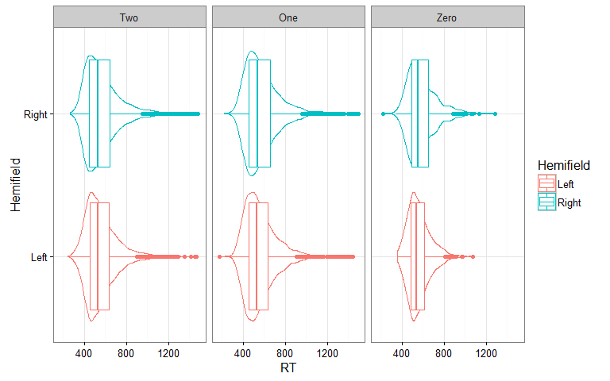<!-- -->

```r
#plot stim-locked CPP binned by RT
data_Stim_locked_ERP %>% summarySEwithin(., measurevar="CPP", 
                                         withinvars=c("Time", "RT_bin"), 
                                         idvar="ID") %>%
    mutate(Time = as.numeric(as.character(Time))) %>%
    ggplot(., aes(x=Time, y=CPP, color=RT_bin,fill=RT_bin)) + 
    geom_line(size=1) + 
    geom_ribbon(aes(ymin=CPP-ci, ymax=CPP+ci), alpha = 0.5, colour=NA) + 
    coord_cartesian(ylim = c(-0.1, 6.5),  xlim = c(-100, 900)) +
    xlab("Time (ms)") + ylab("CPP Amplitude (\u00b5V)") + # \u00b5 makes the "u" symbol for 'micro'V
    theme(axis.title.x = element_text(face="bold", size=12),
          axis.text.x  = element_text(face="bold", angle=0,  size=12), #element_text(face="bold", angle=0,  size=12),
          axis.title.y = element_text(face="bold", size=12),
          axis.text.y  = element_text(angle=0, vjust=0.5, size=12),
          legend.title = element_text(size=12, face="bold"),
          legend.text = element_text(size = 12, face = "bold"),
          panel.background = element_blank(), #remove grey background 
          legend.position= c(0.88,0.88)) + #Move ledgend position
    guides(color=FALSE) +
    # annotation_custom(CPP_scalp,xmin = 30, xmax = 270, ymin = 4, ymax = 6.25) + #add the CPP scapl plot 
    geom_vline(xintercept=as.numeric(data %>% filter(RT_bin == "Fast") %>% summarise(mean(RT))), 
               colour  = scales::hue_pal()(1), size=0.75, alpha=0.75, linetype="dashed") +
    geom_vline(xintercept=as.numeric(data %>% filter(RT_bin == "Slow") %>% summarise(mean(RT))), 
               colour  = scales::hue_pal()(2)[2], size=0.75, alpha=0.75, linetype="dashed") +
    geom_vline(xintercept=as.numeric(CPPonset_RTbin %>% ungroup() %>% filter(RT_bin == "Fast") %>% summarise(mean(CPPonset))), 
               colour  = scales::hue_pal()(1), size=0.75, alpha=0.75) +
    geom_vline(xintercept=as.numeric(CPPonset_RTbin %>% ungroup() %>% filter(RT_bin == "Slow") %>% summarise(mean(CPPonset))), 
               colour  = scales::hue_pal()(2)[2], size=0.75, alpha=0.75) +
    geom_hline(yintercept=0, alpha = 0.5) + 
    geom_vline(xintercept=0, alpha = 0.5) + #add black likes at 0 on x and y axis 
    scale_x_continuous(breaks = seq(-100, 900, 100)) + #increase the resolution of the axis ticks
    scale_y_continuous(breaks = seq(0,6,1)) +
    ggtitle("[D]") -> StimLockedCPP_sup
```

```
## Automatically converting the following non-factors to factors: Time, RT_bin
```

```r
    ggsave("StimLockedCPP_RTbin.png")
```

```
## Saving 8 x 5 in image
```

```r
###########CPP slope
    
#plot resp-locked CPP binned by RT
data_Resp_locked_ERP %>% summarySEwithin(., measurevar="CPPr", 
                                         withinvars=c("Time", "RT_bin"), 
                                         idvar="ID") %>%
    mutate(Time = as.numeric(as.character(Time))) %>%
ggplot(., aes(x=Time, y=CPPr, color=RT_bin,fill=RT_bin)) + 
    geom_line(size=1) + 
    geom_ribbon(aes(ymin=CPPr-ci, ymax=CPPr+ci), alpha = 0.5, colour=NA) + 
    coord_cartesian(ylim = c(-0.1, 7),  xlim = c(-700, 50)) +
    xlab("Time (ms)") + ylab("CPP Amplitude (\u00b5V)") + # \u00b5 makes the "u" symbol for 'micro'V
    theme(axis.title.x = element_text(face="bold", size=12),
          axis.text.x  = element_text(face="bold", angle=0,  size=12), #element_text(face="bold", angle=0,  size=12),
          axis.title.y = element_text(face="bold", size=12),
          axis.text.y  = element_text(angle=0, vjust=0.5, size=12),
          legend.title = element_text(size=12, face="bold"),
          legend.text = element_text(size = 12, face = "bold"),
          panel.background = element_blank(), #remove grey background 
          legend.position= c(0.44,0.88)) + #Move ledgend position
    guides(color=FALSE) +
    geom_hline(yintercept=0, alpha = 0.5) + 
    geom_vline(xintercept=0, alpha = 0.5) + #add black likes at 0 on x and y axis 
    scale_x_continuous(breaks = seq(-700, 50, 100)) + #increase the resolution of the axis ticks
    scale_y_continuous(breaks = seq(0,7,1)) +
    ggtitle("[E]") -> RespLockedCPP_sup #increase the resolution of the axis ticks
```

```
## Automatically converting the following non-factors to factors: Time, RT_bin
```

```r
ggsave("RespLockedCPP_RTbin.png")
```

```
## Saving 8 x 5 in image
```

```r
##Pull out mean beta slope measures from -300 to -50ms in Resp locked beta
data_Resp_locked_ERP %>% 
            filter(Time>-150, Time<(-10)) %>% 
            group_by(ID, RT_bin) %>% 
            summarise( xyBar =mean(Time*CPPr),
                       xBar = mean(Time),
                       yBar = mean(CPPr),
                       x2Bar =mean(Time^2),
                       CPPr_Slope = (xyBar - xBar*yBar) / (x2Bar - xBar^2)) %>%
            select(ID, RT_bin, CPPr_Slope) -> CPPslope_RTbin

#check group means:
CPPslope_RTbin %>% 
    group_by(RT_bin) %>% 
    summarise(SD = sd(CPPr_Slope),
        CPPslope = mean(CPPr_Slope))
```

```
## # A tibble: 2 × 3
##   RT_bin     SD CPPslope
##    <chr>  <dbl>    <dbl>
## 1   Fast 0.0247   0.0456
## 2   Slow 0.0225   0.0281
```

```r
ezANOVA(data = as.data.frame(CPPslope_RTbin)
                        , dv = .(CPPr_Slope)
                        , wid = .(ID)
                        , within = .(RT_bin)
                        , type = 3)
```

```
## Warning: Converting "RT_bin" to factor for ANOVA.
```

```
## $ANOVA
##   Effect DFn DFd    F                   p p<.05   ges
## 2 RT_bin   1  79 91.6 0.00000000000000745     * 0.121
```

```r
ggplot(CPPslope_RTbin) +
    geom_density(aes(x=CPPr_Slope, colour=RT_bin))
```

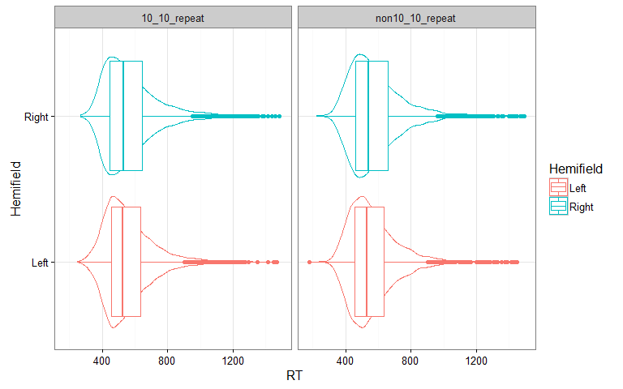<!-- -->

```r
data %>%
    ggplot(., aes(x = RespLockedCPPslope, 
                  y = RT)) +
    # geom_point(alpha = 0.5, shape = 1) +
        geom_smooth() +
        xlim(-0.2, 0.4)
```

```
## `geom_smooth()` using method = 'gam'
```

```
## Warning: Removed 15 rows containing non-finite values (stat_smooth).
```

<!-- -->

```r
colnames(data_Stim_locked_ERP)
```

```
##  [1] "ID"               "Trial"            "TotalTrialNumber"
##  [4] "Time"             "CPP"              "N2c"             
##  [7] "N2i"              "Hemifield"        "RT"              
## [10] "RT_bin"
```

```r
colnames(data_Resp_locked_ERP)
```

```
## [1] "ID"               "Trial"            "TotalTrialNumber"
## [4] "Time"             "CPPr"             "Hemifield"       
## [7] "RT"               "RT_bin"
```

#Test the effect of RT_bin on left hemisphere beta power

```r
#plot stim-locked Stim_locked_Beta binned by RT
data_Stim_locked_Beta %>% summarySEwithin(., measurevar="Stim_locked_Beta", 
                                         withinvars=c("Time", "RT_bin"), 
                                         idvar="ID") %>%
    mutate(Time = as.numeric(as.character(Time))) %>%
    ggplot(., aes(x=Time, y=Stim_locked_Beta, color=RT_bin,fill=RT_bin)) + 
    geom_line(size=1) + 
    geom_ribbon(aes(ymin=Stim_locked_Beta-ci, ymax=Stim_locked_Beta+ci), alpha = 0.5, colour=NA) + 
    coord_cartesian(ylim = c(-0.1, 0.01),  xlim = c(-100, 800)) +
    xlab("Time") + ylab("Beta Power (\u00b5V)") +
    theme(axis.title.x = element_text(face="bold", size=12),
          axis.text.x  = element_text(face="bold", angle=0,  size=12), #element_text(face="bold", angle=0,  size=12),
          axis.title.y = element_text(face="bold", size=12),
          axis.text.y  = element_text(angle=0, vjust=0.5, size=12),
          legend.title = element_text(size=12, face="bold"),
          legend.text = element_text(size = 12, face = "bold"),
          panel.background = element_blank(), #remove grey background 
          legend.position= c(0.3,0.2)) + #Move ledgend position
    guides(color=FALSE) +
    geom_hline(yintercept=0, alpha = 0.5) + 
    geom_vline(xintercept=0, alpha = 0.5) +
    ggtitle("[F]") -> StimLockedBeta_sup
```

```
## Automatically converting the following non-factors to factors: Time, RT_bin
```

```r
    ggsave("Stim_locked_Beta_RTbin.png")
```

```
## Saving 8 x 5 in image
```

```r
data_Resp_locked_Beta %>% summarySEwithin(., measurevar="Resp_locked_Beta", 
                                         withinvars=c("Time", "RT_bin"), 
                                         idvar="ID") %>%
    mutate(Time = as.numeric(as.character(Time))) %>%
    ggplot(., aes(x=Time, y=Resp_locked_Beta, color=RT_bin,fill=RT_bin)) + 
    geom_line(size=1) + 
    geom_ribbon(aes(ymin=Resp_locked_Beta-ci, ymax=Resp_locked_Beta+ci), alpha = 0.5, colour=NA) + 
    coord_cartesian(xlim = c(-600, 100)) +
    xlab("Time") + ylab("Beta Power (\u00b5V)") +
    theme(axis.title.x = element_text(face="bold", size=12),
          axis.text.x  = element_text(face="bold", angle=0,  size=12), #element_text(face="bold", angle=0,  size=12),
          axis.title.y = element_text(face="bold", size=12),
          axis.text.y  = element_text(angle=0, vjust=0.5, size=12),
          legend.title = element_text(size=12, face="bold"),
          legend.text = element_text(size = 12, face = "bold"),
          panel.background = element_blank(), #remove grey background 
          legend.position= c(0.2,0.2)) + #Move ledgend position
    guides(color=FALSE) +
    geom_hline(yintercept=0, alpha = 0.5) + 
    geom_vline(xintercept=0, alpha = 0.5) -> RespLockedBeta_sup 
```

```
## Automatically converting the following non-factors to factors: Time, RT_bin
```

```r
    ggsave("Resp_locked_Beta_RTbin.png")
```

```
## Saving 8 x 5 in image
```

```r
##Pull out mean beta slope measures from -300 to -50ms in Resp locked beta
data_Resp_locked_Beta %>% 
            filter(Time>-300, Time<(-50)) %>% 
            group_by(ID, RT_bin) %>% 
            summarise( xyBar =mean(Time*Resp_locked_Beta),
                       xBar = mean(Time),
                       yBar = mean(Resp_locked_Beta),
                       x2Bar =mean(Time^2),
                       Resp_locked_Beta_Slope = (xyBar - xBar*yBar) / (x2Bar - xBar^2)) %>%
            select(ID, RT_bin, Resp_locked_Beta_Slope) -> Resp_locked_Beta_slope_RTbin


#check group means:
Resp_locked_Beta_slope_RTbin %>% 
    group_by(RT_bin) %>% 
    summarise(SD = sd(Resp_locked_Beta_Slope),
        Beta_slope = mean(Resp_locked_Beta_Slope))
```

```
## # A tibble: 2 × 3
##   RT_bin       SD Beta_slope
##    <chr>    <dbl>      <dbl>
## 1   Fast 0.000283  -0.000346
## 2   Slow 0.000246  -0.000276
```

```r
ezANOVA(data = as.data.frame(Resp_locked_Beta_slope_RTbin)
                        , dv = .(Resp_locked_Beta_Slope)
                        , wid = .(ID)
                        , within = .(RT_bin)
                        , type = 3)
```

```
## Warning: You have removed one or more Ss from the analysis. Refactoring
## "ID" for ANOVA.
```

```
## Warning: Converting "RT_bin" to factor for ANOVA.
```

```
## $ANOVA
##   Effect DFn DFd    F       p p<.05    ges
## 2 RT_bin   1  79 10.8 0.00148     * 0.0173
```


##Make plots for Response to Rviewers (and to maybe include in supplementry info)

```r
source("multiplot.R")

png("Review_Figure_multiplot.png", width = 10*600, height = 10*600,  units = "px", res = 600) 
multiplot(alpha_sup, N2c_sup, N2i_sup, StimLockedCPP_sup, RespLockedCPP_sup, StimLockedBeta_sup, cols=2)
```

```
## `geom_smooth()` using method = 'gam'
```

```r
dev.off()
```

```
## png 
##   2
```

