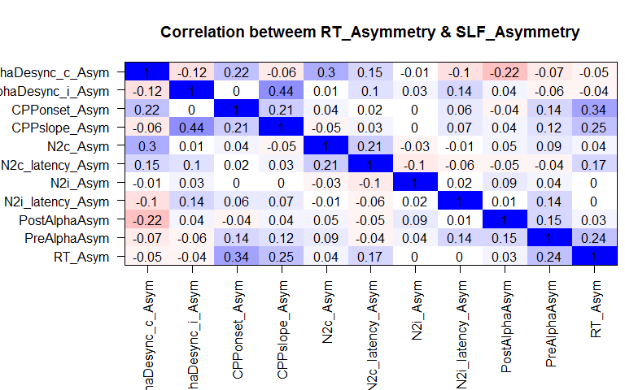
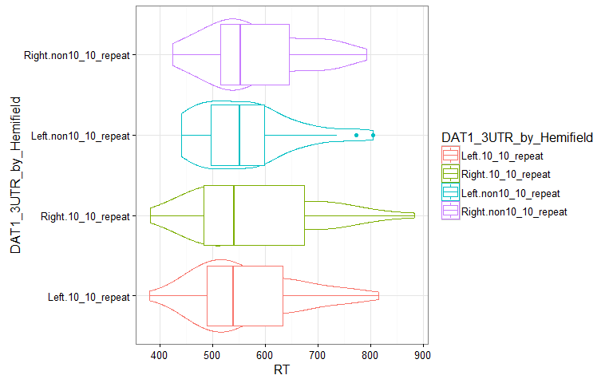

# BigDots
Daniel Newman  
12 June 2016  


#First Look at the effect of Hemifield on RT, regardless of DAT1 genotype (because we loose 4 participants with failed genotypes later when testing for effect of DAT1 genotype)

```
## Data: data
## Models:
## RT_random_effects_only: log(RT) ~ 1 + (Hemifield | ID) + (1 | ITI) + (1 | Trial)
## RT_Hemifield: log(RT) ~ (Hemifield | ID) + (1 | ITI) + (1 | Trial) + Hemifield
## RT_Hemifield_by_TOT: log(RT) ~ (Hemifield | ID) + (1 | ITI) + (1 | Trial) + Hemifield + 
## RT_Hemifield_by_TOT:     Trial + Hemifield:Trial
##                        Df     AIC     BIC logLik deviance   Chisq Chi Df
## RT_random_effects_only  7 -8990.2 -8934.6 4502.1  -9004.2               
## RT_Hemifield            8 -8995.2 -8931.6 4505.6  -9011.2  6.9803      1
## RT_Hemifield_by_TOT    10 -9034.5 -8955.1 4527.3  -9054.5 43.3258      2
##                        Pr(>Chisq)    
## RT_random_effects_only               
## RT_Hemifield             0.008241 ** 
## RT_Hemifield_by_TOT     3.908e-10 ***
## ---
## Signif. codes:  0 '***' 0.001 '**' 0.01 '*' 0.05 '.' 0.1 ' ' 1
```


**So this ^ shows that regardless of DAT1 genotype, participants tended to react faster to left hemifield targets, but this leftward advangate decreased over time**

#Check for difference in behavioural accuracy between 10_10_repeat and non10_10_repeat participants?

```
## [1] 92.01389
```

```
## `stat_bin()` using `bins = 30`. Pick better value with `binwidth`.
```


```
## [1] "Factorial Permutation test for the effect of DAT1_3UTR on Accuracy:"
```

```
##      Effect     p p<.05
## 1 DAT1_3UTR 0.162
```

**So this ^ shows shows no significant difference in accuracy between the DAT1 genotype groups** 

#Simple effects of Genotype inside each DAT1 Group show that non10_10_repeat participants have significant leftward RT asymmetry, and the 10_10_repeat participants do not

```
##        ID     Num_RT_Trials  
##  036M_JK: 1   Min.   :163.0  
##  037M_JD: 1   1st Qu.:250.2  
##  059M_HP: 1   Median :266.0  
##  061M_LG: 1   Mean   :260.5  
##  068M_CB: 1   3rd Qu.:278.0  
##  091M_SW: 1   Max.   :286.0  
##  (Other):70
```

```
## `stat_bin()` using `bins = 30`. Pick better value with `binwidth`.
```


```
## `stat_bin()` using `bins = 30`. Pick better value with `binwidth`.
```



```
## [1] "Factorial Permutation test for the simple effect of Target Hemifield on RT in the non10_10_repeat group:"
```

```
##      Effect p p<.05
## 1 Hemifield 0     *
```

```
## [1] "Factorial Permutation test for the simple effect of Target Hemifield on RT in the 10_10_repeat group:"
```

```
##      Effect     p p<.05
## 1 Hemifield 0.127
```


###However, the difference the DAT1Group x Hemifield interaction in RT is not significant, and also there is no significant difference in RT-asymmetry between the 10_10_repeat and non10_10_repeat DAT1_3UTRs:


```
## [1] "Factorial Permutation test for Hemifield x DAT1 group interaction on RT:"
```

```
##                         Effect     p p<.05
## 1           DAT1_10_10_repeats 0.953      
## 2                    Hemifield 0.003     *
## 3 DAT1_10_10_repeats:Hemifield 0.744
```

```
## $ANOVA
##                Effect DFn DFd          F          p p<.05          ges
## 2           DAT1_3UTR   1  74 0.07557194 0.78415644       0.0009813568
## 3           Hemifield   1  74 8.04637362 0.00587824     * 0.0040930147
## 4 DAT1_3UTR:Hemifield   1  74 0.54387465 0.46316344       0.0002777942
```

```
## `stat_bin()` using `bins = 30`. Pick better value with `binwidth`.
```


```
##         DAT1_3UTR RT_Asym.mean
## 1    10_10_repeat -0.005010636
## 2 non10_10_repeat -0.014029338
```

```
## 
## 	Welch Two Sample t-test
## 
## data:  RT_collapsed$RT_Asym by RT_collapsed$DAT1_3UTR
## t = 1.2996, df = 68.637, p-value = 0.1981
## alternative hypothesis: true difference in means is not equal to 0
## 95 percent confidence interval:
##  -0.004826457  0.022863860
## sample estimates:
##    mean in group 10_10_repeat mean in group non10_10_repeat 
##                  -0.005010636                  -0.014029338
```

```
## [1] "Factorial Permutation test for effect if DAT1 group RT Asymmetry:"
```

```
##      Effect   p p<.05
## 1 DAT1_3UTR 0.2
```


#Try linear mixed model approach to test the DAT1_3UTR x Hemifield effect on log(RTs) in the single trial data:



```
## Data: data2
## Models:
## RT_random_intercepts_only: log(RT) ~ 1 + (Hemifield | ID) + (1 | ITI) + (1 | Trial)
## RT_DAT1_3UTR: log(RT) ~ (Hemifield | ID) + (1 | ITI) + (1 | Trial) + DAT1_3UTR
## RT_Hemifield: log(RT) ~ (Hemifield | ID) + (1 | ITI) + (1 | Trial) + DAT1_3UTR + 
## RT_Hemifield:     Hemifield
## RT_HemifieldbyDAT1_3UTR: log(RT) ~ (Hemifield | ID) + (1 | ITI) + (1 | Trial) + DAT1_3UTR + 
## RT_HemifieldbyDAT1_3UTR:     Hemifield + DAT1_3UTR:Hemifield
##                           Df     AIC     BIC logLik deviance  Chisq Chi Df
## RT_random_intercepts_only  7 -8437.7 -8382.4 4225.8  -8451.7              
## RT_DAT1_3UTR               8 -8435.7 -8372.6 4225.9  -8451.7 0.0251      1
## RT_Hemifield               9 -8439.6 -8368.6 4228.8  -8457.6 5.8808      1
## RT_HemifieldbyDAT1_3UTR   10 -8437.9 -8358.9 4228.9  -8457.9 0.2815      1
##                           Pr(>Chisq)  
## RT_random_intercepts_only             
## RT_DAT1_3UTR                 0.87400  
## RT_Hemifield                 0.01531 *
## RT_HemifieldbyDAT1_3UTR      0.59571  
## ---
## Signif. codes:  0 '***' 0.001 '**' 0.01 '*' 0.05 '.' 0.1 ' ' 1
```

```
## Data: data2
## Models:
## RT_random_intercepts_only: log(RT) ~ 1 + (1 | Site/DAT1_3UTR/ID) + (1 | ITI) + (1 | Trial)
## RT_DAT1_3UTR: log(RT) ~ (1 | Site/DAT1_3UTR/ID) + (1 | ITI) + (1 | Trial) + 
## RT_DAT1_3UTR:     DAT1_3UTR
## RT_Hemifield: log(RT) ~ (1 | Site/DAT1_3UTR/ID) + (1 | ITI) + (1 | Trial) + 
## RT_Hemifield:     DAT1_3UTR + Hemifield
## RT_HemifieldbyDAT1_3UTR: log(RT) ~ (1 | Site/DAT1_3UTR/ID) + (1 | ITI) + (1 | Trial) + 
## RT_HemifieldbyDAT1_3UTR:     DAT1_3UTR + Hemifield + DAT1_3UTR:Hemifield
##                           Df     AIC     BIC logLik deviance   Chisq
## RT_random_intercepts_only  7 -8092.7 -8037.4 4053.3  -8106.7        
## RT_DAT1_3UTR               8 -8090.7 -8027.6 4053.4  -8106.7  0.0845
## RT_Hemifield               9 -8127.5 -8056.4 4072.7  -8145.5 38.7357
## RT_HemifieldbyDAT1_3UTR   10 -8127.3 -8048.4 4073.6  -8147.3  1.8121
##                           Chi Df Pr(>Chisq)    
## RT_random_intercepts_only                      
## RT_DAT1_3UTR                   1     0.7713    
## RT_Hemifield                   1  4.852e-10 ***
## RT_HemifieldbyDAT1_3UTR        1     0.1783    
## ---
## Signif. codes:  0 '***' 0.001 '**' 0.01 '*' 0.05 '.' 0.1 ' ' 1
```

**So the linear mixed model approach ^ shows no significant DAT1_3UTR x Hemifield effect**

##However simple effects of hemifield inside DAT1_3UTR linear mixed model approach confirms that non10_10_repeat participants have signficantly faster RTs to left targets and 10_10_repeat participants do not: 

```
## 
## 	 Simultaneous Tests for General Linear Hypotheses
## 
## Fit: lmer(formula = log(RT) ~ Hemifield + (Hemifield | Site/ID) + 
##     (1 | ITI) + (1 | Hemifield) + (1 | Trial), data = data2[data2$DAT1_3UTR == 
##     "10_10_repeat", ], REML = FALSE, na.action = na.omit)
## 
## Linear Hypotheses:
##                     Estimate Std. Error z value Pr(>|z|)    
## (Intercept) == 0     6.30192    0.04426 142.384   <1e-10 ***
## HemifieldRight == 0  0.01476    0.01198   1.232    0.388    
## ---
## Signif. codes:  0 '***' 0.001 '**' 0.01 '*' 0.05 '.' 0.1 ' ' 1
## (Adjusted p values reported -- single-step method)
```

```
## 
## 	 Simultaneous Tests for General Linear Hypotheses
## 
## Fit: lmer(formula = log(RT) ~ Hemifield + (Hemifield | Site/ID) + 
##     (1 | ITI) + (1 | Hemifield) + (1 | Trial), data = data2[data2$DAT1_3UTR == 
##     "non10_10_repeat", ], REML = FALSE, na.action = na.omit)
## 
## Linear Hypotheses:
##                     Estimate Std. Error z value Pr(>|z|)    
## (Intercept) == 0    6.309314   0.043695 144.396   <1e-10 ***
## HemifieldRight == 0 0.021944   0.007259   3.023    0.005 ** 
## ---
## Signif. codes:  0 '***' 0.001 '**' 0.01 '*' 0.05 '.' 0.1 ' ' 1
## (Adjusted p values reported -- single-step method)
```

###So non10_10_repeat have significant pseudoneglect (i.e. faster RTs to left hemifield targets), and 10_10_repeat do not, but this is only seen in the simple effects (doing seperate test for each DAT1_3UTR). The factorial design gives no significant DAT1_3UTR x Hemifield effect


##Look at the DAT1Group x Hemifield x Time-on-task interaction in the single trial data:

```
## Data: data2
## Models:
## RT_random_effects_only: log(RT) ~ 1 + (1 | ID) + (1 | ITI) + (1 | Trial)
## RT_Hemifield: log(RT) ~ (1 | ID) + (1 | ITI) + (1 | Trial) + Hemifield
## RT_DAT1: log(RT) ~ (1 | ID) + (1 | ITI) + (1 | Trial) + Hemifield + DAT1_3UTR
## RT_TOT: log(RT) ~ (1 | ID) + (1 | ITI) + (1 | Trial) + Hemifield + DAT1_3UTR + 
## RT_TOT:     Trial
## RT_Hemifield_by_DAT1: log(RT) ~ (1 | ID) + (1 | ITI) + (1 | Trial) + Hemifield + DAT1_3UTR + 
## RT_Hemifield_by_DAT1:     Trial + Hemifield:DAT1_3UTR
## RT_Hemifield_by_TOT: log(RT) ~ (1 | ID) + (1 | ITI) + (1 | Trial) + Hemifield + DAT1_3UTR + 
## RT_Hemifield_by_TOT:     Trial + Hemifield:DAT1_3UTR + Hemifield:Trial
## RT_DAT1_by_TOT: log(RT) ~ (1 | ID) + (1 | ITI) + (1 | Trial) + Hemifield + DAT1_3UTR + 
## RT_DAT1_by_TOT:     Trial + Hemifield:DAT1_3UTR + Hemifield:Trial + DAT1_3UTR:Trial
## RT_Hemifield_by_DAT1_by_TOT: log(RT) ~ (1 | ID) + (1 | ITI) + (1 | Trial) + Hemifield + DAT1_3UTR + 
## RT_Hemifield_by_DAT1_by_TOT:     Trial + Hemifield:DAT1_3UTR + Hemifield:Trial + DAT1_3UTR:Trial + 
## RT_Hemifield_by_DAT1_by_TOT:     Hemifield:DAT1_3UTR:Trial
##                             Df     AIC     BIC logLik deviance   Chisq
## RT_random_effects_only       5 -8096.7 -8057.2 4053.3  -8106.7        
## RT_Hemifield                 6 -8133.4 -8086.0 4072.7  -8145.4 38.7362
## RT_DAT1                      7 -8131.5 -8076.2 4072.7  -8145.5  0.0840
## RT_TOT                       8 -8178.3 -8115.2 4097.2  -8194.3 48.8309
## RT_Hemifield_by_DAT1         9 -8178.1 -8107.1 4098.1  -8196.1  1.8122
## RT_Hemifield_by_TOT         10 -8180.1 -8101.2 4100.1  -8200.1  3.9996
## RT_DAT1_by_TOT              11 -8180.3 -8093.5 4101.2  -8202.3  2.1849
## RT_Hemifield_by_DAT1_by_TOT 12 -8179.5 -8084.7 4101.7  -8203.5  1.1536
##                             Chi Df Pr(>Chisq)    
## RT_random_effects_only                           
## RT_Hemifield                     1  4.851e-10 ***
## RT_DAT1                          1    0.77189    
## RT_TOT                           1  2.790e-12 ***
## RT_Hemifield_by_DAT1             1    0.17824    
## RT_Hemifield_by_TOT              1    0.04551 *  
## RT_DAT1_by_TOT                   1    0.13937    
## RT_Hemifield_by_DAT1_by_TOT      1    0.28280    
## ---
## Signif. codes:  0 '***' 0.001 '**' 0.01 '*' 0.05 '.' 0.1 ' ' 1
```


###So there is no evidence for a 3-way DAT1Group x Hemifield x Time-on-task interaction. I haven't included random slopes directly above, so if there was any hint on a 3-way DAT1Group x Hemifield x Time-on-task interaction this model should have detected it!
