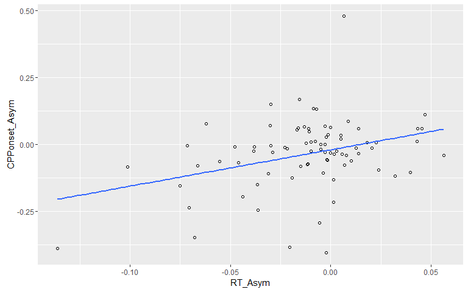
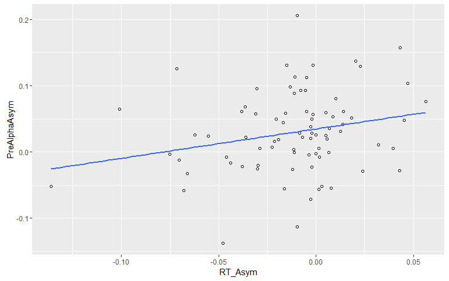
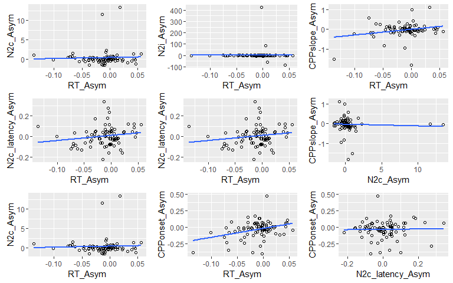

# BigDots
Daniel Newman  
12 June 2016  


#Test the effect of Target Hemifield on RT, CPPonset, N2c, etc. using Factorial Permutation test

```
## [1] "Factorial Permutation test for the effect of Hemifield on RT:"
```

```
##      Effect     p p<.05
## 1 Hemifield 0.001     *
```

<!-- --><!-- -->

```
## [1] "Factorial Permutation test for the effect of Hemifield on CPP Slope:"
```

```
##      Effect     p p<.05
## 1 Hemifield 0.257
```

```
## [1] "Factorial Permutation test for the effect of Hemifield on CPP Onset:"
```

```
##      Effect     p p<.05
## 1 Hemifield 0.027     *
```

<!-- --><!-- -->

```
## [1] "Factorial Permutation test for the effect of Hemifield on N2i_latency:"
```

```
##      Effect     p p<.05
## 1 Hemifield 0.691
```

```
## [1] "Factorial Permutation test for the effect of Hemifield on N2i Amplitude:"
```

```
##      Effect     p p<.05
## 1 Hemifield 0.251
```

```
## [1] "Factorial Permutation test for the effect of Hemifield on N2c_latency:"
```

```
##      Effect     p p<.05
## 1 Hemifield 0.948
```

```
## [1] "Factorial Permutation test for the effect of Hemifield on N2c Amplitude:"
```

```
##      Effect     p p<.05
## 1 Hemifield 0.783
```

```
## [1] "Factorial Permutation test for the effect of Hemifield on AlphaDesync_c:"
```

```
##      Effect     p p<.05
## 1 Hemifield 0.297
```

```
## [1] "Factorial Permutation test for the effect of Hemifield on AlphaDesync_i:"
```

```
##      Effect     p p<.05
## 1 Hemifield 0.297
```


#Test the effect of Target Hemifield on RT, CPPonset, N2c, etc. using repeated measures ANOVA

```
## [1] "Repeated Measures ANOVA  for the effect of Hemifield on RT:"
```

```
## $ANOVA
##      Effect DFn DFd        F           p p<.05        ges
## 2 Hemifield   1  79 11.09909 0.001315453     * 0.00614155
```

<!-- --><!-- -->

```
## [1] "Repeated Measures ANOVA  for the effect of Hemifield on CPP Slope:"
```

```
## $ANOVA
##      Effect DFn DFd        F         p p<.05          ges
## 2 Hemifield   1  79 1.256175 0.2657719       0.0007765846
```

```
## [1] "Repeated Measures ANOVA  for the effect of Hemifield on CPP Onset:"
```

```
## $ANOVA
##      Effect DFn DFd        F          p p<.05        ges
## 2 Hemifield   1  79 4.946383 0.02900039     * 0.02313747
```

<!-- --><!-- -->

```
## [1] "Repeated Measures ANOVA  for the effect of Hemifield on N2i_latency:"
```

```
## $ANOVA
##      Effect DFn DFd         F         p p<.05          ges
## 2 Hemifield   1  79 0.1545535 0.6952802       0.0006968114
```

```
## [1] "Repeated Measures ANOVA  for the effect of Hemifield on N2i Amplitude:"
```

```
## $ANOVA
##      Effect DFn DFd        F         p p<.05         ges
## 2 Hemifield   1  79 1.258714 0.2652931       0.005234692
```

```
## [1] "Repeated Measures ANOVA  for the effect of Hemifield on N2c_latency:"
```

```
## $ANOVA
##      Effect DFn DFd           F        p p<.05          ges
## 2 Hemifield   1  79 0.005721552 0.939896       1.828447e-05
```

```
## [1] "Repeated Measures ANOVA  for the effect of Hemifield on N2c Amplitude:"
```

```
## $ANOVA
##      Effect DFn DFd          F         p p<.05          ges
## 2 Hemifield   1  79 0.07554369 0.7841474       0.0003143128
```

```
## [1] "Repeated Measures ANOVA  for the effect of Hemifield on AlphaDesync_i:"
```

```
## $ANOVA
##      Effect DFn DFd         F         p p<.05        ges
## 2 Hemifield   1  79 0.2429437 0.6234553       0.00146603
```

```
## [1] "Repeated Measures ANOVA  for the effect of Hemifield on AlphaDesync_c:"
```

```
## $ANOVA
##      Effect DFn DFd        F         p p<.05         ges
## 2 Hemifield   1  79 1.029711 0.3133244       0.005442722
```


#test correlation between all of the Asymmetry measures (i.e. RT, N2, CPP, alpha, asymmetry) 

```
## Call:corr.test(x = data_for_cor, method = "pearson", adjust = "none", 
##     alpha = 0.05, ci = TRUE)
## Correlation matrix 
##                    AlphaDesync_c_Asym AlphaDesync_i_Asym CPPonset_Asym
## AlphaDesync_c_Asym               1.00              -0.12          0.22
## AlphaDesync_i_Asym              -0.12               1.00          0.00
## CPPonset_Asym                    0.22               0.00          1.00
## CPPslope_Asym                   -0.06               0.44          0.21
## N2c_Asym                         0.30               0.01          0.04
## N2c_latency_Asym                 0.15               0.10          0.02
## N2i_Asym                        -0.01               0.03          0.00
## N2i_latency_Asym                -0.10               0.14          0.06
## PostAlphaAsym                   -0.22               0.04         -0.04
## PreAlphaAsym                    -0.07              -0.06          0.14
## RT_Asym                         -0.05              -0.04          0.34
##                    CPPslope_Asym N2c_Asym N2c_latency_Asym N2i_Asym
## AlphaDesync_c_Asym         -0.06     0.30             0.15    -0.01
## AlphaDesync_i_Asym          0.44     0.01             0.10     0.03
## CPPonset_Asym               0.21     0.04             0.02     0.00
## CPPslope_Asym               1.00    -0.05             0.03     0.00
## N2c_Asym                   -0.05     1.00             0.21    -0.03
## N2c_latency_Asym            0.03     0.21             1.00    -0.10
## N2i_Asym                    0.00    -0.03            -0.10     1.00
## N2i_latency_Asym            0.07    -0.01            -0.06     0.02
## PostAlphaAsym               0.04     0.05            -0.05     0.09
## PreAlphaAsym                0.12     0.09            -0.04     0.04
## RT_Asym                     0.25     0.04             0.17     0.00
##                    N2i_latency_Asym PostAlphaAsym PreAlphaAsym RT_Asym
## AlphaDesync_c_Asym            -0.10         -0.22        -0.07   -0.05
## AlphaDesync_i_Asym             0.14          0.04        -0.06   -0.04
## CPPonset_Asym                  0.06         -0.04         0.14    0.34
## CPPslope_Asym                  0.07          0.04         0.12    0.25
## N2c_Asym                      -0.01          0.05         0.09    0.04
## N2c_latency_Asym              -0.06         -0.05        -0.04    0.17
## N2i_Asym                       0.02          0.09         0.04    0.00
## N2i_latency_Asym               1.00          0.01         0.14    0.00
## PostAlphaAsym                  0.01          1.00         0.15    0.03
## PreAlphaAsym                   0.14          0.15         1.00    0.24
## RT_Asym                        0.00          0.03         0.24    1.00
## Sample Size 
## [1] 80
## Probability values (Entries above the diagonal are adjusted for multiple tests.) 
##                    AlphaDesync_c_Asym AlphaDesync_i_Asym CPPonset_Asym
## AlphaDesync_c_Asym               0.00               0.30          0.05
## AlphaDesync_i_Asym               0.30               0.00          1.00
## CPPonset_Asym                    0.05               1.00          0.00
## CPPslope_Asym                    0.57               0.00          0.07
## N2c_Asym                         0.01               0.92          0.71
## N2c_latency_Asym                 0.19               0.38          0.87
## N2i_Asym                         0.92               0.77          0.97
## N2i_latency_Asym                 0.39               0.22          0.60
## PostAlphaAsym                    0.04               0.75          0.70
## PreAlphaAsym                     0.54               0.61          0.21
## RT_Asym                          0.68               0.75          0.00
##                    CPPslope_Asym N2c_Asym N2c_latency_Asym N2i_Asym
## AlphaDesync_c_Asym          0.57     0.01             0.19     0.92
## AlphaDesync_i_Asym          0.00     0.92             0.38     0.77
## CPPonset_Asym               0.07     0.71             0.87     0.97
## CPPslope_Asym               0.00     0.68             0.80     1.00
## N2c_Asym                    0.68     0.00             0.07     0.78
## N2c_latency_Asym            0.80     0.07             0.00     0.40
## N2i_Asym                    1.00     0.78             0.40     0.00
## N2i_latency_Asym            0.56     0.94             0.62     0.89
## PostAlphaAsym               0.70     0.65             0.67     0.41
## PreAlphaAsym                0.30     0.43             0.75     0.69
## RT_Asym                     0.02     0.70             0.13     0.98
##                    N2i_latency_Asym PostAlphaAsym PreAlphaAsym RT_Asym
## AlphaDesync_c_Asym             0.39          0.04         0.54    0.68
## AlphaDesync_i_Asym             0.22          0.75         0.61    0.75
## CPPonset_Asym                  0.60          0.70         0.21    0.00
## CPPslope_Asym                  0.56          0.70         0.30    0.02
## N2c_Asym                       0.94          0.65         0.43    0.70
## N2c_latency_Asym               0.62          0.67         0.75    0.13
## N2i_Asym                       0.89          0.41         0.69    0.98
## N2i_latency_Asym               0.00          0.91         0.21    0.99
## PostAlphaAsym                  0.91          0.00         0.20    0.78
## PreAlphaAsym                   0.21          0.20         0.00    0.03
## RT_Asym                        0.99          0.78         0.03    0.00
## 
##  To see confidence intervals of the correlations, print with the short=FALSE option
## 
##  Confidence intervals based upon normal theory.  To get bootstrapped values, try cor.ci
##                             lower     r upper    p
## AlphDsync_c_A-AlphDsync__As -0.33 -0.12  0.10 0.30
## AlphDsync_c_A-CPPn_A         0.00  0.22  0.42 0.05
## AlphDsync_c_A-CPPs_A        -0.28 -0.06  0.16 0.57
## AlphDsync_c_A-N2c_A          0.08  0.30  0.49 0.01
## AlphDsync_c_A-N2c__A        -0.08  0.15  0.36 0.19
## AlphDsync_c_A-N2_As         -0.23 -0.01  0.21 0.92
## AlphDsync_c_A-N2_l_A        -0.31 -0.10  0.12 0.39
## AlphDsync_c_A-PstAA         -0.42 -0.22 -0.01 0.04
## AlphDsync_c_A-PrAlA         -0.28 -0.07  0.15 0.54
## AlphDsync_c_A-RT_As         -0.26 -0.05  0.18 0.68
## AlphDsync__As-CPPn_A        -0.22  0.00  0.22 1.00
## AlphDsync__As-CPPs_A         0.24  0.44  0.60 0.00
## AlphDsync__As-N2c_A         -0.21  0.01  0.23 0.92
## AlphDsync__As-N2c__A        -0.12  0.10  0.31 0.38
## AlphDsync__As-N2_As         -0.19  0.03  0.25 0.77
## AlphDsync__As-N2_l_A        -0.08  0.14  0.35 0.22
## AlphDsync__As-PstAA         -0.18  0.04  0.25 0.75
## AlphDsync__As-PrAlA         -0.27 -0.06  0.16 0.61
## AlphDsync__As-RT_As         -0.25 -0.04  0.19 0.75
## CPPn_A-CPPs_A               -0.01  0.21  0.41 0.07
## CPPn_A-N2c_A                -0.18  0.04  0.26 0.71
## CPPn_A-N2c__A               -0.20  0.02  0.24 0.87
## CPPn_A-N2_As                -0.22  0.00  0.22 0.97
## CPPn_A-N2_l_A               -0.16  0.06  0.28 0.60
## CPPn_A-PstAA                -0.26 -0.04  0.18 0.70
## CPPn_A-PrAlA                -0.08  0.14  0.35 0.21
## CPPn_A-RT_As                 0.13  0.34  0.52 0.00
## CPPs_A-N2c_A                -0.26 -0.05  0.17 0.68
## CPPs_A-N2c__A               -0.19  0.03  0.25 0.80
## CPPs_A-N2_As                -0.22  0.00  0.22 1.00
## CPPs_A-N2_l_A               -0.16  0.07  0.28 0.56
## CPPs_A-PstAA                -0.18  0.04  0.26 0.70
## CPPs_A-PrAlA                -0.11  0.12  0.33 0.30
## CPPs_A-RT_As                 0.04  0.25  0.45 0.02
## N2c_A-N2c__A                -0.01  0.21  0.41 0.07
## N2c_A-N2_As                 -0.25 -0.03  0.19 0.78
## N2c_A-N2_l_A                -0.23 -0.01  0.21 0.94
## N2c_A-PstAA                 -0.17  0.05  0.27 0.65
## N2c_A-PrAlA                 -0.13  0.09  0.30 0.43
## N2c_A-RT_As                 -0.18  0.04  0.26 0.70
## N2c__A-N2_As                -0.31 -0.10  0.13 0.40
## N2c__A-N2_l_A               -0.27 -0.06  0.17 0.62
## N2c__A-PstAA                -0.26 -0.05  0.17 0.67
## N2c__A-PrAlA                -0.25 -0.04  0.19 0.75
## N2c__A-RT_As                -0.05  0.17  0.38 0.13
## N2_As-N2_l_A                -0.20  0.02  0.23 0.89
## N2_As-PstAA                 -0.13  0.09  0.31 0.41
## N2_As-PrAlA                 -0.18  0.04  0.26 0.69
## N2_As-RT_As                 -0.22  0.00  0.22 0.98
## N2_l_A-PstAA                -0.21  0.01  0.23 0.91
## N2_l_A-PrAlA                -0.08  0.14  0.35 0.21
## N2_l_A-RT_As                -0.22  0.00  0.22 0.99
## PstAA-PrAlA                 -0.08  0.15  0.35 0.20
## PstAA-RT_As                 -0.19  0.03  0.25 0.78
## PrAlA-RT_As                  0.02  0.24  0.44 0.03
```

```
## png 
##   2
```

<!-- -->

```
## png 
##   2
```

<!-- --><!-- --><!-- --><!-- --><!-- --><!-- --><!-- --><!-- -->

```
## png 
##   2
```

<!-- -->

```
## `stat_bin()` using `bins = 30`. Pick better value with `binwidth`.
```

```
## png 
##   2
```

```
## `stat_bin()` using `bins = 30`. Pick better value with `binwidth`.
```

<!-- -->

#Look at 


#Look at the effect of Hemifield on RT on a single trial level using linear mixed model


```
## Data: data
## Models:
## RT_random_effects_only: log(RT) ~ 1 + (Hemifield | ID) + (1 | ITI) + (1 | Trial)
## RT_Hemifield: log(RT) ~ (Hemifield | ID) + (1 | ITI) + (1 | Trial) + Hemifield
## RT_Hemifield_by_TOT: log(RT) ~ (Hemifield | ID) + (1 | ITI) + (1 | Trial) + Hemifield + 
## RT_Hemifield_by_TOT:     Trial + Hemifield:Trial
##                        Df     AIC     BIC logLik deviance   Chisq Chi Df
## RT_random_effects_only  7 -9139.3 -9083.6 4576.7  -9153.3               
## RT_Hemifield            8 -9144.6 -9080.9 4580.3  -9160.6  7.2606      1
## RT_Hemifield_by_TOT    10 -9184.8 -9105.2 4602.4  -9204.8 44.1537      2
##                        Pr(>Chisq)    
## RT_random_effects_only               
## RT_Hemifield             0.007048 ** 
## RT_Hemifield_by_TOT     2.583e-10 ***
## ---
## Signif. codes:  0 '***' 0.001 '**' 0.01 '*' 0.05 '.' 0.1 ' ' 1
```

```
## Data: data
## Models:
## RT_Hemifield_by_TOT: log(RT) ~ (Hemifield | ID) + (1 | ITI) + (1 | Trial) + Hemifield + 
## RT_Hemifield_by_TOT:     Trial + Hemifield:Trial
## RT_PreAlphaPower: log(RT) ~ (Hemifield | ID) + (1 | ITI) + (1 | Trial) + Hemifield + 
## RT_PreAlphaPower:     Trial + PreAlphaPower + Hemifield:Trial
##                     Df     AIC     BIC logLik deviance Chisq Chi Df
## RT_Hemifield_by_TOT 10 -9184.8 -9105.2 4602.4  -9204.8             
## RT_PreAlphaPower    11 -9213.3 -9125.8 4617.7  -9235.3 30.55      1
##                     Pr(>Chisq)    
## RT_Hemifield_by_TOT               
## RT_PreAlphaPower     3.253e-08 ***
## ---
## Signif. codes:  0 '***' 0.001 '**' 0.01 '*' 0.05 '.' 0.1 ' ' 1
```

<!-- -->

**So this ^ shows that participants tended to react faster to left hemifield targets, but this leftward advangate decreased over time**


